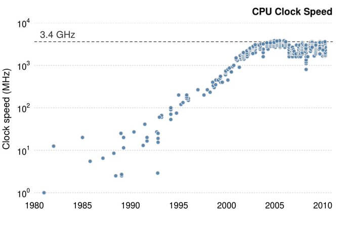

# Foreword by Miško Hevery

## Why another framework?

The short answer is that the current approach to framework design is not producing fast sites, and this problem will not disappear by simply waiting for a faster CPU and network.

## What is the core problem?

The core problem is that the industry has become very proficient at building complex applications to solve complex needs. The web applications of today are more capable than those of yesterday. Code bases are larger than ever. All of this is fantastic and a sign of the maturing industry.

However, tools (frameworks) still need to catch up with codebases. All frameworks need to know about the application before they can run. Frameworks need to know about component boundaries, state, and event listeners. However, how the frameworks obtain this information has a significant impact on how much code needs to be downloaded to the client on application startup.

Most frameworks use a technique called hydration. Hydration recovers all of the framework state (component boundaries, application state, event listeners) by re-executing all of the components on the page, starting with the root component and recursively visiting all components on the page. This is fine for small codebases, but as the applications become more complex, the amount of code needed to be executed by the browser on page startup becomes overwhelming, resulting in slow startup performance. This is the current O(n) approach to interactivity.

Qwik does not use hydration but instead employs resumability. Resumability takes advantage of the fact that the application has already been executed on the server as part of SSR/SSG, and the framework can serialize component boundaries, application state, and event listeners into the resulting HTML. On the client, the framework can deserialize the information instead of executing the code again. Resumability does not require running any code on application startup. This creates constant startup costs, regardless of the application complexity. This is the O(1) approach to interactivity.

The use of resumability opens up the possibility of lazy loading. Hydration requires eager execution of all components on the current page, which means that none of the components on the page can be lazy loaded. Only components not currently in the render tree can be lazy-loaded. Without hydration, loading all components on the page lazily is now possible. Now, the amount of code that the browser needs to execute is proportional to the interaction's complexity rather than the page's complexity.

## But CPUs and networks are getting faster. Won't this problem go away?

In short, no. CPUs get faster in three ways:

1. By increasing the clock cycles
2. By increasing the number of instructions per clock cycle.
3. By adding more CPU cores and parallelizing the applications.

Image from [Twitter](https://twitter.com/csgillespie/status/732532249325907968?lang=id)

The limit on clock speed has been reached, and it is about 3.5 GHz. Why? At 3.5GHz, light can travel about 8.5cm, which is less than one order of magnitude to the size of a silicon die. Getting close to the theoretical limit of what Physics will allow for a signal to travel from one end of the chip to the other explains the stagnation of clock speeds.

Modern CPUs try to parallelize many instructions concurrently. But more parallel designs are more complex. In addition, code is sequential, so parallelizing instructions is difficult and relies on speculative execution. So, it is unlikely that instruction parallelism can ever be more than a handful of instructions at a time.

Almost all growth in performance in recent years has been due to multiple CPU cores running applications in parallel. It is common for phones to have half a dozen cores. But there is a catch: JavaScript is single-threaded, which means it can only run on one core at a time. So, websites do not benefit from multiple CPU cores.

If sites require ever more JavaScript, then it is unlikely that growth in processing speed will be able to fix the startup performance problem. The solution to JavaScript bloat must come in the form of spreading the cost over time rather than requiring all of the JavaScript to run on startup, as is currently the case.

## Hydration alternatives

People have been trying to solve the hydration issue for a while, but none of the solutions have really caught on at scale because they all have trade-offs.

[Hydration sabotages the lazy loading.](https://www.builder.io/blog/hydration-sabotages-lazy-loading)

- Islands - Extra work for the developer. Inter-island communication is a problem. Islands tend to grow over time.
- Server Components - Server components can't have state and interactivity. If app requirements change over time, component boundaries may need to be refactored, which may not be trivial.
- Progressive Hydration - Improves Time-To-Interactive (TTI) but does not improve the amount of code that needs to be executed.

The real issue is that hydration-based frameworks were designed as client-side rendering (CSR) frameworks, with server pre-rendering as an afterthought. This design choice forces the framework to re-run the application code on hydration. The framework only knows how to CSR the application. The fact that the CSR can reuse the DOM elements is incidental and does not lower the JavaScript requirements.

## Why another framework?

Everyone stands on the shoulders of others. Qwik is not the first resumable framework, but it is the first open-source resumable framework. Google has Wiz that has been resumable for the past ten years; it runs Google Search, Photos, and many other properties. These apps are fast!

I really tried to integrate resumability into existing frameworks with a good Developer Experience (DX). I tried every rendering engine I could think of, but no luck; the assumptions that existing frameworks make and presumably requirements are not compatible. Through a process of elimination of existing solutions, a new solution was born.

## Easy is the same as performant

Many frameworks have great DX. They also have escape hatches. These escape hatch APIs are used once the codebase becomes large to "optimize" the application for speed. Ways of pruning the render tree to minimize the blast radius of framework rendering. The implication is that there are two ways of writing components. The DX-friendly/simple way and the performant way. It was ensured that Qwik only had one way. There will not be optimization APIs to "memoize" things to limit the framework rendering; instead, in Qwik, everything is memoized all the time. That is not to say that a slow application can't be written in Qwik; developers are a creative bunch, but rather that the happy path in Qwik is the performant path. There is no alternative. This philosophy permeates through Qwik. Here are a few things that don't need to be done in Qwik:

- Memoize state (all state is always memoized)
- Lazy-load components (all code is automatically broken down into functions and available for lazy loading)
- Prefetch code (Qwik service worker automatically prefetches code)
- Bundle optimization (Qwik-insights uses AI to optimize bundling, minimize waterfalls, and determine the order of prefetch.)

In places where Qwik can't ensure the right solution, it provides guide rails:

- Notify early of images that are missing size and cause CLS.
- Suggest image optimization by auto-fixing the code.
- Highlights which areas of the UI experience layout-shift

## Not just another framework

There are a lot of frameworks to choose from! They differ on API. Do components need to be in a separate file? Are components markup with behavior or behavior with markup? But even though there are many choices for DX, it can be argued that if one zooms out, all of these frameworks work the same way. They are all CSR frameworks, with server rendering and hydration bolted on.

Qwik is very familiar with the DX and other popular frameworks. This is intentional to make developers feel at home. But don't be fooled by its familiarity. It works on fundamentally different principles. It is an SSR-first framework that focuses on startup performance by delivering nothing but HTML + CSS out of the box. This is in stark contrast to other approaches.

The hope is that Qwik will become successful, but no one can predict the future. However, it is certain that the next big framework will not rely on hydration.

## Qwik loves the community

I express my sincere gratitude to the Qwik community. Qwik is more than just an open-source project; it is a venture designed to be operated and owned collectively by the community. The Qwik community actively engages in supporting one another, responding to inquiries, prioritizing and resolving issues, crafting solutions, and determining the project's future trajectory. The existence and success of Qwik owe much to the dedicated involvement of the community.

Miško Hevery
