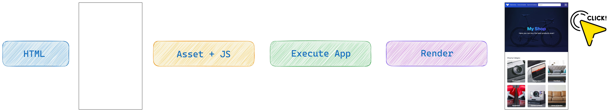
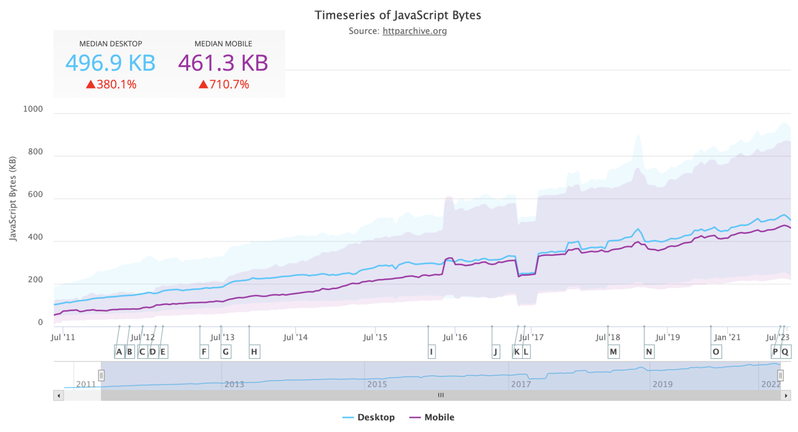

# Frontend Architectures

Starting with a greenfield application often presents a fortunate opportunity because it allows for the imagination to run wild. It's a chance to make decisions and consider what might be best for the application. Is this or that architecture better? How can the application be distributed to everyone quickly and easily? It's easy to get caught up in the moment's hype, but the best thing to do in these moments is to try to stay calm and put all choices on the table.

Listing the requirements to be met is certainly the first step to take. Who are the users? Will they use mobile or desktop? In what environmental conditions are they required to use the application? For example, suppose the typical platform user uses the app in an area with zero connectivity. In that case, this difficulty must be considered and, therefore, cannot be forgotten.

Once all these requirements are clear, the next step is to make the list of frontend architectures that allow for achieving the desired results within the deadlines imposed by the project. But what are the different architectures that can be chosen? The most important ones will be explained. This list will be very useful for aligning some terms and considerations that will be used throughout this book. The book's main topic is Qwik, but before learning to run, it's important to know how to walk.

## Client Side Rendering (CSR)

Client Side Rendering is the process of sending to the browser a series of HTML, CSS and JS files with our logic and these files are the result of the compiling code we have written and the libraries we have used.
Single-Page applications (SPA) use this process and have been in vogue for many years in the frontend world starting with AngularJS way back in 2010 and then continuing with Angular and React and now many other frameworks. AngularJS was a game changer for frontend development because it replaced a way of developing applications where developer experience was sorely lacking.

> Developer Experience (DX): We have already heard and digested the term user experience (UX) and it is the experience you have when using a product, service, or any system. This experience is based on the ease of use, its usefulness, and the perception we have of its use. If these users are developers then we can talk about developer experience (DX). Organizations that offer products, tools, or services for developers aim to improve DX. This particular attention leads to happy and loyal developers who will continue to use the products, tools, or services. This will also bring a further benefit because it will create word of mouth which will positively benefit and increase its use. A clear example is the presence of good documentation, easy to understand and resolves doubts very quickly.

At the time it was very difficult to write and maintain applications because vanilla JavaScript was used versus a more modern TypeScript used today.
Using JavaScript in large applications used to be the norm, but thinking back to the effort required to write such applications at the time and how easily bugs could be introduced without obviously knowing makes me smile. But let's not waste time talking and get back to the topic of this paragraph, Client Side Rendering.
The more features we add to our Single-page application, the larger the JS files will be and will affect the loading speed.
There is a clear direct correlation between functionality and required JavaScript, the bigger your app gets, the more JavaScript it will need at the expense of performance.

> Libraries can be included to take advantage of functions written by third parties.
> e.g., If I want to be able to easily manipulate dates and time zones, instead of writing all the logic to handle the various cases, I can download and use the DayJS library distributed via NPM, which is the repository of all the JavaScript libraries and more.

However, it's useful to know that the more dependencies included in the project, the more the size of the application bundle increases because the functionality is being added to the code base. Therefore, one of the best practices to apply is to keep unnecessary dependencies to a minimum. The compilation process will allow for optimizing and packaging the application code of the SPA and obtaining files that can be loaded when the application starts.

A usually very concise HTML file (index.html) will be produced, which, via script tags, will include all the JS and CSS necessary to display and make the application interactive.

This is an example of a real-world SPA index.html file. It can be noticed that it will appear as a blank page because there are no things to display.

```html
<!DOCTYPE html>
<html lang="en">
  <head>
    <meta charset="utf-8" />
    <title>...</title>
    <meta
      name="viewport"
      content="width=device-width, initial-scale=1.0, maximum-scale=1.0, user-scalable=no, viewport-fit=cover"
    />
    <link
      rel="icon"
      type="image/x-icon"
      href="favicon.ico"
    />
    <meta name="description" content="..." />
    <link rel="stylesheet" href="theme.2780d3.css" />
    <link rel="stylesheet" href="styles.4e229bd3f.css" />
  </head>
  <body>
    <script
      type="text/javascript"
      src="runtime.7c545.js"
    ></script>
    <script
      type="text/javascript"
      src="polyfills.be8befaa.js"
    ></script>
    <script
      type="text/javascript"
      src="scripts.859e944f8beb.js"
    ></script>
    <script
      type="text/javascript"
      src="main.29d35dbd.js"
    ></script>
  </body>
</html>
```

> An SPA application's build produces static files; therefore, our application can be easily served with CDN-based solutions.

Here, the CSR rendering process can be seen.



Steps:

- Download the HTML
- Via the links in the HTML, download the assets and the JavaScript
- Run JavaScript
- Render the application
- Finally, the user can click

With this approach, the application will immediately download everything it needs, and all the logic will be available in advance, but this type of process has limitations that must be taken into account. The first limit is related to performance because the application will be downloaded entirely into the browser's memory, and therefore, the initial waiting times, before being able to interact with the platform, will require a few seconds of waiting for larger applications. When downloading the app, the user will only see a blank page until it is fully loaded, not the best user experience. Frameworks have introduced a lazy loading feature over the years to avoid this problem. Let's imagine an application needs to be optimized as a bundle because there are a lot of features and js to load. As developers, the code can be modified to isolate a certain part at the module level; for example, the user profile section can be isolated to load it only if the user wants to access that section.

> This optimization is left to the developer, but at least it allows us to limit a known CSR problem.

On the other hand, having all the application code in memory, however, ensures that navigation through the application paths can be done very quickly and fluidly. For example, a global state of the application, with [Redux](https://redux.js.org/) can also always be kept in memory because the page is never reloaded. After all, routing is client-side.



This graph shows the average amount of Javascript present on the page over time, and it can be seen that in a few years, the growth has been considerable. The biggest problem is the devices and conditions of the users. They generally do not keep up with this trend. Every year, there are new and more powerful devices, but the dominant trend for devices worldwide is to be cheaper, not better performing. Precisely for this reason, there has been a paradigm shift in developing medium/large-sized applications to the `Multi page application` approach.

Another factor to consider is whether or not the site needs to be indexed by search engines. By their nature, SPAs are not easily indexable because, as mentioned above, they have very basic initial HTML, and all the logic is in the JavaScript bundle. The crawler, usually in a hurry (has a time limit for each indexing), will have to execute the JavaScript to render the application. Since this is an expensive operation in terms of time and bandwidth, an optimal result will not be achieved. To overcome this problem, many companies provide different content based on the user agent. If it is recognized that the request comes from the crawler, the content is returned with static HTML; on the other hand, if it's a normal request, the standard process is followed. Therefore, if the goal is to create an easily indexable web application, the CSR approach is to be avoided.

## Multi Page Application (MPA)

The multi-page application architecture can be used to solve the problems of SEO and slow loading with white pages. In fact, with this approach, it's a return to the beginnings of web applications where both Client and Server are constantly communicating to deliver pages as quickly as possible. Respond with HTML pages rich in SEO content and eliminate that annoying blank page that characterizes the CSR approach when the entire application is loaded into memory. The code executed by the server and the code executed on the client side can also be split. The database can then be queried securely on the server side using secrets such as connecting to external databases or services. The frameworks that allow for the use of the MPA approach guarantee that the server-side code will never be sent to the browser to guarantee its secrecy.

- Static Site Generation (SSG)

In this type of approach, the application is developed normally, but the output of the build procedure produces static files that can be statically hosted because each time an app is built, a series of pages are created. These files are then served to users, meaning the server does not have to do additional work when a user visits the website. The pages can then be served via CDN and have further control over the entire flow.

> A content delivery network (CDN) is a group of servers distributed across multiple geographic areas that accelerates the delivery of web content closer to users' geographic locations. Data centers around the world use caching, a process that temporarily stores copies of files to help you access content on the Internet more quickly from a web-enabled device or browser via a server near you. CDNs cache content close to your physical location. This content is static and can be images, videos or, more generally, any type of file.
> Imagine that a CDN is like a supermarket; having a supermarket on every corner makes shopping faster and more efficient and also reduces the possibility of queuing at the checkout.

This approach is great for optimizing the response time of the application. It is easy to host because the application is a set of static files, but there is a disadvantage regarding the data used. Let's imagine there is a page with a list of users. If static generation is performed, the users present in the list will be those available during compilation. Once the page's HTML has been produced and written to a static file, it is immutable. So, if two more users are added to the database, they will not be present unless a new compilation is launched. A very frequent use case of this architecture is blogs. Once the page with the article has been produced, it will hardly change over time. Therefore, there is extreme ease of implementation and excellent scalability with CDN. However, it is known that if the data changes quickly over time, a new build would have to be launched to produce the new updated files. In this case, it is not the best; there is certainly something better.

- Server-side rendering (SSR)

Server-side rendering involves generating HTML for each page on the server when a user requests it. Also, with this way of writing applications, the server and client are normally developed by dividing what the server is and what the client is. Rendering happens at the time of the request, and everything happens on the server side and never runs in the browser. Therefore, unlike SSG, where the page is already rendered on the server waiting to be served to the client, SSR renders the page on the server after receiving a request. SSR is ideal for websites with dynamic or personalized content that changes frequently, such as e-commerce websites or social media platforms. So with SSR, there is an alternative to SSG, and rapidly changing data is resolved very well. In terms of costs, an up-and-running server is needed, or Lambda functions need to be used, so compared to the static approach, higher costs than a static solution will have to be incurred.

> Lambda Function is a cloud computing service that, without the need to configure servers or network components, allows you to execute code in response to events which, in the case of web applications, are HTTP requests. In practice, every time we request a page with an HTTP request, a Lambda function will be called which will return the requested page.

Thanks to this approach we can have several advantages:

- reduced costs: because payment will only be for the actual execution time of the code and only when it is executed
- serverless: it is not necessary to have an always active server because everything will be based on cloud infrastructure
- autoscaling: automatic instantiation of resources based on requests received

With the MPA approach, it should be known that the pages that are sent to the browser are rich in content, faithfully reflect the page of the application, and can contain the necessary metadata to be indexed correctly without any difficulty. However, these pages are HTML code with no interactivity, and therefore, a hydration process is required to make them responsive to user events (e.g., clicking a button). The `Hydration` process will be looked at in a while.

- Incremental Static Regeneration (ISR)

This technique was created to overcome the slowness of the real-time generation of the pages in SSR mode because it allows for defining a revalidation period for each page, indicating the frequency with which the page must be regenerated in the background. A page is then generated, which will be used to respond to requests quickly; behind the scenes, the server will prepare the updated version, which will then replace the previous one in the cache. The advantages of this approach are the possibility of updating pages dynamically by finding the right balance between response times and dynamic data.

SEO also benefits from this because the pages are easily indexable by search engines so excellent indexing can be guaranteed. The developer's experience is good because it is usually to carry out this type of configuration. Specific APIs facilitate this type of setting so that the focus can be on the functions and not on the configuration. The server management costs also benefit because the resources used for each request are optimized.

As in all choices, there are compromises; in fact, invalidating the cache requires correct management, and whoever develops the application must carefully evaluate how to invalidate the cache if necessary because otherwise, there is a risk of providing content that is not updated correctly. Another thing to take into consideration is the load of the server; if many pages require frequent regeneration, then there could be an overload of resources on the server side; at this point, it would be better to opt for a classic SSR instead of the ISR which as it has been understood is a cross between SSG and SSR.
