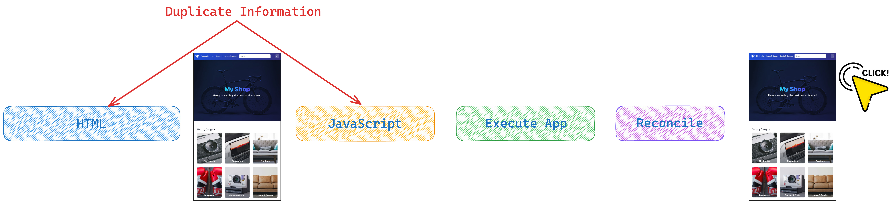
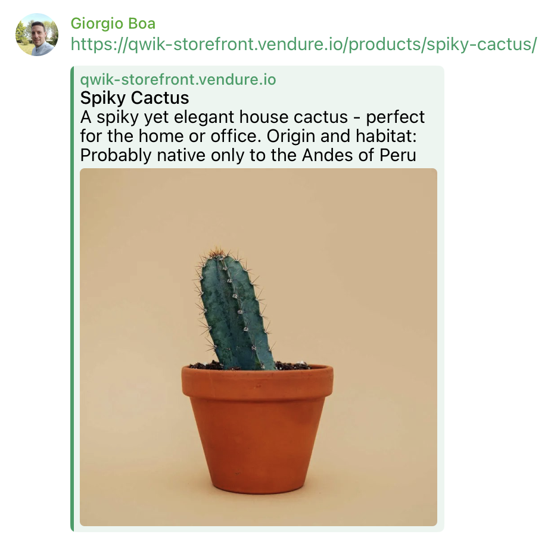
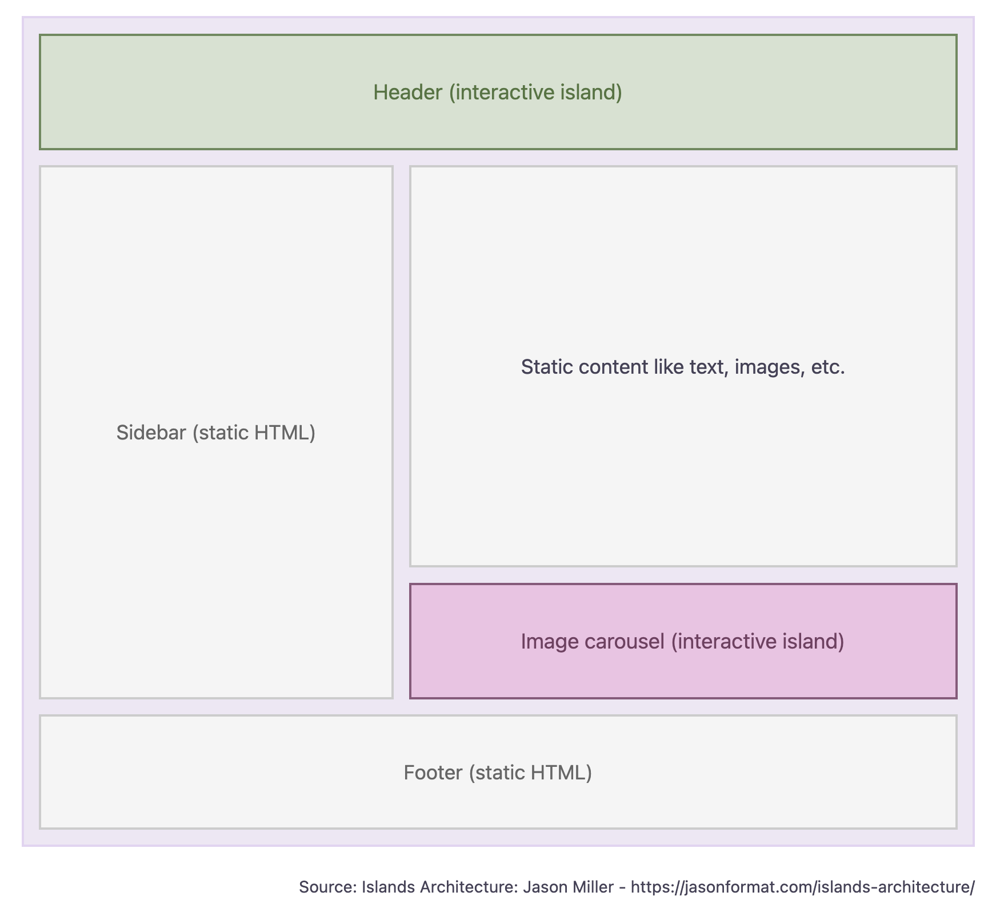

# Hydration

Hydration is a process that occurs on the client side and is linked to the generation of pages on the server side. It is used to recreate the state of the application (e.g., the state of the open/closed menu) and the interactivity of the HTML rendered by the server (e.g., the listener of events on the buttons to make them interactive). The server generates the page server-side to support SEO and sends this page in HTML and CSS to the browser. Then, an additional process, Hydration, is needed to add the application state.

To carry out the Hydration process, all input information is needed, such as the data displayed on the page rather than the number of open orders that need to be processed. This type of behavior is easy to notice because, in the Network tab of the browser, data being sent from the server to the client can be seen to ensure this mechanism. This creates network overhead just to perform this state reconciliation process, which is a problem and a waste of resources.

Imagine a header with the title of the page and a button that opens and closes the side menu. The page sent from the server to the browser will contain the page's title and the menu's state, which will be used by the application to show whether the menu is open or closed. This gives a significant advantage for SEO. However, once the page is rendered, it will begin the hydration process, which will calculate the state of the menu and attach the listener to the menu button to allow the application to become interactive.

Here, the hydration rendering process can be seen.



Steps:

- Immediately download the HTML with the information to show a snapshot of the application. It is larger than the one previously seen in the Single Page Application.
- Then, download the JavaScript needed to perform the hydration process.
- Run the application.
- There is the Reconciliation phase, which recreates the state.
- Finally, the application is interactive, and it can be clicked.

Note that JavaScript is used twice, once to create the HTML and the other to perform the Hydration. If the word "My Shop" is searched within the files produced by the build, this word will be found twice in the HTML and JavaScript sent to the browser because all the information is used to recreate the state. So, the process seems faster than a single-page application because there is faster feedback, but more time passes before interaction with the app is possible, and therefore, in the end, it's slower.

However, the end users of the application are now able to see and read the contents even if they are not completely interactive because, as mentioned, server-side rendering eliminates the problem of the blank page at startup (typical of the CSR approach) and this is all to the advantage of search engines and social media crawlers. It is possible to add some extra information to the static page sent by the server, which allows the links to preview the contents. So, imagine sending a link to an article that has been read to an acquaintance; this link, referring to a page containing this extra information, will be displayed with a preview of the article itself to offer a superior user experience.



## Island architecture

To overcome the costly waste of resources that hydration causes, a solution was sought by splitting and postponing the hydration process; this architecture is also called Partial hydration.
The central point of this architecture is the concept of an island because the HTML pages will be rendered on the server, and only in the points where there is dynamism will an island be defined.

There can be multiple islands within the same page; these islands are like placeholders, which will then be hydrated on the client side independently, thanks to the HTML and the state that the server provides.
So, in fact, the Hydration problem is being circumvented only by splitting the process into multiple independent operations.

In general, the applications that benefit from this approach are mostly static, with some points where there is dynamism; blogs, news sites, and showcase sites are the ideal use cases for this architecture because, all in all, it does not bring disadvantages.
By doing this, the static content does not require rework because it does not support events, but for example, the buttons, search bar, and menu must receive special treatment to become interactive and require the input state provided by the server for rehydration and event management.



This is just an example, but to get good results we need to think about how to split our app.
Here, through the appropriate APIs, some frameworks allow us to render our HTML page without interactivity and to intelligently hydrate only parts of our page. Let's imagine we have a part of the page outside the initial viewport, for this section, it is possible to define an island and postpone the hydration process until it is visible. [Astro](https://astro.build/) for example, one of the frameworks that supports the Island architecture, offers us various directives to command Hydration at a time we see fit.

Example:

```typescript
<BuyButton client:load />
```

- **client:load**: Based on priority, as soon as possible.
- **client:idle**: According to priority, calmly.
- **client:visible**: Based on whether they are visible or not.
- **client:media**: Based on screen size.
- **client:only**: Skip HTML server rendering and render only on the client.

> `client:only` is similar to `client:load` in that it loads, renders, and hydrates the component immediately on page load.

In the previous graph, we can see that the islands are independent silos and the borderline is clear and well delineated, but once we have all these islands on our page we will also have to share some information between islands. For example, let's think about wanting to select one or more orders from a list, and in the header we want to display the sum of all the selected orders. If to optimize the rendering we have separated these two components into islands we must find a way to make them communicate. If we want to co-share the state between islands, the solution that is used as a standard is to share the information via a state external to the islands. In this way, the external source will act as a source of truth to keep the information, but in my opinion, it is not an optimal solution. The first problem I see is that we have to use an external library to manage the state, as a second thing we are adding a layer and further boilerplate code for such a simple and certainly necessary operation in most applications.
So in my opinion this architecture tries to solve the hydration problem but introduces other limitations which then fall on the shoulders of the developers who have to fight these problems.
