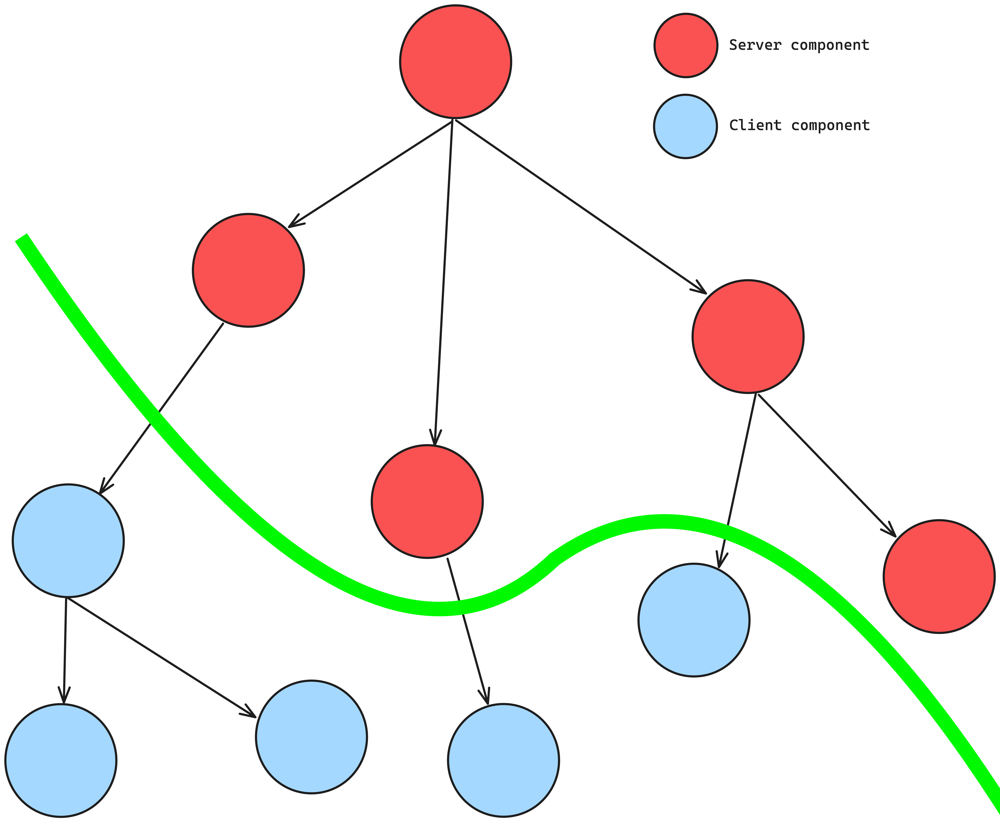

# React Server Component

An evolution of the island architecture is the introduction of React server components. This approach is specific to React and aims to limit and further optimize the hydration process by defining server and client components.

## Server components

There are some advantages to using Server components because we can for example perform data retrieval securely on the server side, and communicate with tokens and API keys, without the risk of exposing them to the client.
Being able to read the information on the server side certainly also guarantees us greater speed and also allows us to make server-to-server calls which overcome a whole series of problems that could be encountered by making the call on the client side. Furthermore, our business logic can remain on the server without exposing it to the client, particular algorithms or discount calculations for certain customer groups can remain safe from prying eyes.
The size of the Javascript bundle that the server and client exchange also benefits from this approach and all this benefits users with less powerful devices or slower internet since the client does not have to download, parse and execute any JavaScript for the server components.
We are still talking about server-side rendering so our application will be optimized for search engines and will be highly shareable on social networks. As seen previously, bots can analyze the page to generate social card previews for our pages.
It is also possible to perform `streaming` of our component, in fact with this technique it is possible to divide the transmission to the client of the component into blocks and transmit them as soon as they are ready. This technique benefits the user who sees the page in advance without having to wait for the entire page to be rendered on the server. For example, if a section of our page requires a database query that we know is slower, we can postpone sending the section just mentioned and render the rest of the information on the client so the end-user has visibility of the page. [Next.js](https://nextjs.org/) is one of the frameworks that has implemented this architecture and has chosen to support server components by default so any new component created will be a Server component.

## Client components

Compared to server components, these components are interactive and have the advantage that they can use state, effects and events because the hydration process gives them interactivity.
These features allow us to update the user interface and provide immediate feedback on our applications.
Another advantage is that of being able to exploit the libraries that require the browser's API, the `document`, `window` and other objects are only present in the "client world" so if the libraries we use to make use of them, client component is the choice to focus on. Furthermore, if we have to use the browser API to read/write on localstorage or use more advanced APIs such as the camera, geolocation and more, we are forced to use the client component for the reasons seen previously. [Next.js](https://nextjs.org/) is one of the frameworks that has implemented this architecture and to declare Client components it is necessary to add the `use client` directive of React in the first line of each component, to instruct the framework of our intention. `use client` creates a boundary between server and client, this means that once the boundary is crossed by declaring `use client` all modules imported from it, including child components, are considered part of the client package.
So once we have moved to the client side we can no longer import server components, we are forced to continue on the client side.

So, as developers, decisions need to be made about which components are servers and which are clients.
With this type of architecture, it can be seen that the boundary between the Server Component and the Client Component is not a straight line but a curved line that can be shaped at will according to the commands.
If a server component requires dynamism one day, it will be necessary to go and refactor the architecture. For example, the Footer component, which is initially static but then requires dynamism with the various evolutions because the subscription to the newsletter or the "Contact Us" section is inserted.
