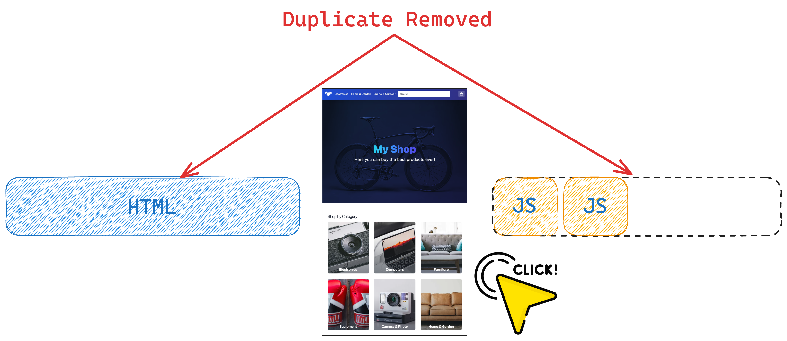

# Resumability, the Qwik way

Different approaches and mechanisms have been observed to manage the rendering of applications. However, if attention has been paid to the various solutions, it will certainly have been noticed that none of them solve all the problems. There is the CSR, which has the problem of an initial bundle to download before being able to interact with the application. On the other hand, server-side rendering with all its facets: SSG, SSR, and ISR is also present. Not to mention the hydration problem common to almost all frameworks available in the frontend landscape, with some trying to optimize it because it has been realized that it is a process greedy for resources and overheads. It was deliberately said "almost all" because Qwik was born to solve this problem once and for all with a new mental model, Resumability.
This innovative approach reverses the way of thinking, starting from the events triggered by the user and not from the continuous search to recreate the application state.

Qwik is an SSR framework, but the CSR approach can also be used.
In the SSR mode, the rendering always starts with a static HTML page served by the server with inline CSS and only 1KB of JavaScript injected at the last part of the HTML to ensure maximum performance.
This small JavaScript code will intercept any events coming from outside (user interactions) and react accordingly, so a global event listener is attached to that.

Here, the Resumability rendering process can be seen.

Steps:

- The HTML with the information to show a snapshot of the application is immediately downloaded. It is larger than the one previously seen in the Single Page Application. This HTML also contains some extra information, including the serialized application state.
- The page is interactive straight away, waiting for events triggered by the user. So, on click, thanks to the fact that serialized information is sent in the HTML, the framework can execute only the JavaScript necessary for that specific action to avoid the massive download of the entire JavaScript bundle upfront.
  There are no duplicate calculations, but better results with a cleaner process.

An excellent result can be observed!
This approach will be clarified in the next chapter because this innovative way makes Qwik the framework for future generations.
