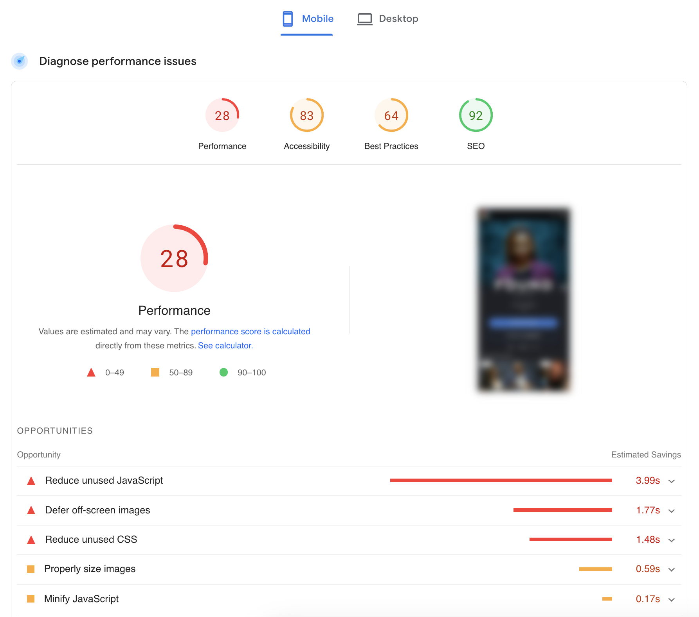
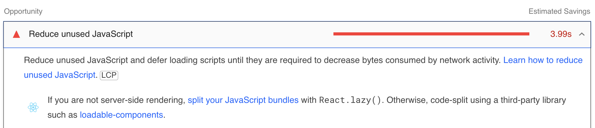

# Qwik, the Framework Built on Top of Closure-Extraction

In the previous chapter, it was learned that Qwik is unique compared to other frameworks. This framework can send the browser a static page consisting only of HTML and CSS and 1KB of JavaScript. This almost magically makes the application interactive immediately upon startup. However, it's worth delving a little deeper into this because, behind every magic trick, there's a trick. With modern connections, a page containing HTML and CSS is undoubtedly efficient and speedy. It would be the ideal situation, but unfortunately, interactivity is needed, which requires JavaScript.

JavaScript was pointed out as it seems to be the weak point in creating quality applications. This can be analyzed using [pagespeed](https://pagespeed.web.dev/), a reference site offered by Google to analyze web applications. Google has been actively working for years to raise awareness among developers about optimizing web applications to improve the ecosystem and make the web a better place. Google, also the developer of the Chrome browser, has created a series of tools and DevTools to help developers improve their applications and code.

The results of a completely random site can be analyzed by focusing on pagespeed. A screenshot of a site chosen at random will be provided, but any favorite site can be tested and the results compared. Just insert the site in this URL: https://pagespeed.web.dev/analysis?url=`your-website-here` to start the analysis. After a few seconds, the result will be available.

Here is the report:

The analyses for mobile devices, which usually have lower results than desktop ones, are being looked at. All references to the site have been deliberately removed, and the image showing the site preview has been blurred to avoid pointing fingers. However, it can be revealed that the site belongs to a very famous American television company. The results are likely no better unless the check was run on a site where Qwik is present, for example, [qwik.dev](https://pagespeed.web.dev/analysis?url=https://qwik.dev/). It is suggested that this test be run to see the differences.

In the first part of the results, there are several things regarding the Core Web Vitals that were deliberately not included in the image because these metrics will be analyzed in the following chapters. For now, the focus is on the advice that the analysis offers. Specifically, what seems to be the biggest problem: "Reduce unused JavaScript", was wanted to be discussed.

The introductory theme of this chapter, dear JavaScript, which creates slowness in applications, is back. If the advice is clicked on to read further details, this description can be seen.

According to this advice, the JavaScript must be reduced and, if possible, use `React.lazy()`. The tool has analyzed the page, understood the technology used, and is giving targeted advice on the framework. But how can the JavaScript sent be limited if the framework itself requires it to run Hydration or the processes seen in the previous chapter? How can developers be blamed for the inefficiency caused by frameworks?

Methods can be invented to limit the problem, but don't worry; the problem is not with the developers. It is hoped that this comparison has provided reassurance in this regard.
