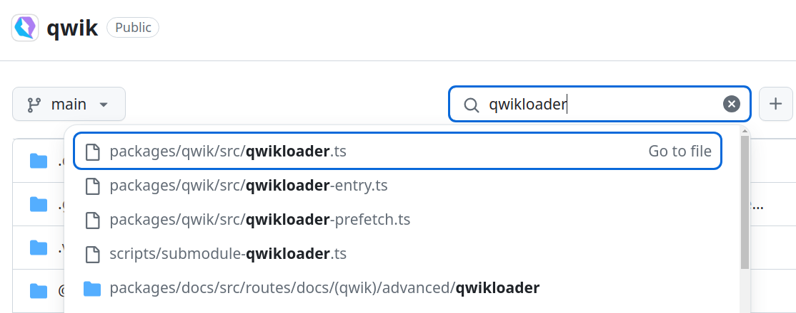
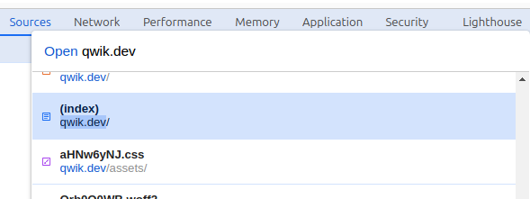
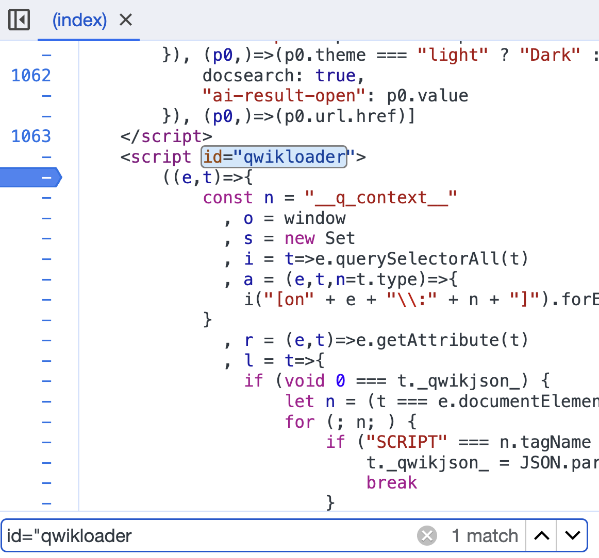
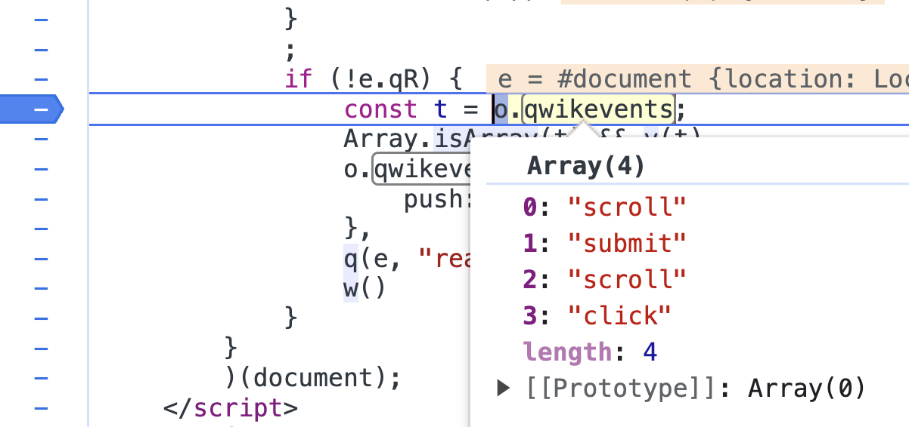
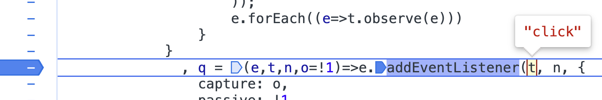
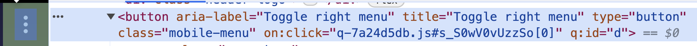
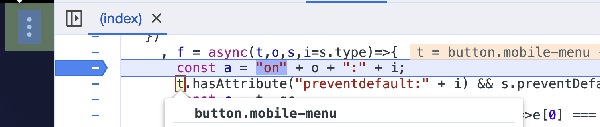
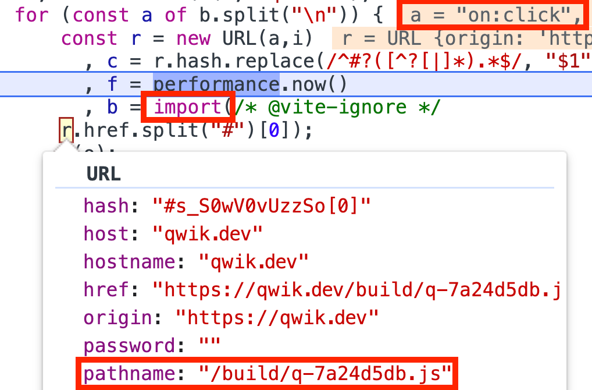
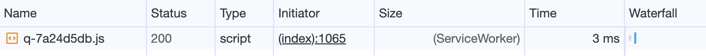

# Resumability

As previously mentioned, Qwik does not send JavaScript at startup; it only sends HTML and CSS. Upon launching the analysis on the site [qwik.dev](https://pagespeed.web.dev/analysis?url=https://qwik.dev/), the enormous differences with other approaches to the rendering process become apparent.
To be honest, as has been previously stated, only 1KB of Javascript is sent. This script is inserted at the end of the page because the browser parses the HTML top-down and tries to resolve the various links, scripts, rendering of the HTML, and all the other tasks that the browser is asked to perform. This script is called [qwikloader](https://qwik.dev/docs/advanced/qwikloader/) and is recognizable because, by inspecting the page, it can be seen.

## Qwik Loader

Upon analyzing the page of a Qwik application (Chrome Dev Tools --> Element Tab), the source code can be seen, and scrolling to the bottom of the page reveals this script.

```HTML
<script id="qwikloader">
((doc) => {
  [...]
})(document);
</script>
```

Inside this script, there is vanilla JavaScript code that contains a function [IIFE](https://developer.mozilla.org/en-US/docs/Glossary/IIFE), which, by its nature, is immediately invoked. It is used to make the application immediately ready to be interactive, and it knows how to download the rest of the application on an as-needed basis. Here's the magic trick that was being sought, but this is just the tip of the iceberg. Let's go deeper.

> IIFE (Immediately Invoked Function Expression): It is a design pattern that is also known as a Self-Executing Anonymous Function and contains two major parts:
>
> 1. The first is the anonymous function with lexical scope enclosed within the Grouping Operator (). This prevents accessing variables within the IIFE idiom as well as polluting the global scope.
> 2. The second part creates the immediately invoked function expression () through which the JavaScript engine will directly interpret the function.
>
> Source: [MDN Web Docs Glossary](https://developer.mozilla.org/en-US/docs/Glossary/IIFE)

Ok, the code is minified, and it's not clear what it does, but by analyzing this code, it will be possible to fully understand the magic trick that Qwik is capable of doing.
Well, there are at least two paths that can be taken. The simplest is to go to the Qwik repository and search for the file that declares this famous script called `qwikloader` within the framework.
The project is open-source, so all the material needed to search and find this file is available. Starting from the root of the project, it's possible to simply try luck and search for a file called qwikloader; let's see if today is a lucky day.



Fortunately, now and then things go in the right direction and in fact, the first file is exactly what we need.
We can read the code and try to understand what is being executed, we have more readable variables because the code here is not minified, we also have TypeScript which helps us understand the code better, but we cannot see the code in action and therefore it's difficult to follow the flow of the code and try to imagine how it will work in the browser. So we can try the other method that immediately comes to mind, let's try to insert a breakpoint in our browser and with the Chrome DevTools we go forward step by step to try to understand in broad terms what this piece of code does.

The same can be done to actively follow the debugging in the [Qwik documentation site](https://qwik.dev/).
First, it's necessary to open the DevTools; it's possible to search for `qwik.dev` and look for the element with `(index)` using the "Open file" function.



Once the element is found, it can be selected, and now all that's left is to search for the string `id="qwikloader"` to finally be able to insert a breakpoint on the code so live debugging can be performed.



Let's refresh the page. Now, everything is ready to investigate the code.
By inspecting the code, this point of code can be debugged.

```
const t = o.qwikevents;
```



Here, it can be seen that Qwik knows in advance which events can be executed within the page because some logic has been executed on the server side to create the page. It then takes advantage of the work done on the server side and passes the information into the browser to create a list of events. This list is then used to create event listeners for both the `window` and `document` objects.



Excellent, so it's possible to capture the events that happen on the page. So now, any user input is being waited for. But how do you understand where it was clicked?
If the HTML is analyzed, it will be possible to find special attributes that Qwik adds to the HTML during the build phase. It might be thought that it will weigh everything down, but the weight is negligible compared to other traditional methods that download all the JavaScript upfront.

It can be seen that in the "Menu" button, there is a non-standard attribute `on:click="...."`.



Let's place an additional breakpoint on this line of code `const a = "on" + o + ":" + i;` and click on the "Menu" button. Here, it can be seen that the variable `t` is the target of the event. So, the user event was captured via the global event listener, and now some logic is being executed managing to reference the element that received the user's action.



If the debugging is continued, it can be seen that the value of the `on:click` attribute will be read. The value of this attribute is the JavaScript file to be executed containing the logic that will animate the application.



It was purposely said to execute because the import (see image) will perform an HTTP call to obtain that specific file path, but before downloading the file from the server, it will pass through a service worker that is instantiated at application startup to preload all possible JavaScript files that the application can use. To leave the browser's main thread free to render the application, behind the scenes, a service worker preloads the Javascript files to have them immediately available. If the network tab is looked at, confirmation of what was said can be found.



In the `size` column (ServiceWorker), it can be seen, and as execution times of the HTTP call 3ms can be seen, it is clear that it is a resource already available. The file will be executed, and the code will continue with its reasoning.
It is very important to note that in that file, there is only the logic necessary to complete the execution of the click made by the user.

But who produces this division into small independent files? Qwik performs this division into files during the build phase of the application by the `Optimizer`, which will be explored in the next chapter. In fact, as developers, there's no need to worry about anything; the application is written normally like any other framework.
It is necessary to take a step back and understand how one can differentiate the code that must be executed on the server and what will be executed on the client side to understand in detail how the optimizer can perform this magic.
