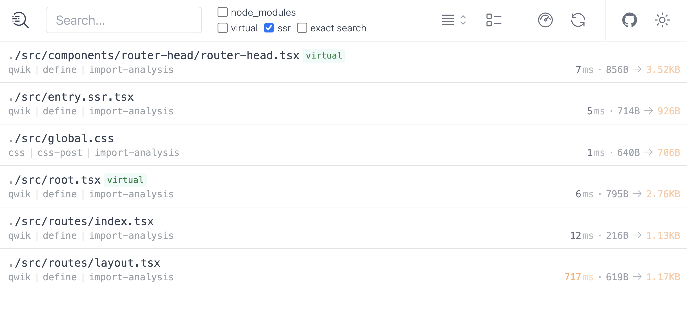
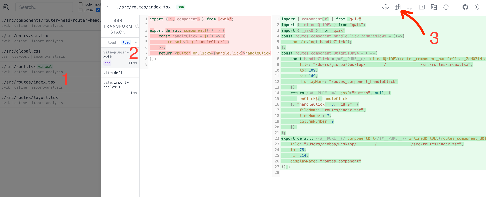
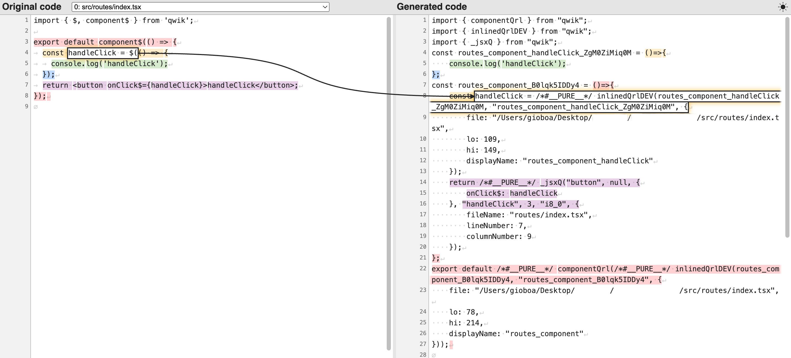
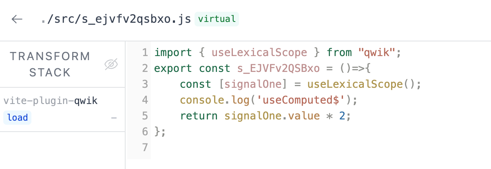
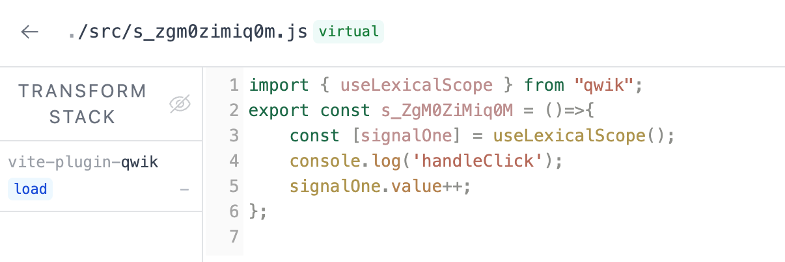
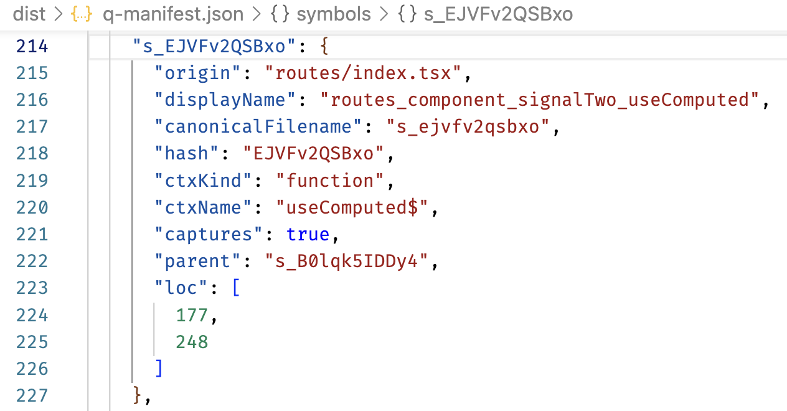
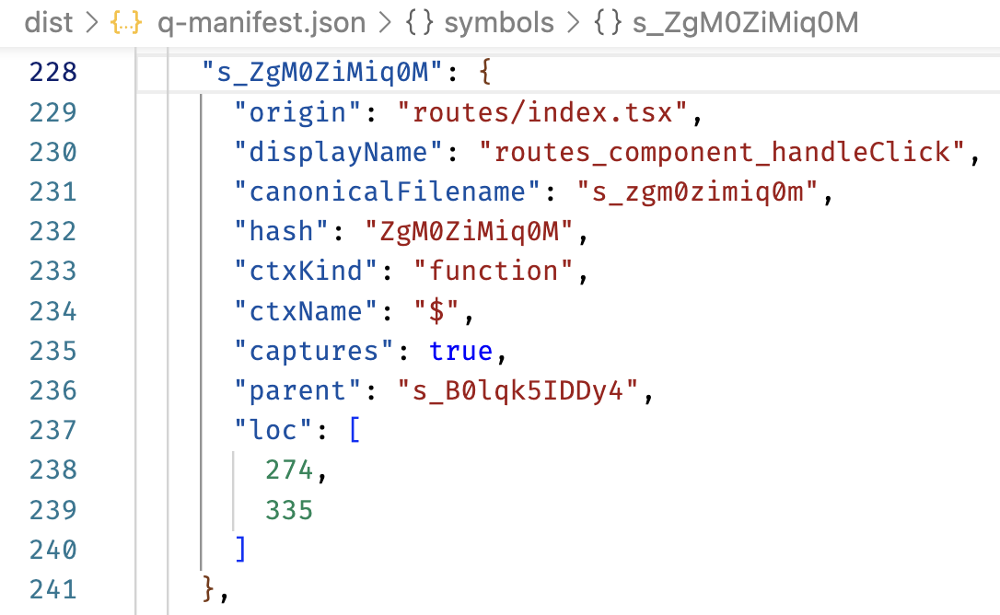
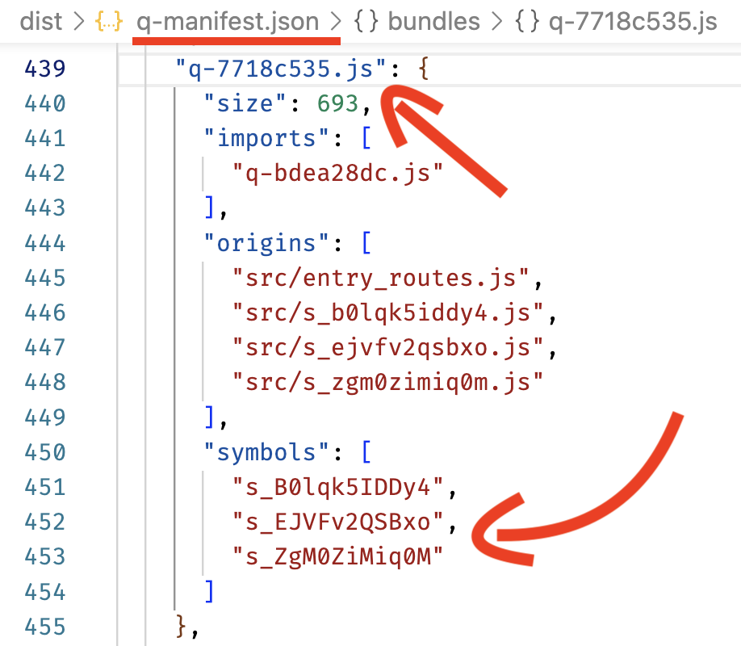
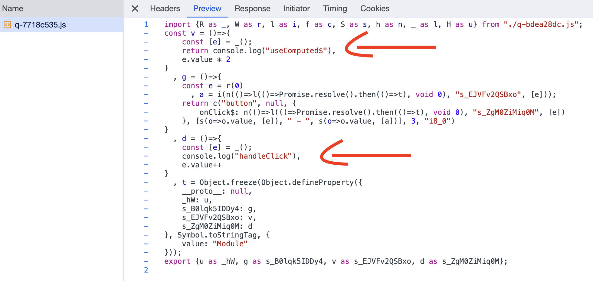
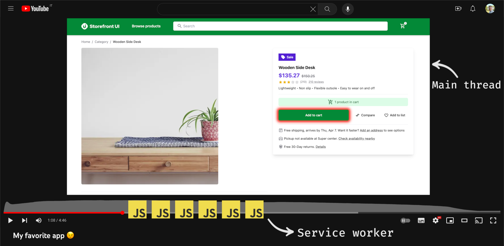

# Qwik compilation Process

You have seen how to create Vite plugins, and in fact, behind the scenes, at the time of compilation, optimization takes place and prepares our code to be used in the Resumability architecture.
To perform this optimization, the Qwik team built `Qwik Optimizer` in Rust using [SWC](https://swc.rs) (stands for Speedy Web Compiler), the same technology used by [TurboBuild](https://turbo.build/), to perform advanced optimizations without sacrificing build times.
SWC accepts any JavaScript or TypeScript files using modern JavaScript features and outputs valid code that is supported by all major browsers; it's fast because it is Rust-based. If you were to do the same computations with JavaScript, you would run into the problem that it is single-threaded and is not a good place to do heavy computation. Additionally, the Rust and SWC communities are growing, and you can easily find support, so it's a plus.
So, `Qwik Optimizer` looks for `$` and applies a transformation that extracts the expression into a loadable and importable symbol.

Is there a way to see how this transformation occurs in the Vite process?
You can install a special plugin, `vite-plugin-inspect,` to be able to analyze what Vite does behind the scenes; this is also very useful when you are developing a new plugin because it is difficult to understand the build process without being able to see step by step what happens behind the scenes.
To activate the plugin, it is very simple; as you saw before, just add it to the configuration as follows.

```typescript
import Inspect from 'vite-plugin-inspect';

export default defineConfig(() => {
  return {
    plugins: [..., Inspect()],
  };
});
```

So, activate it by adding `Inspect()` inside the dependencies array. This plugin, if not configured differently, will start when you launch the `dev` process, and in addition to the application, an interactive page will also be served, usually at the address `localhost:5173/__inspect/` to inspect the modules.

Let's see the component below using this plugin and try to analyze the information it provides us.

FILE: `./src/routes/index.tsx`

```typescript
export default component$(() => {
  const handleClick = $(() => {
    console.log("handleClick");
  });
  return (
    <button onClick$={handleClick}>handleClick</button>
  );
});
```

Here are the screens of the build steps.





**Step 1**: Clicking on the file `./src/routes/index.tsx` opens a panel displaying the transformation steps that have been performed.

**Step 2**: One of the steps is `vite-plugin-qwik`, which is responsible for the optimizations performed by the Qwik plugin, the `Optimizer`.

**Step 3**: Clicking on the icon provides a detailed analysis of how the file is optimized.



Here, you can see that our `handleClick` function has been extracted on an isolated symbol.

> `Symbols` are single lazy-loadable pieces in Qwik; as you saw earlier, when `$` is encountered, the optimizer creates a symbol.
> `Bundles` are JavaScript packages that can contain one or more symbols. These packages are files loaded by the service worker under the hood and imported when needed.

This is a simple example, but let's complicate things to see how Qwik groups `Symbols` into the `Bundles`. This serves to optimize the entire Resumability process and obtain maximum performance.

Let's take this slightly more complex example.

FILE: `./src/routes/index.tsx`

```typescript
export default component$(() => {
  const signalOne = useSignal(0);
  const signalTwo = useComputed$(() => {
    console.log("useComputed$");
    return signalOne.value * 2;
  });
  const handleClick = $(() => {
    console.log("handleClick");
    signalOne.value++;
  });
  return (
    <button onClick$={handleClick}>
      {signalOne.value} - {signalTwo.value}
    </button>
  );
});
```

In this example, you can see `signalOne` and `signalOne`, which are two reactive variables. Let's go into more detail about the `useSignal` and `useComputed$` API, but for now, you just need to know that every time `signalOne` changes, `signalTwo` changes automatically too.
Every time you click on the button, `signalOne` will be changed, and, as previously explained, `signalTwo` will also be changed.
These transformations and optimizations only take place in the build phase for production, and the code that is produced is minified, which is why two console.log were added to better understand how the functions are divided in the screenshots. This way, you will be able to trace the complete tour without too much difficulty.

Let's start by analyzing the two symbols using the `vite-plugin-inspect` tool seen previously.





The build process creates two constants, which are the example functions. In a previous chapter, this behavior was discussed in detail. The functions contain `useLexicalScope`, which is a function that restores the necessary variables from the closure.

The build process generates a `q-manifest.json` file that provides a detailed graph of the bundles and symbols. This data is used by the service worker to cache network requests for known bundles.

The output of the build contains our functions.





In fact, in this file, you will find `"displayName": "routes_component_signalTwo_useComputed"` and `"canonicalFilename": "s_ejvfv2qsbxo"` and you will therefore find confirmation of the name of the symbol and the name of the API and the variable in the `displayName` property.

If you analyze the `q-manifest.json` file more deeply, you will see the description of the `q-7718c535.js` bundle, which contains previously seen symbols within the `symbols` property.



When launching the application and inspecting the network requests in the browser's DevTools, you can observe that the specific file containing the two `symbols` is requested. You can also see the two `console.log` statements.



Although the explanation involved several steps, let's hope this detailed exploration has clarified the process. Thanks to the `Qwik Optimizer` developed by the Qwik team, you can write modern and readable code while the framework handles the optimization. It's pretty cool!

## Service Worker

The resumability technique relies on executing code related to user interactions. However, for the JavaScript code to be executed, it needs to be downloaded. This is where the Service Worker comes into play.

The Service Worker operates in a separate thread, allowing background actions to be performed without affecting the smoothness of the application. This is particularly useful because browsers are single-threaded.

In a Qwik app, the Service Worker's task is to preload all possible chunks that the user may request through their actions. It does this silently in the background. The code is already available in the browser's cache when the user interacts with the application. Instead of requesting it from a remote server, the code is ready to be executed.

For example, when the user clicks on a button for the first time, the request goes to the Service Worker, which returns the requested bundle (if the code is not in the cache, the request is sent to the network). The JavaScript bundle is then executed, and the application performs its logic.

Once a specific JavaScript related to an action has been executed, the code remains in memory and can be reused.

This process is similar to watching a YouTube video. When you watch a video, the rest of the video is downloaded in the background, ready to be played when needed. The Service Worker in the Resumability mental model performs a similar task. It prepares everything in the background to ensure optimal performance if further iterations are required.



Another task of the Service Worker is to minimize the number of requests by preloading bundles. It uses the `q-manifest.json` file mentioned earlier. The `manifest` represents a complete graph of symbols and corresponding blocks, including the correlation between them. When a symbol is preloaded, the Service Worker also preloads all other related symbols.

## Bundler configuration

One extremely powerful thing is to be able to change the way the framework builds our app via configuration. You usually have control over the application splitting because you use lazy loading, but this requires the developer to write dynamic imports and refactor the code.
With Qwik, if you want, you have full control of which symbol goes into which chunk, and no other framework can offer this granular possibility.
In fact, all `$` are potential lazy load locations; this `$` marker is used to inform the bundler on how to group the symbols.
Thanks to the fact that the Qwik team also develops the bundling and optimization part, different strategies can be set up to load our bundles.

## entryStrategy config

> Qwik's optimization and bundling strategy is already very good by default, but if you want full control over this process, you have the tools to do it.

In the Vite plugin `qwikVite()`, there is the `entryStrategy` parameter which can be changed if you wish to vary the optimization of the bundle.
The first thing you can think of is to go and set it to create a single file. On the other hand, you have always been used to running our entire app at a single time, so in Qwik, it would be a single bundle with all the symbols.
The problem with this approach is that you are loading more symbols than the client could request, you are effectively wasting bandwidth, and until the bundle has been loaded, you cannot execute any symbols.

> It should be noted that this approach might come in handy if you are in a no connectivity area because by loading the whole application, I'm able to use it, calls to external services permitting.
> Basically, I can create differently optimized applications just with a setting; for users with no connection, I will set the creation of a single file; for the others, instead, I will be able to benefit from the Resumability.

The opposite approach to the one just seen is to create a bundle for each symbol, which is the behavior that Qwik uses in development mode.
With this high fragmentation, however, the client has to make many more requests to load all the bundles, and this often leads to undesirable waterfall request behavior.

By default for production, the `"entryStrategy"` parameter is set to `smart` which allows Qwik to make heuristics about how symbols should be loaded lazily, but you can override this logic by providing a `manual` configuration like this one.
FILE: `vite.config.ts`

```typescript
export default defineConfig(() => {
  return {
    plugins: [
      qwikVite({
        entryStrategy: {
          type: "smart",
          manual: {
            ...{
              i1Cv0pYJNR0: "bundleA",
              "0vphQYqOdZI": "bundleA",
            },
            ...{
              vXb90XKAnjE: "bundleB",
              hYpp40gCb60: "bundleB",
            },
          },
        },
      }),
      //...
    ],
    // ...
  };
});
```

In this example, the configuration specifies which symbols go into `bundleA` and `bundleB`. However, manually configuring the bundles can be a tedious task. The optimal chunks depend on user behavior, which can only be observed over time. Therefore, Qwik Insight was created to collect anonymous usage information and refine the bundling strategy based on real user data.

## Qwik Insights

Qwik Insight is a feature that collects information about requested symbols, their priority, frequency, and associations. This data can be used to optimize the bundling strategy in subsequent builds. Qwik Insight can also track bundle priorities for each route, instructing the service worker on which files to download immediately.

The application needs to be wrapped with a special component that anonymously aggregates and collects the symbols that are used to activate Qwik Insights. The data is sent to a remote database for storage. In the build process, the Qwik Vite plugin can be configured to use the real user usage information.

FILE: `vite.config.ts`.

```typescript
export default defineConfig(async () => {
  return {
    plugins: [
      qwikInsights({
        publicApiKey: loadEnv("", ".", "")
          .PUBLIC_QWIK_INSIGHTS_KEY,
      }),
      //...
    ],
    // ...
  };
});
```

Qwik Insights can track the bundles needed for each route, providing insights into unused parts of the application or the effectiveness of specific buttons as calls to action. It can also preload all the required bundles from a specific link, ensuring instant browsing without waiting for file downloads.
