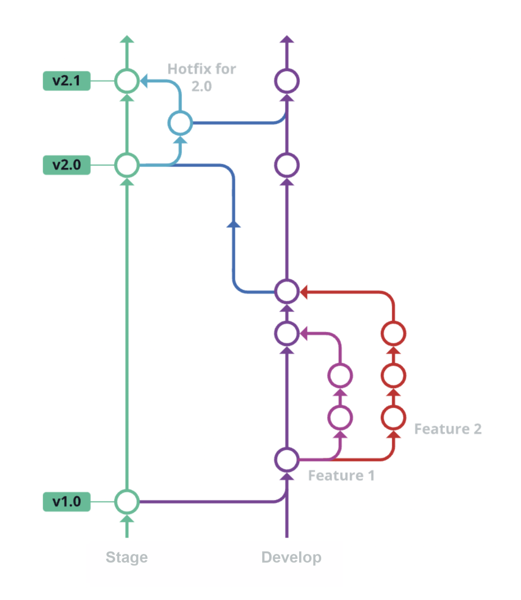
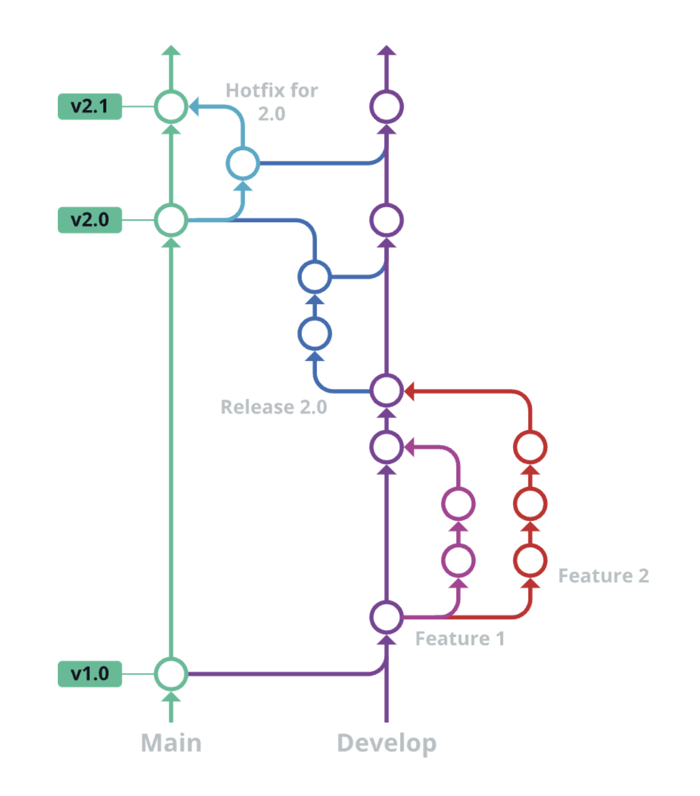

# Branching Strategies

Once the deployment system is set up, multiple environments will likely be needed to test the application. Cloud solution services already offer the possibility of creating multiple environments for deployments. Differentiation of code with environment variables is possible, so instead of using the production APIs, the test environment ones can be used. Keep in mind that this feature is also possible with other solutions. This guarantees security because, for example, users can be created and data modified without creating problems in the production environment, but everything can be tested in a protected environment, the test environment. The same thing can apply to the dev environment and other cases. With Cloud solutions, it takes just a few clicks, while recreating the various environments with the Virtual Private Server (VPS) or housing solution will require more effort. To test newly developed features, a development environment will be needed, but not only that, the ability to version code to keep track of all the changes will also be necessary.

Nowadays, practically everyone uses [Git](https://git-scm.com/doc) as a versioning method, and it has become the standard precisely because it is very simple and well-documented. This ensures that changes are never lost, and the author of a certain codebase line can be quickly identified. Furthermore, by versioning the code, the complete history of the application can be maintained. Going into detail about Git would take another book to delve deeper into the topic, but to better manage the fact that different versions of the application can be tested in various environments, it is important to know that there are different methods for organizing versioning of the projects. However, the focus needs to be on the term `branch` because it will be used often in the next paragraphs. When using `Git` to version code, a primary branch (typically named 'main') serves as the repository for all code changes. With each subsequent process, a chronological record of saved versions is established.

A branch is a parallel branch detached from the main one. This branch has a life of its own and is used to create new features or resolve bugs, in short, to make changes in the code. Imagine having to change the background color of a page from white to black. From the main branch, a new branch is created. On this branch, there will be the possibility to change the color and try the modification locally. As mentioned, this does not affect the main branch, which will remain with the old background color, i.e., white. Once the change is declared ok, the changes made can be merged into the main branch. This type of operation has allowed other developers to work in parallel because, in the meantime, other features have been precisely implemented. After all, this methodology facilitates collaboration on the same code base.

### GitHub Flow

Start by analyzing GitHub Flow, also called Trunk Based Development, a versioning flow that does not lend itself well to managing multiple branches, but precisely because of its simplicity, it is the right hook for subsequent flows.

This way of versioning code is certainly the simplest. As mentioned before, there is a main branch. For each feature that is requested, a branch `Feature 1`, `Feature 2`, `Feature ...` is created, the modification is implemented in an isolated and independent manner, and then once satisfied with the work, the changes can be included in the main branch. In the figure, it is seen that by doing so, development can occur in parallel, and the main branch will remain unchanged until the changes are transferred. So, with this approach, the main branch contains the code that is in production, and as changes are included, production will also be updated. The advantages of this way of working are simplicity and agility, and since every change is included punctually, there is maximum alignment precisely because the code included from the various branches is limited and punctual. On the other hand, having multiple control environments is impossible; the modification is included directly in the main branch.

### GitLab Flow

This way of managing versioning is more complex than the previous one, but it allows the goal of having multiple environments to be able to test the application to be achieved.

There are two parallel branches, which are respectively those of `Develop` and that of `Stage`. These are the names of the two environments that are desired. There will also be the production line, which will be a third parallel line, but the focus is narrowly on two environments to give the idea. There are these two parallel histories, and features are added via branches `Feature 1`, and `Feature 2` in the `Develop` branch. To this branch, it is possible to attach a pipeline that says: Every time something changes, execute a deployment in the `Develop` environment. By doing so, there will be the possibility to go and check the application to understand if everything works as desired. Once satisfied with the changes, the code can be dumped into the `Stage` environment, often also called `Test` or `QA` (Quality Assurance). Here, too, through a pipeline, the environment will automatically be updated, and it will be possible to run tests to ensure everything works. The `Develop` and `Stage` environments are separate; they will write and read from separate external sources (database, API, etc., etc.), allowing maximum isolation. Usually, at each alignment of a `Stage` branch, a release can also be created for the application and, therefore, a version advancement. If changes are needed to the code in the `Stage` branch, a `hotfix` can be run starting directly from the version that suffers from the problem. It should be noted that the `hotfixes` are also developed in separate branches, and once the changes are confirmed, the hotfix will be transferred to the `Stage` branch. The developments in the `Develop` branch have continued, but it is necessary to include the `hotfix` also in the `Develop` branch to avoid the problem recurring in a subsequent release. This whole process can be repeated for each specific environment; therefore, even if it is not present in the photo, a `main` branch will contain the production code. The same hotfix and code transfer reasoning seen previously also apply to any parallel environments that are desired to be created. The production deployment that points to real data will then be attached to the `main` branch, so the users can use the application. The benefits of this mode are many, but the greatest is certainly that of finally having separate and isolated environments from each other.

### Git Flow

This versioning method is the most complex of those seen so far. It was created for large code bases and to guarantee better control and precision of the code base.

This methodology is used in large companies, and all the major tools support Git Flow, but precisely because it is complex, it requires an extra Git tool to be able to manage it better. Start by saying that it is similar to the previous one. However, if you want to be a purist of this methodology, very specific names have to be given to the various branches. In this way, the scope of the individual branch is clear to everyone. Furthermore, once the code is ready for a release, a release branch will be created. In this release branch, any changes are then made if necessary. GitLab flow and Git flow are very similar, but as previously mentioned, Git flow forces the adoption of some best practices that guarantee precision but add some extra steps that weigh down and slow down the process. This type of methodology is not suitable for everyone. If agility and speed are needed, it is not ideal, but in large companies where a certain structure is needed, and many developers work on the code, it is certainly a choice to consider.
