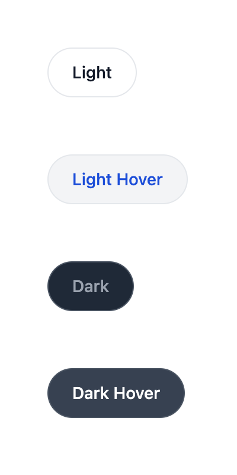

# Tailwind CSS

Tailwind CSS is a CSS framework that stands out for its use of utility classes to implement styles, as opposed to the traditional CSS approach.

Let's look at an example:

FILE: `button.tsx`

```typescript
export const Button = component$(() => {
  return (
    <button class="bg-blue-500 text-white">
      My Button
    </button>
  );
});
```

Here, you can use Tailwind CSS utility classes to define a blue background and white text color for your component. Instead of creating a class that combines these two properties, you can use two specific classes from Tailwind CSS. This approach allows for faster development but can result in verbose classes when creating complex styles.

Let's take a look at this example:



Here, you have a button available in two themes: `Light` and `Dark`. You also have hover variants for both themes. If you analyze the Tailwind classes used, you can see the following:

```typescript
<button
  type="button"
  class="rounded-full border border-gray-200 bg-white px-5 py-2.5 text-sm font-medium text-gray-900 hover:bg-gray-100 hover:text-blue-700 focus:z-10 focus:outline-none focus:ring-4 focus:ring-gray-200 dark:border-gray-600 dark:bg-gray-800 dark:text-gray-400 dark:hover:bg-gray-700 dark:hover:text-white dark:focus:ring-gray-700"
>
  [...]
</button>
```

As mentioned before, Tailwind can be verbose, and your button has many classes. Some CSS purists dislike Tailwind because it requires more classes compared to traditional CSS. However, this approach has several advantages:

- **Self-explanatory classes**: By reading the classes used, you can quickly understand the type of style being applied. Once you learn the meaning of the classes, it becomes automatic.
- **Copy/paste approach**: Within the HTML, you have everything you need to reuse parts or components of your applications. Simply copy and paste, and you're good to go. This is convenient when finding snippets on the web, allowing you to immediately incorporate them into your project and modify them as needed.
- **Single file component**: With Tailwind, you don't need to jump between files to see what a specific class looks like. You can understand the definition of classes without leaving the file you're working on. After using Tailwind for a few days, you quickly learn that `p-10` indicates `padding: 2.5rem; /* 40px */`, and the same goes for other classes. There's no need to refer to other files, making everything clear and concise.
- **Highly configurable**: Through the Tailwind configuration file, you can customize the framework's behavior to your liking. These changes will be reflected in the final stylesheet. Additionally, Tailwind allows the addition of custom plugins, providing endless possibilities.
- **PurgeCSS by default**: When using traditional CSS, you often create multiple classes for each HTML element. Although you don't reach the same number of classes as with Tailwind, there is a downside. When you need to remove a part of the HTML, you also have to remove the associated classes. This can be challenging, especially if the class is used by multiple elements. Unused classes tend to accumulate over time, reducing the efficiency of the application. Moreover, when applications are handed over from one developer to another, the fear of breaking something in production often prevents the deletion of unused classes. With Tailwind, unused classes can be eliminated during the build phase. Tailwind offers hundreds of utility classes, but only the used ones are included in the final bundle of your application. This process happens by default, but it is possible to achieve the same result using a traditional approach and a custom build process.

It's important to note that when purging CSS, the code of your project is statically analyzed. Therefore, if you use dynamic class names, you may encounter issues. All class names must be explicitly and completely written in your code.

❌ Let's see an example of incorrect use:

```typescript
export default component$(() => {
  const color = "red";
  return (
    <div class={`bg-${color}-500`}>this won’t work</div>
  );
});
```

This example doesn't work because the `bg-red-500` class cannot be statically recomposed. The interpolation is evaluated at runtime. To ensure the system works correctly, you should use the full name of the class.

✅ Let's see an example of correct use:

```typescript
export default component$(() => {
  const color = "bg-red-500";
  return <div class={`${color}`}>this works</div>;
});
```

To add Tailwind CSS to Qwik, simply use the `pnpm qwik add tailwind` command. The Qwik CLI will add and install the necessary dependencies and create the required configuration files. In the upcoming chapters, you can use Tailwind in the application you create together. Now, let's explore some useful tips based on your years of experience.

## Tailwind Tips

There are some tricks you can use to work effectively with Tailwind. While they are not strict rules, these tips can simplify and enhance your development experience.

Firstly, there are different ways to define classes within your Qwik component. You can use a string, an array of strings, or an object that allows for conditional insertion.

```typescript
// string
class="class1 class2 class3"

// array of strings
class={['class1', 'class2', 'class3']}

// object
class={{
  "class1": myCondition1,
  "class2": myCondition2,
  "class3": myCondition3,
}}
```

One of the main disadvantages of Tailwind is the lack of readability when using multiple classes together. It can be challenging for your brain to process all the information when classes are written in this manner. Fortunately, Qwik provides a second option that can help break down the multitude of classes you need to use. Let's take the previous button example and try dividing the classes by defining your class as an array.

```typescript
class={[
  "rounded-full border border-gray-200 bg-white px-5 py-2.5",
  "text-sm font-medium text-gray-900",
  "hover:bg-gray-100 hover:text-blue-700",
  "focus:z-10 focus:outline-none focus:ring-4 focus:ring-gray-200",
  "dark:border-gray-600 dark:bg-gray-800 dark:text-gray-400",
  "dark:hover:bg-gray-700 dark:hover:text-white dark:focus:ring-gray-700",
]}
```

By dividing the classes into blocks, you can improve readability without reducing the number of classes. Additionally, you can group the classes based on their purpose, according to your preferences. In the example, you start with border-related classes, followed by text-related classes, and then hover and focus classes. Finally, you group the classes applied when the theme is dark.

> Nowadays, almost everyone supports the dark and light theme, and for this reason, with Tailwind, we can use the `dark:` syntax to override the style for a given property in a very simple way.

This trick allows you to mitigate the readability issue associated with Tailwind. It's a simple way to enhance readability. If there are only 4 or 5 classes, using the array syntax may not be necessary, and you can use the simple string syntax instead.

You can also benefit from using the VSCode extension [Tailwind CSS IntelliSense](https://marketplace.visualstudio.com/items?itemName=bradlc.vscode-tailwindcss). This extension improves the developer experience by providing advanced features such as autocomplete, syntax highlighting, and linting. It helps you learn Tailwind and prevents errors. It even warns you if you declare two classes that override each other, such as `text-sm text-lg`. In such cases, it suggests refactoring to eliminate one of the classes and optimize the style.

Another helpful plugin is [prettier-plugin-tailwindcss](https://www.npmjs.com/package/prettier-plugin-tailwindcss). This plugin can be added to Prettier and automatically reorders the classes used, ensuring they are consistently ordered based on logical concepts. For example, `dark:` classes are always placed at the end, while modifiers like `hover:` and `focus:` are grouped and sorted after plain utilities. This plugin provides a quick overview of related classes, helping you maintain control over your styles.

Additionally, the [Tailwind Forms](https://github.com/tailwindlabs/tailwindcss-forms) plugin, developed by the official Tailwind CSS team, is very useful. It provides a style reset for form elements, making it easy to override their styles. This plugin is essential when creating custom forms.

Moreover, you can create your own custom CSS classes if you frequently use a set of classes. For example, if you often use `p-10 m-2 font-sm`, you can create your own class like this:

```CSS
.p10-m2-fsm {
  /* Using @apply we can use any utility class name from Tailwind */
  @apply p-10 m-2 font-sm;
  /* more additional CSS property here */
}
```

In this way, you use `@apply` to define a CSS class while leveraging the utility classes provided by Tailwind. You can also define other CSS properties if needed. The name of the class is reminiscent of Tailwind's naming convention, allowing you to read your code without constantly switching between component and CSS files. The class name indicates that you are using padding, margin, and a specific font size.

## Creating a Component Library

As you have seen, some tricks allow you to make the best use of Tailwind, but usually, when developing medium to large applications, certain elements are repeated throughout the application flow. For example, buttons which are present many times in the application because they allow user interaction. The quickest thing to do if you need to create a new button on your page is to copy and paste the button from another location where it is already present. But by doing so, button by button, technical debt will be created without knowing it. Let's imagine you need to renew the style of your application; you will have to examine all the components one by one to change the style. To avoid this problem, it is a good idea to create a reusable component that you can use at all points where it is required to centralize the logic and optimize any modification interventions.

Let's see an example:

FILE: `button.tsx`

```typescript
export enum ButtonVariant {
    primary = 'primary',
    secondary = 'secondary',
}

export const variantClasses = {
    [ButtonVariant.primary]: 'text-black',
    [ButtonVariant.secondary]: 'text-red',
};

export type ButtonProps = QwikIntrinsicElements['button'] & {
    label: string;
    variant: `${ButtonVariant}`;
    onClick$: [...];
};

export const Button = component$<ButtonProps>(({ variant, label, onClick$ }) => {
    return (
        <button class={variantClasses[variant]} onClick$={onClick$}>
            {label}
        </button>
    );
});
```

You can use your custom Button like this:

```typescript
[...]
<Button label='My Button' variant={'primary'} onClick$={[...]}/>
[...]
```

In this example, a button component with three properties was created:

- **label**: The label of your button.
- **variant**: You can pass `primary` or `secondary`, and TypeScript helps you avoid mistakes by indicating the possible values. If you pass `primary`, your button will have black text; if you pass `secondary`, the color will be red.
- **onClick$**: This property captures the click event of the button and allows you to apply your logic based on the context of use.

This example illustrates how components can be managed effectively to maintain control over your application. This component library serves as a language from which you can draw to create your application. Having a set of components to rely on reduces the time needed to create repetitive elements (e.g., buttons, inputs, modals, etc.). It establishes a design system that provides a consistent identity to your applications, ensures continuity in a digital ecosystem, and delivers a recognizable brand experience to users.

Consider Amazon as an example. The platform's colors and style are widely recognized because of its design system. Speaking the same language and using the same components and rules increases alignment within the company among developers and other departments such as UI/UX. One of the most famous design systems is Material Design, which Google developed. It has become a trend in web design and is the design system for Android. You can learn more about Material Design on the official website `https://m2.material.io/`.
