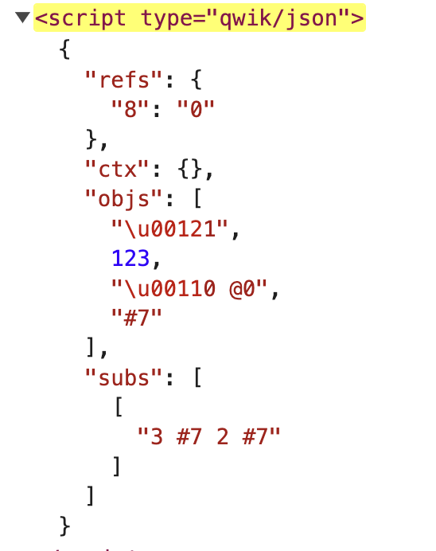

# Managing Data with Qwik

Now that the basics of making applications visually appealing have been covered, the focus can shift to understanding how to read data from external sources. This capability enhances the applications, making them more engaging and providing the user with the most enjoyable experience possible. Consider this example: during a login procedure, interaction with the application changes its state. The application "remembers" the user and allows access to personal information. Specifically, in Qwik, there are several ways to manage the state of the application, but the fundamental idea is to simplify the developer's work. In this chapter, different approaches to managing application states will be explored and reviewed with some examples.

## Local State Management

### useSignal

The low-level Qwik API that will be most beneficial in managing an app's application state is `useSignal`. It takes an initial value and returns a reactive signal. This reactive signal is an object with a single property `.value`. Changing this property will automatically update any component that depends on it.

Consider this example:

```typescript
export default component$(() => {
  const countSig = useSignal(123);

  return (
    <div>
      Count: {countSig.value}
      <button onClick$={() => countSig.value++}>
        Increment
      </button>
    </div>
  );
});
```

> A naming convention has been defined to use the `Sig` suffix for signals variable names to make the component code more "Scannable".

In this example created via `useSignal`, a reactive variable with an initial value of 123 is established. As soon as it's modified (through the `onClick$` event), it triggers an update to the UI. Signals are highly efficient because the framework can track where that signal is read, allowing it to update things accordingly with a precise change without having to check and re-render the DOM of the components.

### Qwik Optimizer

The signal mentioned earlier has an initial value of 123. In previous chapters, it was learned that during the build phase, the Qwik Optimizer packages the application to send it to the browser in anticipation of external events. With external events, the bundles necessary to make the application interactive will be executed. But if the application state needs to be changed and the initial value is 123, where can this information be obtained from? After all, on the first click, the value will have to increase by 1 and, therefore, go to 124. The answer is simple. In the static HTML that the server sends to the browser, the Qwik Optimizer also has the task of serializing the application state. It inserts it directly into the HTML page, and if the HTML sent by the browser is inspected, there is a `type="qwik/json"` script, which contains the initial value, 123.



This value will then be retrieved and injected into the JavaScript, which is necessary to make the counter interactive. By doing so, not only can the JavaScript be executed when necessary, but also the application state can be recovered and resumed from the point where the server had serialized the application.

### useStore

In the previous example, something simple was done, but how can more complex states be managed? The `useStore` API can be used. It's very similar to `useSignal,` as it accepts an initial value and, by default, reactively tracks the properties that are nested in it, returning a reactive object. Essentially, it's about many signals that together make up a more complex object, ensuring its reactivity.

Consider this example:

```typescript
export default component$(() => {
  const state = useStore({ count: 0 });

  return (
    <>
      <button onClick$={() => state.count++}>
        Increment
      </button>
      <p>Count: {state.count}</p>
    </>
  );
});
```

This example is very similar to the previous one. `onClick$` is still used, but this time the store is being updated.

> Note that for `useStore` to track all nested properties, many [Proxy objects](https://developer.mozilla.org/en-US/docs/Web/JavaScript/Reference/Global_Objects/Proxy) need to be allocated. This can be a performance issue if you have many nested properties; in that case, you can use the `"deep: false"` option to track only top-level properties. When we create a store, by default, the deep option is false.

## Global State Management with useContext

In the previous examples, how to declare a local state was discussed. However, with `useContext`, a global state in the application can be declared. The alternative to a global state would be to pass the information, component by component, within the props of each one, generating the so-called `props drilling`. To avoid this, it's good practice to create a global state.

Consider this example:

```typescript
// 1
interface UsersStore {
  users: User[];
}
// 2
export const UsersContext =
  createContextId<UsersStore>("Users");

// 3
export const App = component$(() => {
  useContextProvider(
    UsersContext,
    useStore<UsersStore>({
      users: [{ firstName: "John", lastName: "Doe" }],
    })
  );

  return <ChildComponent />;
});

// 4
export const ChildComponent = component$(() => {
  const todos = useContext(UsersContext);
  return (
    <ul>
      {todos.items.map((item) => (
        <li>{item}</li>
      ))}
    </ul>
  );
});
```

This example introduces several new concepts, but let's break them down step by step.

- **1**: The TypeScript type for the global state, which will be a list of users, is created.
- **2**: An id with `createContextId` is created, which will allow the global state to be uniquely referenced.
- **3**: In the App component with `useContextProvider,` the id ( `UsersContext` ), and the initial value, the global state can finally be created.
- **4**: In the child component, `useContext(UsersContext)` can be used to retrieve the list of users from the global state.

> NB. `useContext` will be available from the component where I declare the state with `useContextProvider` and in the descendant components in the tree. So, if I declare it in the root component of my application, it's global; otherwise, it will only belong in a specific part.

## Qwik and Virtual DOM (vDOM)

Most of the operations needed to update the DOM are fine-grained, thanks to the reactive objects just discussed. However, there are structural changes that require more in-depth control of the DOM to update the UI. By structural modifications, operations such as dynamic components, components that create and destroy elements, and other operations that change the structure of the DOM are meant. The vDOM is used to calculate the updates to be made due to these structural operations.

> vDOM is a JavaScript representation of our application that resides in memory. It's used to calculate the changes in our UI; in fact, the current vDOM is compared with the previous one, and from the resulting changes, it will be possible to understand what the actual changes are to be applied in our real UI.
> With other frameworks, we have been used to associating the use of the vDOM with poor performance because the vDOM is an object that includes our entire application.
> Once again, Qwik amazes us because the vDOM decision is made on a per-component basis, only for components that have structural change and are changing their structure. If a component is structural (vDOM), but no change in structure is detected, then Qwik skips the component.

## Exploring routeLoader$

`routeLoader$` is a unique API that allows data to be loaded on the server and injected into a component. For instance, if a list of users needs to be loaded from a database, this is a perfect operation for the server because secret keys and database connections will be needed. These secrets should not be exposed to the client.

> You can only declare a `routeLoader$` in the `index.tsx` and `layout.tsx` files inside the `src/routes` folder, and you need to export them.

Consider this example:

```typescript
export const useUsers = routeLoader$(async () => {
  const users = await // our Database logic
  return users;
});

export default component$(() => {
  const usersSig = useUsers();
  return (
    <div>
      // here we can use usersSig.value to
      // render the user list
    </div>
  );
});
```

If the same list of users is needed in another component, this `routeLoader$` can simply be imported to centralize the logic of the application and maintain clean code. Furthermore, within the same file, multiple `routeLoader$` can be had to load different information. In this case, multiple operations will be performed in parallel to optimize timing.

In special cases, it is possible to use `useVisibleTask$` to perform operations as soon as the component becomes visible in the viewport. Imagine having a component that is outside the viewport because it's far down the page. The code written inside the `useVisibleTask$` hook is not executed at all. Qwik is purist in executing only the necessary JavaScript, and since the component is not visible, that code is considered unnecessary until the component appears on the page.

```typescript
type User = {
    [...]
};

export default component$(() => {
    const usersSig = useSignal<User[]>();

    useVisibleTask$(async () => {
        const response = await fetch('https://..../users');
        usersSig.value = await response.json();
    });

    return <div>We have {usersSig.value?.length} users!</div>;
});
```

Here, by inserting the fetch call inside the `useVisibleTask$` hook, the list of users can be read and then viewed how many there are.

Using and executing code inside `useVisibleTask$` should be considered a last resort because Qwik provides many other methods to avoid eagerly executing JavaScript. There is an ESLint warning rule specifically to make the developer aware of evaluating other options.

Here's what the warning says:

```typescript
Qwik tries very hard to defer client code execution for as long as possible.
This is done to give the end-user the best possible user experience.
Running code eagerly blocks the main thread, which prevents the user from interacting until the task is finished.
"useVisibleTask$" is provided as an escape hatch.

When in doubt, instead of "useVisibleTask$()" use:
- useTask$ -> perform code execution in SSR mode.
- useOn() -> listen to events on the root element of the current component.
- useOnWindow() -> listen to events on the window object.
- useOnDocument() -> listen to events on the document object.

Sometimes it is the only way to achieve the result.
In that case, add:
// eslint-disable-next-line qwik/no-use-visible-task
to the line before "useVisibleTask$" to acknowledge you understand.
```

In addition to `useVisibleTask$`, `useTask$` is seen to perform server-side operations. Furthermore, there is the possibility of listening to events and then carrying out operations. The warning is very clear, but on the other hand, if the executed JavaScript is reduced to a minimum, many benefits will be reaped. So, this best practice should be remembered.

## Using Forms with routeAction$

This API allows form submission operations to be performed. For instance, if writing to a database or sending an email is desired, it can be done securely on the server without worrying about exposing secrets to the client. Then, information can be received in response to updating the UI following the operation.

> You can only declare a `routeAction$` in the `index.tsx` and `layout.tsx` files inside the `src/routes` folder, and you need to export them.

Consider this example:

```typescript
export const useAddUser = routeAction$(async (data, requestEvent) => {
  // the data prop is { firstName: "....", lastName: "..." }
  const user = await // our Database logic
  return {
    success: true,
    user,
  };
});

export default component$(() => {
  const action = useAddUser();

  return (
    <div>
      <Form action={action}>
        <input name="firstName" />
        <input name="lastName" />
        <button type="submit">Add user</button>
      </Form>
      {action.value?.success && (
        <p>User {action.value.user.id} added successfully</p>
      )}
    </div>
  );
});
```

In the example it can be seen that the `Form` component is used. It is a special component that wraps the native HTML form and, therefore, allows action even without JavaScript, has been imported. With JavaScript enabled (as in almost all cases), Qwik offers a very smooth experience without reloading, very similar to a single-page application. (see chapter 1) It should be noted that the `routeAction$` code will be executed only when the user submits the form or if the action is called programmatically.

`routeAction$` can be called programmatically like this:

```typescript
[...]
<button
  onClick$={async () => {
    const { value } = await action.submit({ firstName: 'John', lastName: 'Doe' });
    console.log(value.user.id);
  }}
>
  Add user
</button>
[...]
```

If attention has been paid to the example, it will surely be noticed that among the parameters of `routeAction$,` there is `requestEvent.` This object gives access to the HTTP call that the framework executes behind the scenes, allowing communication between the client and server. Thanks to this object, access to the request and the response, and therefore to the HTTP parameters, cookies, and much more, will be had. Of course, the backend API can always be called via a client-side HTTP call. Simply insert the code inside `onClick$`. So when the button is pressed, the modification API will be called, and then the application will be modified based on the response from the server.

```typescript
[...]
<button
  onClick$={async () => {
    const response = await fetch('https://..../addUser', [...])
        // more logic here
  }}
>
  Add user
</button>
[...]
```

## globalAction$ vs routeAction$

`globalAction$` can be declared in the `src` folder. If the action is shared on multiple routes its use is recommended because it's globally available. On the other hand, `routeAction$` can only be declared in the `src/routes` folder and is accessible within the route it's declared, so its scope is delimited.
