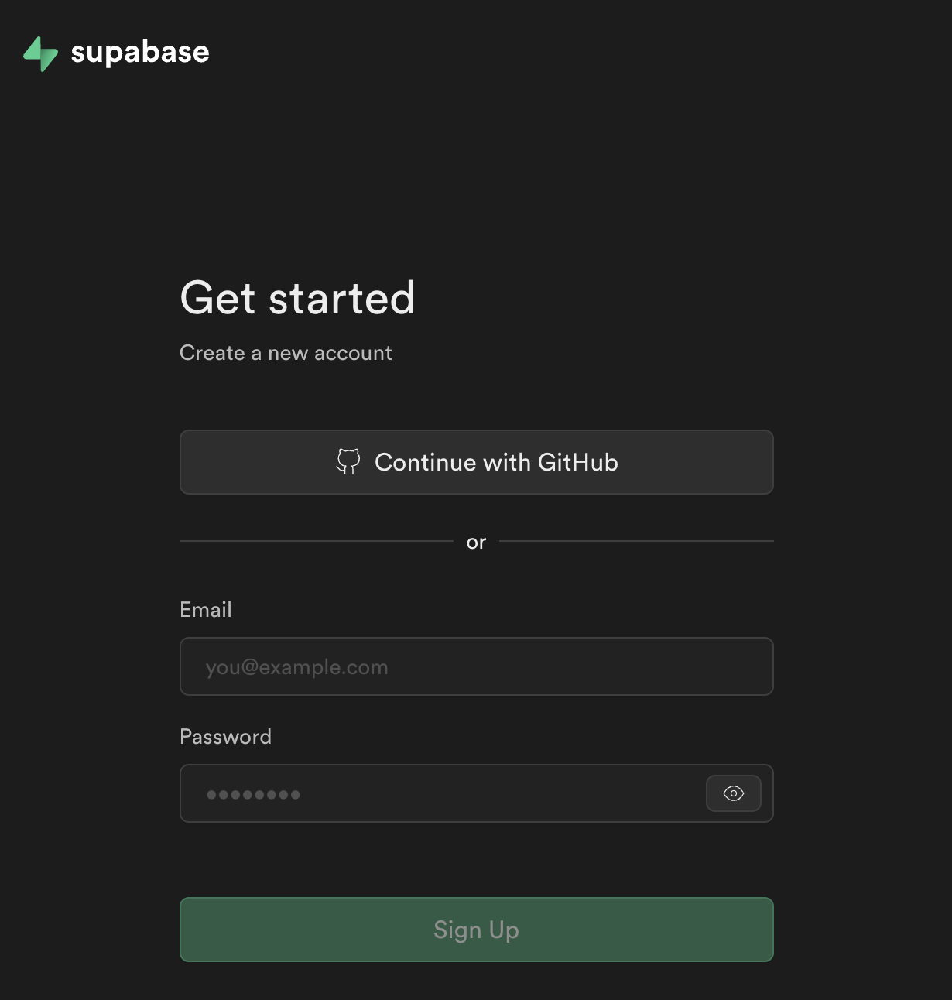
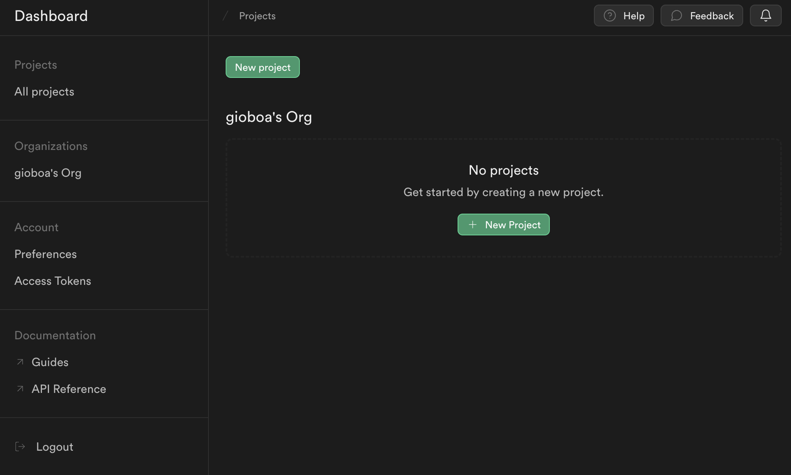
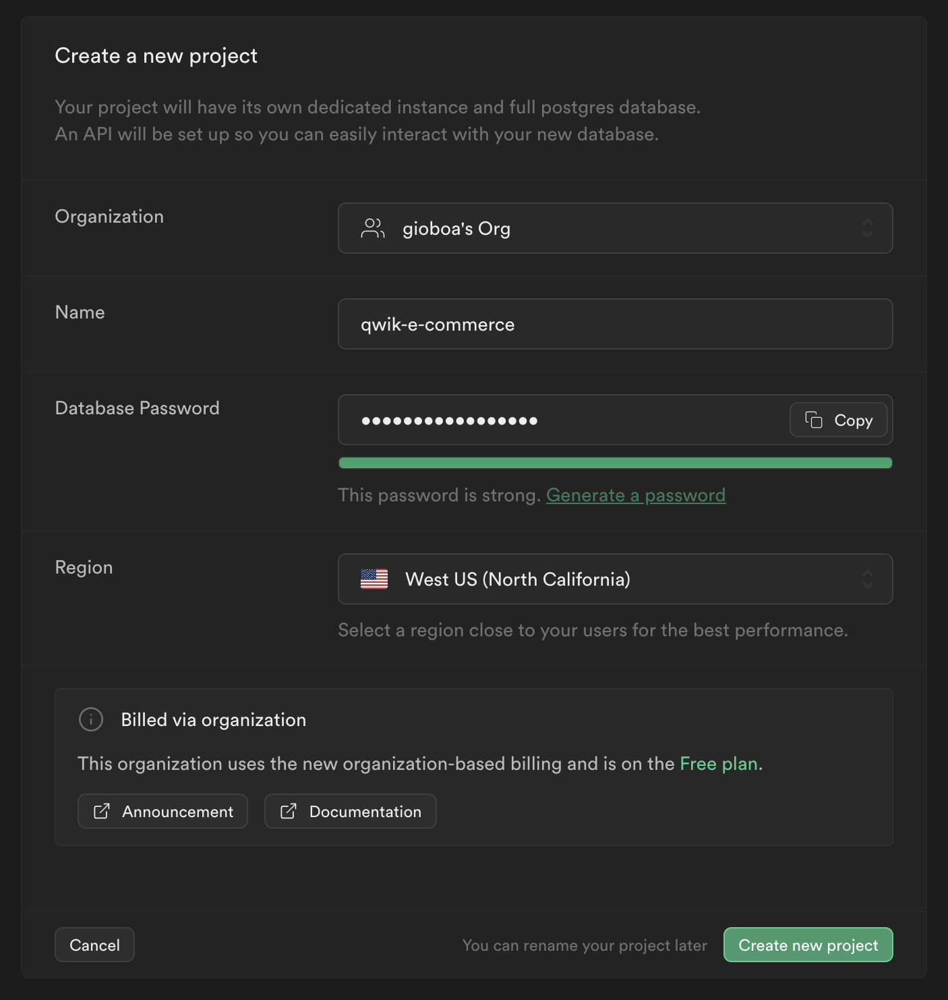
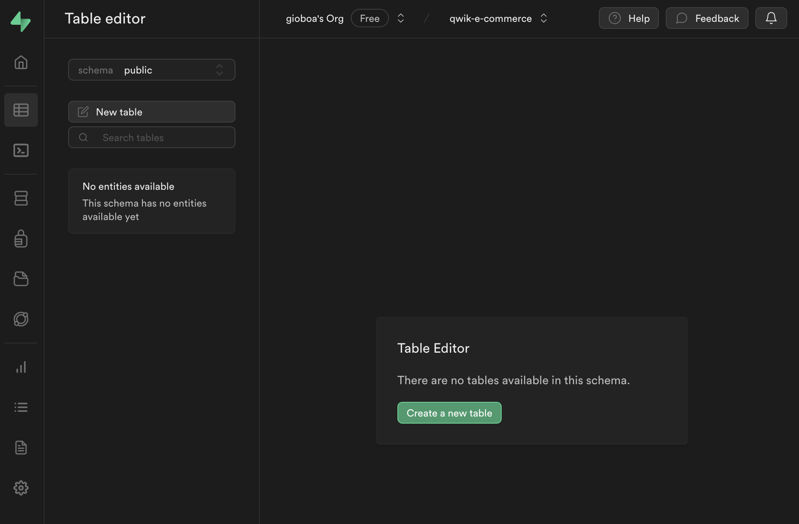
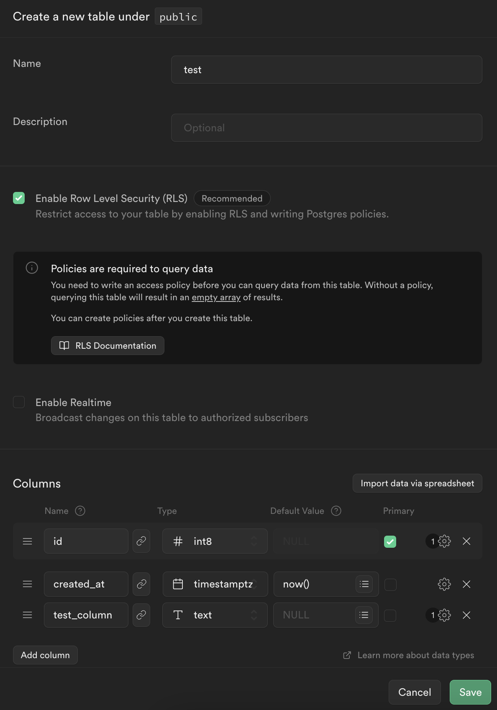
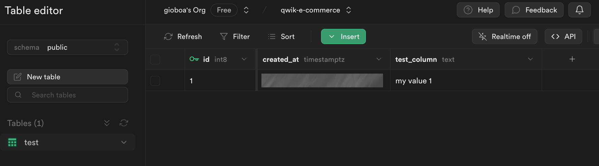
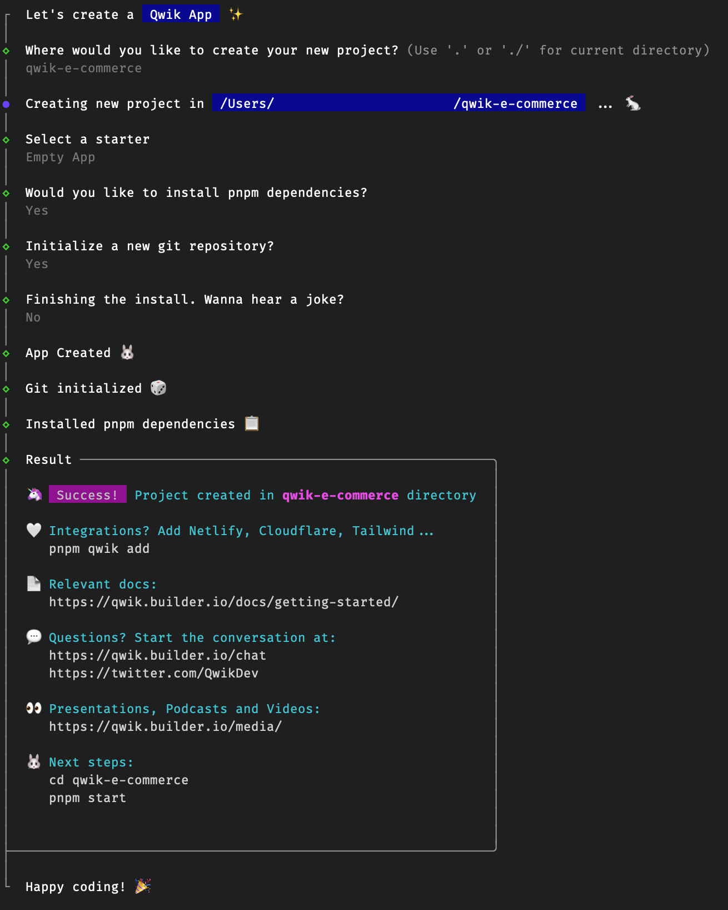
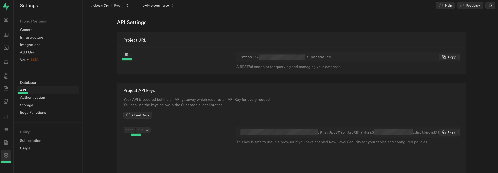
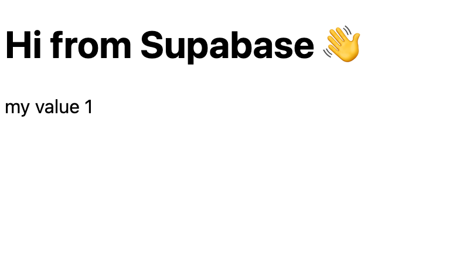

# Technical Requirements

To actively follow this chapter and create the application, ensure that both [Node.js](https://nodejs.org/en) and `npm` are installed on your local computer. Alternatives such as `yarn` and `pnpm` can also be used. `pnpm` might be a preferred choice due to its efficiency and several advantages. In fact, with `pnpm`, when a package is installed, it is stored in a global folder on your computer. Therefore, for each version of a module, there is always only one copy stored on the disk because it creates symbolic links and does not re-download the packages. When using `npm` or `yarn`, for example, if there are 10 projects that use "package A", there will be 10 copies of "package A" on the disk. So, `pnpm` saves a lot of disk space and installation time, let's use it.

You can also view the full code for this module in the Replit below:

<ReplitEmbed src="https://replit.com/@newlineauthors/module08" />

> The code snippets included in the chapter are deliberately minimal to focus attention on the fundamental steps, while in the GitHub repository, you can find the complete version.

## Supabase for Your Backend

After some evaluations, it's clear that the most interesting database to use for your application is Supabase. Below are the advantages:

- **Highly integrated with Qwik**: In fact, it is included in the official integrations of the framework, so compatibility is guaranteed by the team that oversees the project, as well as by the maintainers and the large community present.
- **Supabase configuration**: It's very simple and fast. In fact, in just a few minutes, you can obtain a working solution. All this is thanks to the UI interface that facilitates operations.
- **Authentication and authorization**: These operations are highly integrated with the ability to securely manage user accounts, roles, and permissions, ensuring safety and security for your data.
- **Postgres support**: This allows you to manage complex data relationships and queries effortlessly. This is a significant advantage over other platforms that often offer limited database capabilities.
- **Supabase SDK**: Managing the connection and all database operations is very simple thanks to the provided SDK.
- **Real-time status**: This supports listening to Postgres database changes, monitoring, and synchronizing shared state between clients or sending temporary messages from client to client with low latency. These features are not obvious for this kind of service, and knowing that you can use them effortlessly is very nice.
- **Environments**: It is possible to have multiple environments for your use. You can have the production environment, the test environment, and you can create all the environments you need.
- **Migrations**: Having multiple environments and evolving your database feature after feature, it is possible to automatically migrate the database schema. This guarantees consistency and saves you the burden of managing everything manually, avoiding human errors.

To be able to use Supabase's features, you must create an account, and you can do this directly from their site. You can also use your GitHub account to create the user very quickly.



Once the user has been created, it will be sufficient to create your project via the dashboard. Call it `qwik-e-commerce`.





In addition to the name, you are asked to set a password for your database and the region where to create your database for maximum performance. It is also possible to consult the service's prices, but it doesn't make much sense to list the current prices because this information could change over time. What is important, however, is that you are on the free plan.

Let's create a `test` table and add a new column `test_column`.





After creation, let's create a first example record.



## Render Supabase Data

To get started with your app, you can take advantage of the Qwik CLI as seen in the previous chapters. So go to your favorite directory for your projects and type in the terminal:

```shell
pnpm create qwik@latest
```

> @latest will use the latest version of Qwik

You will be guided with a series of questions to create your project. Let's call the project "qwik-e-commerce" and choose "Empty App" as a starter.



Once the project has been created, you can open the project directory with your favorite editor. The Supabase JS library plays nicely with the server-side APIs from Qwik such as `routeLoader$`, `routeAction$`, or `server$`. You need to install Supabase in the project:

```shell
pnpm install @supabase/supabase-js supabase-auth-helpers-qwik
```

For this implementation, you will need two environment variables that allow you to communicate with Supabase. These can be copied directly from the Supabase Cloud dashboard, Settings > API area. (see image)

FILE: `.env`

```typescript
VITE_SUPABASE_URL=...
VITE_SUPABASE_ANON_KEY=...
```



> Note that you need to manage the Supabase Row Level Security (RLS) to allow your application to read and write to the database. Since things may change over time I prefer to refer you to the [Supabase documentation](https://supabase.com/docs/guides/auth/row-level-security) where it is explained in depth how to configure these policies.

Let's edit the `src/routes/index.tsx` file as follows.

FILE: `src/routes/index.tsx`

```typescript
import { createServerClient } from "supabase-auth-helpers-qwik";

type TestRow = {
  id: number;
  created_at: string;
  test_column: string;
};

export const useTestTable = routeLoader$(
  async (requestEv) => {
    const supabaseClient = createServerClient(
      requestEv.env.get("VITE_SUPABASE_URL")!,
      requestEv.env.get("VITE_SUPABASE_ANON_KEY")!,
      requestEv
    );

    const { data } = await supabaseClient
      .from("test")
      .select("*");

    return data as TestRow[];
  }
);

export default component$(() => {
  const testTableRows = useTestTable();
  return (
    <>
      <h1>Hi from Supabase 👋</h1>
      {testTableRows.value.map((row) => (
        <div key={row.id}>{row.test_column}</div>
      ))}
    </>
  );
});
```

First, you define the type for your records in the test table. Then you use the Qwik server API to read the data from Supabase securely because `routeLoader$` code will never be present in the browser, but is only executed on the server side. Finally, you take the data from the test table and show them on the page. Below, you see the result.


