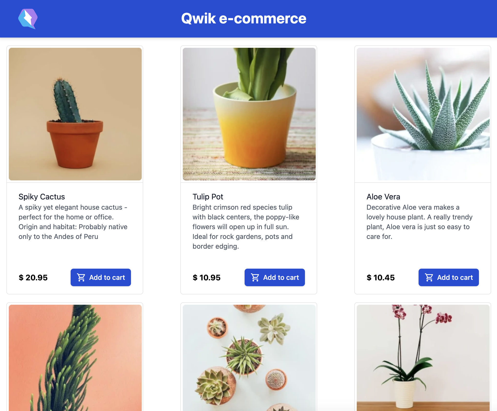
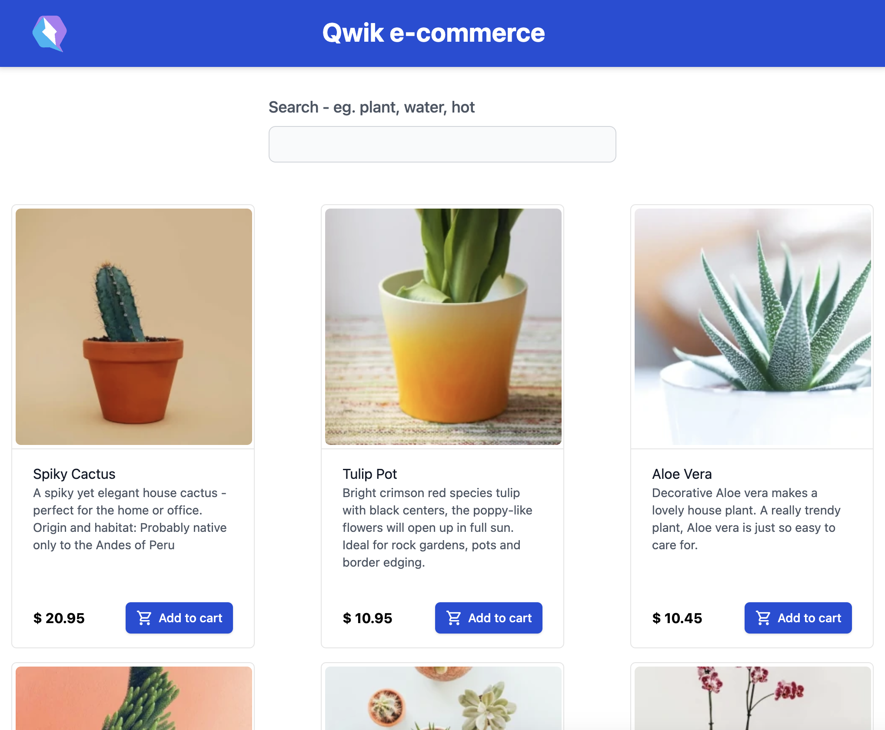
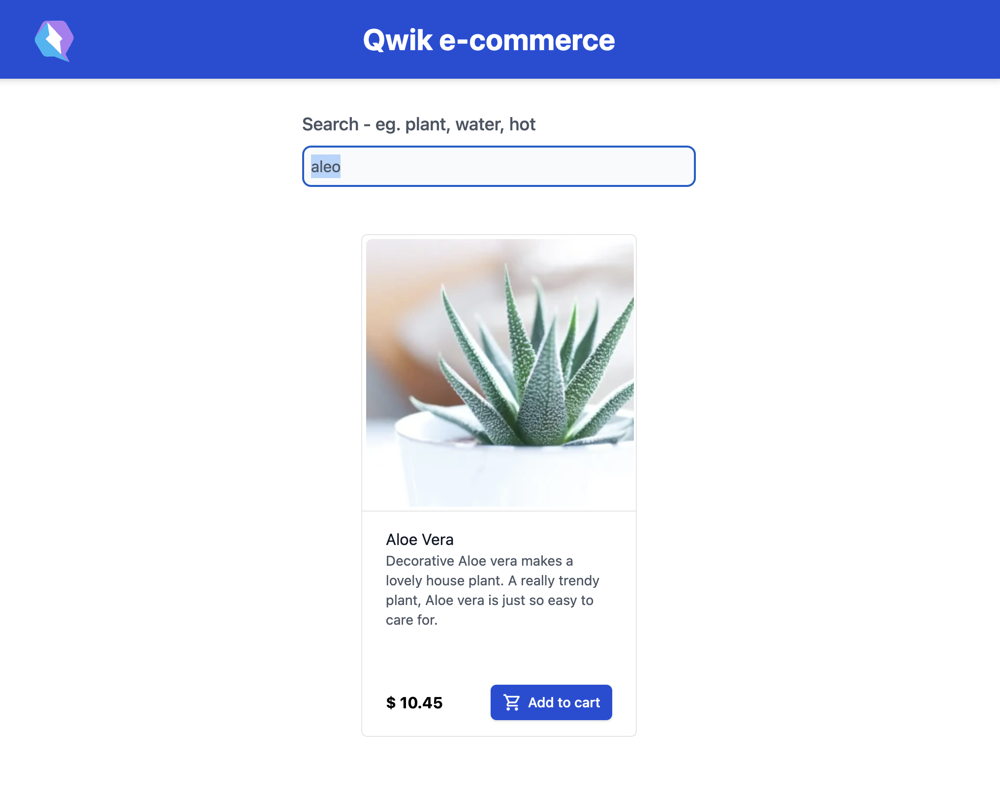

# Displaying Products on the Homepage

Now that the products are in the database, the next step is to display them on video. This will allow users to purchase them and start seeing the first orders come in. In the previous chapters, the process of reading and displaying data from Supabase was learned. There's no need to invent anything new here; the knowledge is already there. All that's needed is to write the code to generate a beautiful list of products.

FILE: `src/routes/index.tsx`

```typescript
import { IconShoppingCart } from "~/components/IconShoppingCart";
import { supabaseClient } from "~/utils/supabase";

export const useUser = routeLoader$(async (requestEv) => {
  const supabaseAccessToken = requestEv.cookie.get(
    "supabase_access_token"
  );
  if (!supabaseAccessToken) {
    return null;
  }
  const { data, error } = await supabaseClient.auth.getUser(
    supabaseAccessToken.value
  );
  return error ? null : data.user;
});

type Product = {
  id: number;
  name: string;
  description: string;
  price: string;
  image: string;
};

export const useProducts = routeLoader$(async () => {
  const { data } = await supabaseClient
    .from("products")
    .select("*");
  return data as Product[];
});

export default component$(() => {
  const userSig = useUser();
  const productsSig = useProducts();
  const navigate = useNavigate();

  return (
    <div class="...">
      {productsSig.value.map((product) => (
        <div key={product.id} class="...">
          <div class="...">
            <div class="...">
              
            </div>
          </div>
          <div class="...">
            <span class="...">{product.name}</span>
            <div class="...">{product.description}</div>
            <div class="...">
              <span class="...">$ {product.price}</span>
              {userSig.value ? (
                <button
                  type="button"
                  class="..."
                  onClick$={() =>
                    console.log("Add to cart!")
                  }
                >
                  <IconShoppingCart />
                  Add to cart
                </button>
              ) : (
                <button
                  type="button"
                  class="..."
                  onClick$={() => navigate("/sign-in")}
                >
                  Sign In
                </button>
              )}
            </div>
          </div>
        </div>
      ))}
    </div>
  );
});
```

Here is the implementation of the homepage to display products. There are two `routeLoader$`. The first one, already familiar from the previous chapter, allows the determination of whether the user is signed in. The second `routeLoader$`, which is needed to read from the `products` Supabase table, has also been seen before. Once the data is read, it's rendered graphically on the homepage. With `key={product.id}`, a unique key is assigned to each element in the list, and then the image and information related to the product are displayed. One last note: the button changes depending on whether the user is signed in. If signed in, the product is added to the cart (for this first step, it's a console.log). Otherwise, a button is displayed that, thanks to the `navigate` function, directs to the sign-in page.

Here is the result.



## Orama Full-Text Search

Orama is an excellent library that enables searching within complex texts and more. It's written in TypeScript and designed for use in cloud environments, highly optimized for speed and low latency. It offers advanced search capabilities, including the `Type tolerance` feature. Let's say users want to search for `Aloe`, but they mistakenly type `Aleo`. A simple string comparison wouldn't yield a potential result, but the powerful algorithms used by Orama make this possible. Results can be suggested to users, enhancing e-commerce performance and increasing earnings. To add Orama to Qwik, simply use the

```shell
pnpm qwik add orama
```

command. The Qwik CLI will add and install the dependencies and create the necessary configuration files for its operation.

Let's see how the code has changed.

FILE: `src/routes/index.tsx`

```typescript
import type { Orama } from "@orama/orama";
import { create, insert, search } from "@orama/orama";
import { IconShoppingCart } from "~/components/IconShoppingCart";
import { supabaseClient } from "~/utils/supabase";

export const useUser = routeLoader$(async (requestEv) => {
  const supabaseAccessToken = requestEv.cookie.get(
    "supabase_access_token"
  );
  if (!supabaseAccessToken) {
    return null;
  }
  const { data, error } = await supabaseClient.auth.getUser(
    supabaseAccessToken.value
  );
  return error ? null : data.user;
});

type Product = {
  id: number;
  name: string;
  description: string;
  price: number;
  image: string;
};

let oramaDb: Orama;

export const useProducts = routeLoader$(async () => {
  const { data } = await supabaseClient
    .from("products")
    .select("*");
  oramaDb = await create({
    schema: {
      id: "string",
      name: "string",
      description: "string",
      price: "number",
      image: "string",
    },
  });
  if (data) {
    data.map(
      async (product: Product) =>
        await insert(oramaDb, {
          ...product,
          id: product.id.toString(),
        })
    );
  }
  return data as Product[];
});

export const execSearch = server$(async (term: string) => {
  const response = await search(oramaDb, {
    term,
    properties: "*",
    boost: { name: 1.5 },
    tolerance: 2,
  });
  return response;
});

export default component$(() => {
  const userSig = useUser();
  const termSig = useSignal("");
  const navigate = useNavigate();
  const productsSig = useProducts();
  const resultsSig = useSignal<Product[]>(
    productsSig.value
  );

  const onSearch = $(async (term: string) => {
    if (term === "") {
      resultsSig.value = productsSig.value;
      return;
    }

    const response = await execSearch(term);
    resultsSig.value = response.hits.map(
      (hit) => hit.document as unknown as Product
    );
  });

  return (
    <div class="...">
      <label class="...">
        Search - eg. plant, water, hot
      </label>
      <input
        type="text"
        class="..."
        bind:value={termSig}
        onKeyDown$={(e) => {
          if (e.key === "Enter") {
            onSearch(termSig.value);
          }
        }}
      />
      {resultsSig.value.map((product) => (
        <div key={product.id} class="...">
          <div class="...">
            <div class="...">
              
            </div>
          </div>
          <div class="...">
            <span class="...">{product.name}</span>
            <div class="...">{product.description}</div>
            <div class="...">
              <span class="...">$ {product.price}</span>
              {userSig.value ? (
                <button
                  type="button"
                  class="..."
                  onClick$={() =>
                    console.log("Add to cart!")
                  }
                >
                  <IconShoppingCart />
                  Add to cart
                </button>
              ) : (
                <button
                  type="button"
                  class="..."
                  onClick$={() => navigate("/sign-in")}
                >
                  Sign In
                </button>
              )}
            </div>
          </div>
        </div>
      ))}
    </div>
  );
});
```

A server-side Orama instance was created and seeded with the products read from Supabase. Above the product list, a search input was created. User input is tracked using `termSig`, and when the `Enter` key is pressed, the search is performed. This operation only occurs if the input is populated. If it's empty, all the products are returned. When a search needs to be conducted, the function enclosed with `server$` is executed. The calculation will then be performed on the server, and the products that match the search filter will be returned. In the query executed by Orama in the `execSearch` function, `boost` was used to give more importance to the product name and the `tolerance` property to offer suggestions in case of typos.

Here is the result.



Here's an example of a typo.


