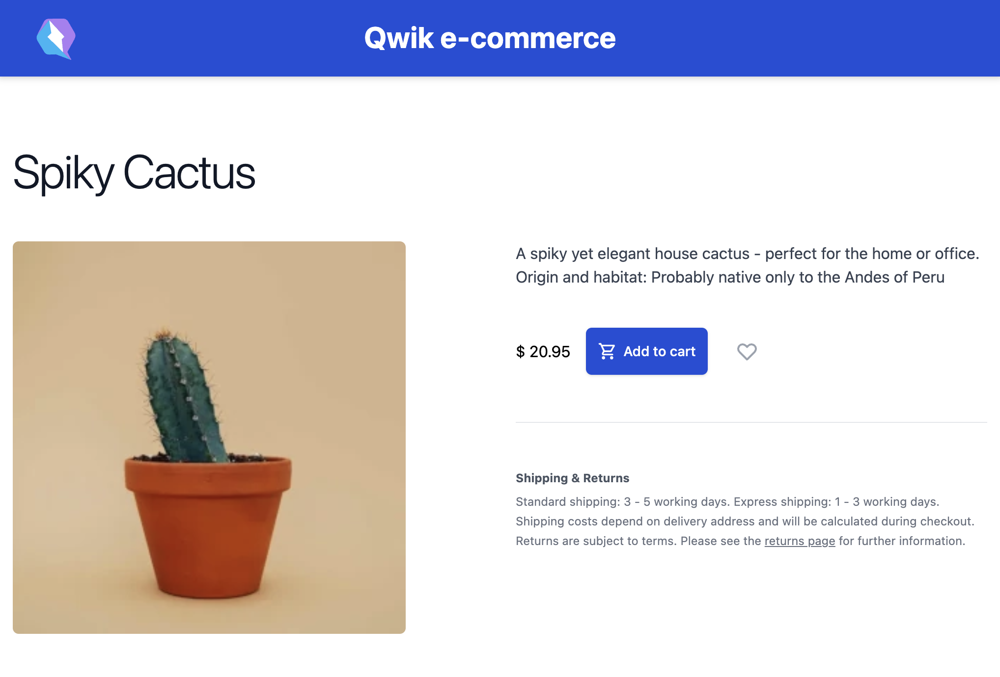

# Product Detail

Now that we have our home page where we show the catalog we are very happy because we are seeing our application take shape. As we have seen, it is very simple to create our pages and the integration with Supabase is truly sensational for how simple and fast it is.
But now we want to implement a detail page for our products, this allows us to add more useful information to the user because we can, for example, show product reviews left by other buyers. Furthermore, another functionality that we can implement is to show the stock of the product itself on the page.
Let's see how we can create a dedicated route for the detail part.
First, we need to create a route to view the details of the article so let's create this structure:

```shell
qwik-e-commerce
├── src
│   ├── routes
│   │   ├── detail
│   │   │   ├── [slug]
│   │   │   │   └── index.tsx
```

Let's analyze the newly created structure in detail, under the `routes` folder we have the `detail` folder, and inside we have a `[slug]` folder. Here we define the component that will render the detail of our product.
So with this structure, we have defined a new application route that will be
`https://my-website.com/detail/<product_slug>/`
Here we can see that we are referring to a field called slug which is not currently present in our application.
So as we said before we can exploit Supabase migrations to create the new field.

Let's create the file where we can write our migration:

```shell
pnpm supabase migration new add_product_slug_field
```

And inside the new file `<timestamp>_add_product_slug_field.sql` we are going to insert our migration script.

```SQL
alter table "public"."products" add column "slug" text;
```

Let's update our `seed.sql` file with the new field: `slug`.

```SQL
insert into public.products
  (name, description, price, image, slug)
values
  ('Spiky Cactus', 'A spiky yet elegant house cactus - perfect for the home or office. Origin and habitat: Probably native only to the Andes of Peru', 20.95,  'spiky_cactus.webp', 'spiky-cactus'),
  ('Tulip Pot', 'Bright crimson red species tulip with black centers, the poppy-like flowers will open up in full sun. Ideal for rock gardens, pots and border edging.', 10.95, 'tulip_pot.webp', 'tulip-pot'),
  ('Aloe Vera', 'Decorative Aloe vera makes a lovely house plant. A really trendy plant, Aloe vera is just so easy to care for.', 10.45, 'aloe_vera.webp', 'aloe-vera'),
  ('Fern Blechnum Gibbum', 'Create a tropical feel in your home with this lush green tree fern, it has decorative leaves and will develop a short slender trunk in time.', 12.95, 'fern_blechnum_gibbum.webp', 'fern-blechnum-gibbum'),
  ('Assorted Indoor Succulents', 'These assorted succulents come in a variety of different shapes and colours - each with their own unique personality.', 42.35, 'assorted_indoor_succulents.webp', 'assorted-indoor-succulents'),
  ('Orchid', 'Gloriously elegant. It can go along with any interior as it is a neutral color and the most popular Phalaenopsis overall.', 30.75, 'orchid.webp', 'orchid');
```

And we launch the following command to apply the changes to our local database.

```shell
pnpm supabase db reset
```

Once the migration is complete we are ready to render the details of our articles.
So let's implement the detail page.

FILE: `src/routes/detail/[slug]/index.tsx`

```typescript
import type { PostgrestSingleResponse } from "@supabase/supabase-js";
import { HeartIcon } from "~/components/HeartIcon";
import { IconShoppingCart } from "~/components/ShoppingCartIcon";
import { useUser } from "~/routes/layout";
import type { Product } from "~/utils/store";
import { supabaseClient } from "~/utils/supabase";

export const useProductDetail = routeLoader$(
  async ({ params, status }) => {
    const slug = params.slug;
    const { data }: PostgrestSingleResponse<Product[]> =
      await supabaseClient
        .from("products")
        .select("*")
        .eq("slug", slug);

    if (!data) {
      status(404);
    }

    return data ? data[0] : null;
  }
);

export default component$(() => {
  const userSig = useUser();
  const navigate = useNavigate();
  const productDetail = useProductDetail();

  if (!productDetail.value) {
    return (
      <div>
        Sorry, looks like we don't have this product.
      </div>
    );
  }

  return (
    <div>
      <div class="...">
        <div>
          <h2 class="...">{productDetail.value.name}</h2>
          <div class="...">
            <div class="...">
              <span class="...">
                <div class="...">
                  
                </div>
              </span>
            </div>
            <div class="...">
              <div class="...">
                <h3 class="...">Description</h3>
                <div class="...">
                  {productDetail.value.description}
                  <div />
                </div>
                <div class="mt-10 flex flex-col sm:flex-row sm:items-center">
                  $ {productDetail.value.price}
                  <div class="flex sm:flex-col1 align-baseline px-4">
                    {userSig.value ? (
                      <button
                        type="button"
                        class="..."
                        onClick$={() =>
                          console.log("Add to cart!")
                        }
                      >
                        <IconShoppingCart />
                        Add to cart
                      </button>
                    ) : (
                      <button
                        type="button"
                        class="..."
                        onClick$={() =>
                          navigate("/sign-in")
                        }
                      >
                        Sign In
                      </button>
                    )}
                    <button type="button" class="...">
                      <HeartIcon />
                      <span class="...">
                        Add to favorites
                      </span>
                    </button>
                  </div>
                </div>

                <section class="...">
                  <h3 class="...">Shipping & Returns</h3>
                  <div class="...">
                    <p>
                      Standard shipping: 3 - 5 working days.
                      Express shipping: 1 - 3 working days.
                    </p>
                    <p>
                      Shipping costs depend on delivery
                      address and will be calculated during
                      checkout.
                    </p>
                    <p>
                      Returns are subject to terms. Please
                      see the{" "}
                      <span class="...">returns page</span>{" "}
                      for further information.
                    </p>
                  </div>
                </section>
              </div>
            </div>
          </div>
        </div>
      </div>
    </div>
  );
});
```

Here is the result:



Let's analyze this implementation. On the server side, inside the routeLoader$, we are reading the parameters, and retrieving the slug typed in the address bar. With this value, we are going to execute a query on Supabase to retrieve the product from our database. If the product does not exist we will display a fallback message indicating that there are no products available for that specific slug.
If we have managed to find a product then we are going to render it on the page and if the user is logged in we are going to show the button to add the product to the cart. As on the homepage, if we are not logged in then the button will have a different label "Sign In" which will take us to the sign-in page.
Furthermore, other extra information is shown that explains the shipping conditions.
Here we were able to create our detail page quickly and easily, we performed the reading on the server side and we did not perform any unnecessary JavaScript operations.
