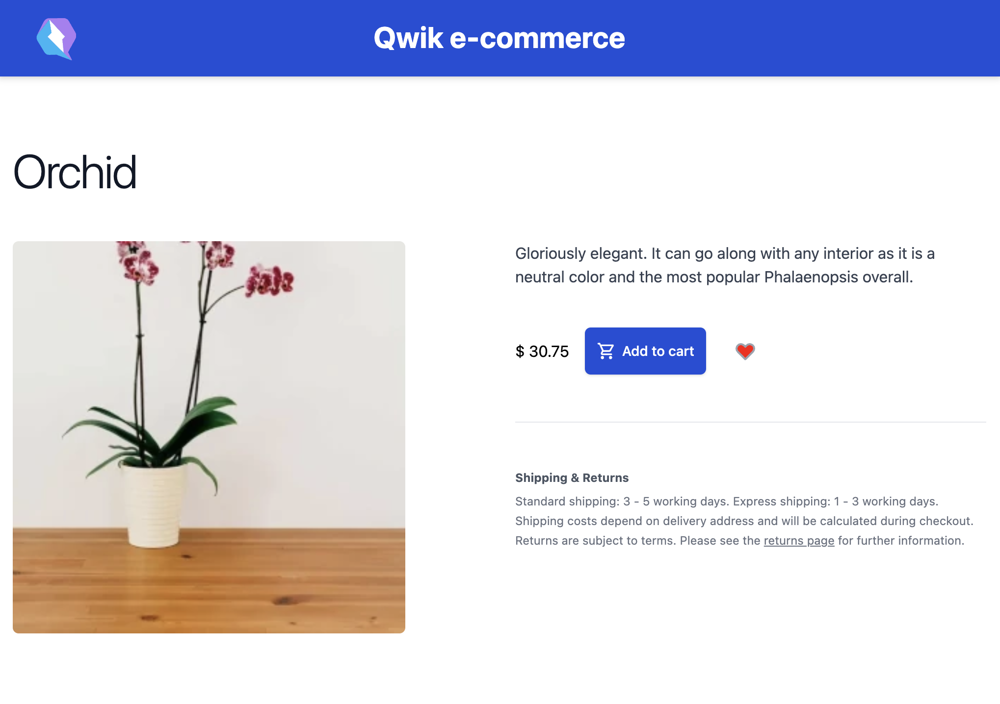

# Add a product to your favorites list

We have displayed the list of products in our application and it would be nice to be able to add the ability to mark as favorite. It is a very common feature in e-commerce applications that of being able to mark a product as a favorite so that it can then be retrieved at a later time to continue with the purchase or go and repurchase it.
In the previous chapter, you may have noticed that there is a heart-shaped icon, to implement this new functionality we can use this graphic element to mark a single article as a favorite. This functionality also offers us the excuse to see together how we can write inside our tables with Supabase because up to now we have only read information, but usually in applications many more operations are performed. Usually to interact with an entity the term CRUD is used to refer to all the operations that can be performed: create, read, update, and delete.

So we are telling ourselves that to implement this functionality we must save in our database that the user has expressed his desire to save that specific product. Thinking about how to structure our database table we can simply think of creating a table with two columns, one with the user ID and one with the product ID these are the two pieces of information that are necessary to track the choices of each user. It can be implemented in a thousand ways, but I think this is the simplest for our context.

Please note that you can find the code for this module in the following Replit:

<ReplitEmbed src="https://replit.com/@newlineauthors/module10" />


Let's create a new migration to create the table that will contain this information.

```shell
pnpm supabase migration new favorites
```

Let's write the SQL that will generate our table to contain the information we need.

```SQL
create table public.favorites (
  id bigint generated by default as identity,
  user_id uuid not null,
  product_id bigint not null,
  constraint favorites_pkey primary key (id),
  constraint favorites_id_key unique (id),
  constraint favorites_product_id_fkey foreign key (product_id) references products (id)
) tablespace pg_default;
```

Now we can go and apply our changes to the database with the following command:

```shell
pnpm supabase db reset
```

Once the changes have been applied we can modify the code in our application as follows. First of all, we have to modify the products on our homepage to insert a link that allows us to reach the detail directly. Here it will be enough to modify the image of our products to accept the user's click and consequently redirect the user to the product detail page.

FILE: `src/routes/index.tsx`

```tsx
export type Product = {
  id: number;
  [...]
  slug: string; // <- We need to add the slug property
};

export default component$(() => {
  return (
    <div class='...'>
      <div class='...'>
        {resultsSig.value.map((product) => (
          <div key={product.id}>
            [...]
             {
                navigate(`/detail/${product.slug}`);
              }}
            />
            [...]
          </div>
        ))}
        [...]
      </div>
    </div>
  );
});
```

Here we see that we have added the `slug` property to our Product type so that we can use it in our component. We have added the `onClick$` event to the image so when the user clicks on the image he will be able to go and see the detail.
Precisely on this detail page, we will add the logic to show or not whether the product is among our favorites. But first let's modify the icon to be able to assume the two states, when it is active or not.

FILE: `src/components/HeartIcon/index.tsx`

```tsx

type Props = {
  active: boolean;
  onClick$?: PropFunction<() => void>;
};

export const HeartIcon = component$<Props>(
  ({ active, onClick$ }) => {
    return (
      <svg
        xmlns="http://www.w3.org/2000/svg"
        class="h-6 w-6 flex-shrink-0"
        fill={active ? "red" : "none"}
        viewBox="0 0 24 24"
        stroke="currentColor"
        stroke-width="2"
        onClick$={() => {
          onClick$ && onClick$();
        }}
      >
        <path
          stroke-linecap="round"
          stroke-linejoin="round"
          d="..."
        />
      </svg>
    );
  }
);
```

Here we have an additional property `active`, in fact now we can go and set whether we want the icon active or not. Furthermore, we have defined the `onClick$` event to manage the user's click and change the status. This prepares the ground for modifying the product detail page.

FILE: `src/routes/detail/[slug]/index.tsx`

```tsx
import type { PostgrestSingleResponse } from "@supabase/supabase-js";
import { HeartIcon } from "~/components/HeartIcon";
import { IconShoppingCart } from "~/components/IconShoppingCart";
import type { Product } from "~/routes";
import { useUser } from "~/routes/layout";
import { supabaseClient } from "~/utils/supabase";

export const useProductDetail = routeLoader$(
  async ({ params, resolveValue }) => {
    const slug = params.slug;
    const { data }: PostgrestSingleResponse<Product[]> =
      await supabaseClient
        .from("products")
        .select("*")
        .eq("slug", slug);

    if (!data || data.length === 0) {
      return { product: null, isFavorite: false };
    }

    let isFavorite = false;
    const user = await resolveValue(useUser);
    if (user) {
      const favoritesResponse = await supabaseClient
        .from("favorites")
        .select("*")
        .match({
          user_id: user.id,
          product_id: data[0].id,
        });
      isFavorite =
        !!favoritesResponse.data &&
        favoritesResponse.data.length > 0;
    }
    return { product: data[0], isFavorite };
  }
);

export const changeFavorite = server$(
  async (
    userId: string,
    productId: number,
    isFavorite: boolean
  ) => {
    if (isFavorite) {
      await supabaseClient
        .from("favorites")
        .insert({ user_id: userId, product_id: productId });
    } else {
      await supabaseClient
        .from("favorites")
        .delete()
        .match({ user_id: userId, product_id: productId });
    }
  }
);

export default component$(() => {
  const userSig = useUser();
  const navigate = useNavigate();
  const productDetail = useSignal(useProductDetail().value);

  if (!productDetail.value.product) {
    return (
      <div>
        Sorry, looks like we don't have this product.
      </div>
    );
  }

  return (
    <div>
      <div class="...">
        <div>
          <h2 class="...">
            {productDetail.value.product.name}
          </h2>
          <div class="...">
            <div class="...">
              <span class="...">
                <div class="...">
                  
                </div>
              </span>
            </div>
            <div class="...">
              <div>
                <h3 class="...">Description</h3>
                <div
                  class="..."
                  dangerouslySetInnerHTML={
                    productDetail.value.product.description
                  }
                />
              </div>
              <div class="...">
                $ {productDetail.value.product.price}
                <div class="...">
                  {userSig.value ? (
                    <button
                      type="button"
                      class="..."
                      onClick$={() =>
                        console.log("Add to cart!")
                      }
                    >
                      <IconShoppingCart />
                      Add to cart
                    </button>
                  ) : (
                    <button
                      type="button"
                      class="..."
                      onClick$={() => navigate("/sign-in")}
                    >
                      Sign In
                    </button>
                  )}
                  <button type="button" class="...">
                    <HeartIcon
                      active={
                        productDetail.value.isFavorite
                      }
                      onClick$={async () => {
                        if (userSig.value) {
                          await changeFavorite(
                            userSig.value.id,
                            productDetail.value.product!.id,
                            !productDetail.value.isFavorite
                          );
                          productDetail.value = {
                            ...productDetail.value,
                            isFavorite:
                              !productDetail.value
                                .isFavorite,
                          };
                        }
                      }}
                    />
                    <span class="...">
                      Add to favorites
                    </span>
                  </button>
                </div>
              </div>
              [...]
            </div>
          </div>
        </div>
      </div>
    </div>
  );
});
```

So far so good, we made several changes to add this functionality, but let's start from the beginning. Let's start from the initial `routeLoader$`, we immediately read the detail of the product which has the slug that corresponds to the one present in our URL.
If there is no product in our database we return `product` equal to null and `isFavorite` equal to false.
Continuing we used the `resolveValue` parameter which we can invoked within `routeLoader$` to retrieve information relating to the user and to understand whether the user is logged in or not.

> With `resolveValue` we will not re-execute the logic and code, but we will recover the value previously calculated in the current request. In practice, for each request there is a cache system that allows you to read the data calculated in the case of nested requests, all this to have maximum optimization.

We continue with the analysis of the code and see that if the user is logged in we read in our Supabase table to understand if we have an associated record for this specific product and user. If a record exists then it means that our user has marked the product as favorite. We take all the information and use it as the return value of our loader. Here we see that compared to before we are returning an object composed of two parts, the product and the property that tells us whether it is preferred or not.
Scrolling through the file we see that we have defined a `server$` function and therefore that it is executed on the server side in complete safety way. This function receives several parameters, the user ID, the product ID, and a boolean that tells us what operation we need to perform. If we have to mark the product as favorite we add a record to the `favorites` table otherwise, we will delete the record that has the indicated user ID and product ID.
Let's then move to the changes we made to our component.
We changed `productDetail` to make it a full-fledged signal by giving it a default value, the result of the logic just seen together. If we hadn't done this we would have only had a read-only signal but we also want to be able to go and modify it. Continuing with the changes we see that in the `onClick$` event of our heart icon, we have few lines with some logic. Here in these lines, we are saying: "If the user is logged in then we are going to call our server-side function to change our database and optimistically we are going to modify our `productDetail` signal to invert the value of ` isFavorite`". By doing so we will be able to view our modification on the screen and we will have implemented the desired feature.



Another section that could be implemented would be the page that shows the favorite products. It will be enough to declare a new application route and then using a `routeLoader$`. We can go and read all the products of a specific user. This functionality contains all the concepts already addressed in the previous chapters and is therefore quite trivial, I challenge you to complete it before continuing to read the chapter.
