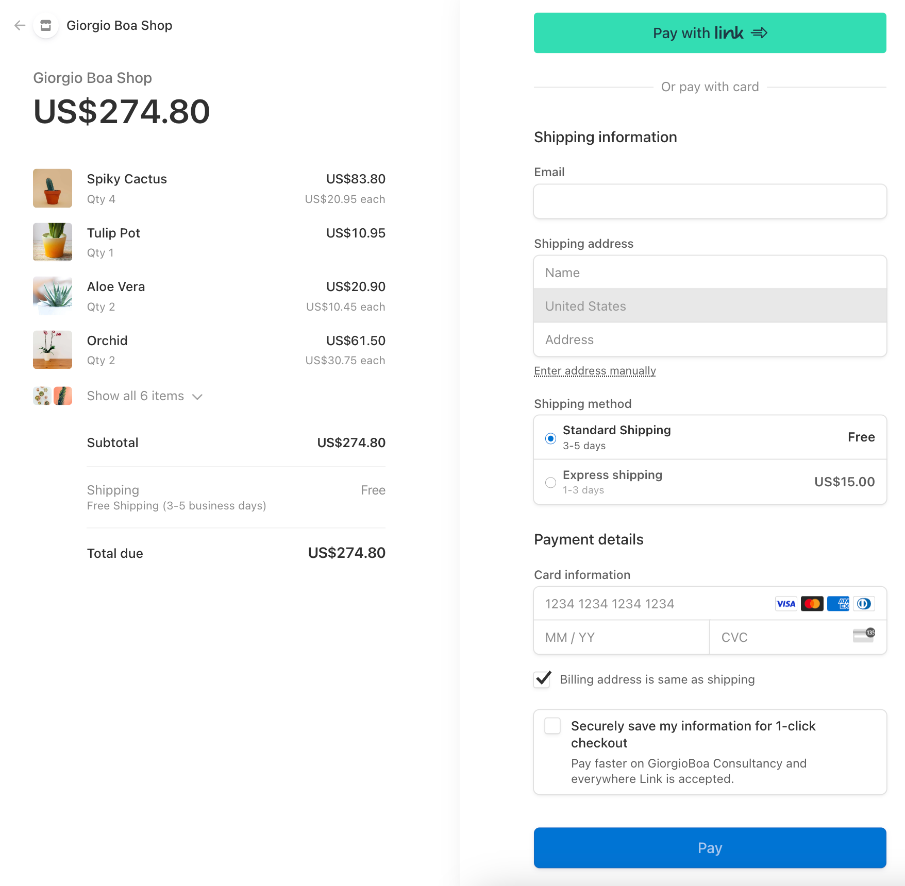
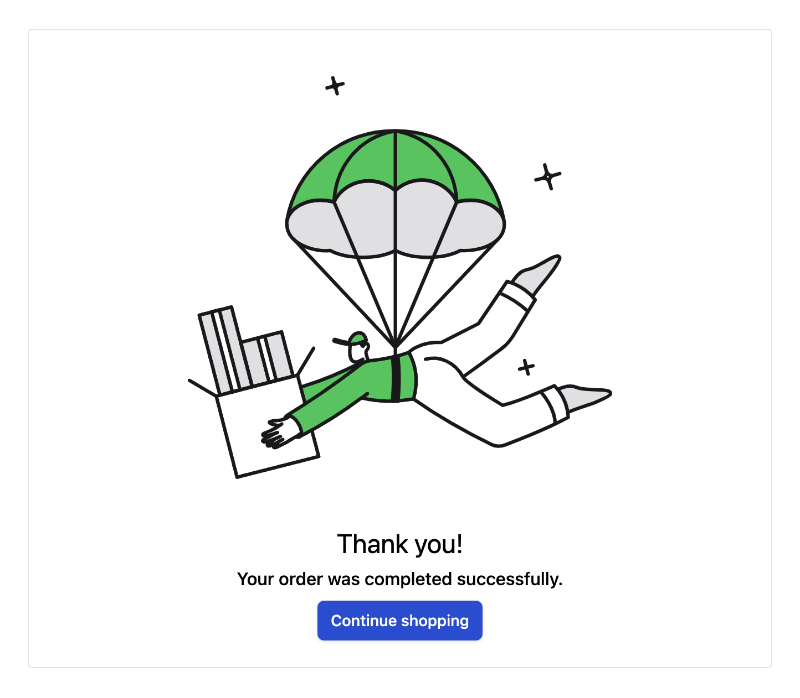

# Stripe

We have added many features to our application but we are missing the most important one, our core feature, the possibility to order and complete the payment.
This type of process is very delicate because money, sensitive data regarding credit cards, and personal information are involved. This is why it is best to use an external service to avoid exposing our users to security problems.
Stripe is a service that allows you to carry out financial operations and is one of the best on the market for simplicity and truly excellent documentation. It offers an SDK for almost all languages and of course also for Javascript.
The first step to perform is to open an account on https://stripe.com and retrieve the API KEYS `Publishable key` and `Secret key` via the Dashboard https://dashboard.stripe.com/apikeys, these will be used to perform integration with the service.

FILE: `.env`

```typescript
VITE_STRIPE_PUBLISHABLE_KEY=...
STRIPE_SECRET_KEY=...
```

We also need to install the JavaScript SDKs `@stripe/stripe-js` & `stripe` to be able to use the service APIs and proceed with the integration as best as possible.

```shell
pnpm install @stripe/stripe-js stripe
```

## Add products to cart

In the previous chapter we got to the point of adding items to the cart, let's go through the logic it implements.
Let's create a file that contains the types related to our global state.

FILE: `src/utils/store.ts`

```typescript
export type Store = {
  cart: Cart;
};

type Cart = {
  products: CartProduct[];
};

export type Product = {
  id: number;
  name: string;
  description: string;
  price: string;
  image: string;
};

export type CartProduct = Product & {
  quantity: number;
};
```

Let's create a global state in our `layout` file

FILE: `src/routes/layout.tsx`

```typescript
import { NavbarTop } from "~/components/NavbarTop";
import type { Store } from "~/utils/store";
import { supabaseClient } from "~/utils/supabase";

export const STORE_CONTEXT =
  createContextId<Store>("STORE_CONTEXT");

const initialData: Store = {
  cart: {
    products: [],
  },
};

export default component$(() => {
  const store = useStore<Store>(initialData, {
    deep: true,
  });
  useContextProvider(STORE_CONTEXT, store);

  return (
    <div>
      <NavbarTop />
      <Slot />
    </div>
  );
});
```

We created a global state with `useContextProvider` to be able to collect the items added to the cart and we also created a button to trigger the checkout process in our `NavbarTop` component.

FILE: `src/components/NavbarTop/index.tsx`

```typescript
const store = useContext(STORE_CONTEXT);
const cartQuantitySig = useComputed$(() =>
  getCartQuantity(store.cart)
);

export const getCartQuantity = (cart: Store["cart"]) =>
  cart.products.reduce(
    (total, item) => total + item.quantity,
    0
  );
```

This is the part of logic that uses `useComputed$` through the `getCartQuantity` method to always keep the number of calculations present in our cart synchronized and the updated data will always be available through the `cartQuantitySig` variable.

Let's modify the logic present in our products on the homepage, but we must remember to modify the product detail page in the same way.
The ideal would be to centralize these logics in a component to avoid repeating the code in multiple places. I also leave this activity to you as a possible extra task to increase your mastery.

FILE: `src/routes/index.tsx`

```typescript
export default component$(() => {
  const store = useContext(STORE_CONTEXT);

  return (
    <button
      type="button"
      onClick$={() => {
        const cartProduct = [...store.cart.products].find(
          (p) => p.id === product.id
        );
        if (cartProduct) {
          cartProduct.quantity += 1;
          store.cart.products = [...store.cart.products];
        } else {
          store.cart.products = [
            ...store.cart.products,
            { ...product, quantity: 1 },
          ];
        }
      }}
    >
      Add to cart
    </button>
  );
});
```

With the following code we are modifying the global state of our application and by doing this all the components that use the global state will be kept updated. By doing so the counter seen previously will also be updated, showing us the number of correct products.
Great we can see in real time that the item counter is increasing.

## Stripe session

To initialize a Stripe session we must make a call with the `Stripe Secret key` and it must be used on the server side so we will create an API to execute this logic. This way, Stripe will create a beautiful and secure checkout page to redirect our users by entering their payment and shipping details. Once users place orders, they will be redirected to a landing page of our choosing, but we'll look at that later in this section.

FILE: `src/routes/api/process-payment/index.ts`

```typescript
import Stripe from "stripe";
import type { CartProduct } from "~/utils/store";

let stripe: Stripe;

export const onPost: RequestHandler = async ({
  request,
  json,
  env,
}) => {
  const body = await request.json();
  if (!stripe) {
    stripe = new Stripe(env.get("STRIPE_SECRET_KEY") || "");
  }
  const stripeLineItems = body.products.map(
    (product: CartProduct) => ({
      price_data: {
        currency: "usd",
        product_data: {
          name: product.name,
          images: [
            `${import.meta.env.VITE_APP_URL}/images/${
              product.image
            }`,
          ],
        },
        unit_amount: parseFloat(product.price) * 100,
      },
      quantity: product.quantity,
    })
  );
  const session = await stripe.checkout.sessions.create({
    line_items: stripeLineItems,
    mode: "payment",
    success_url: `${
      import.meta.env.VITE_APP_URL
    }/order/success`,
    cancel_url: `${
      import.meta.env.VITE_APP_URL
    }/order/cancel`,
    shipping_address_collection: {
      allowed_countries: ["US"],
    },
    shipping_options: [
      {
        shipping_rate_data: {
          type: "fixed_amount",
          fixed_amount: { amount: 0, currency: "usd" },
          display_name: "Standard Shipping",
          delivery_estimate: {
            minimum: { unit: "business_day", value: 3 },
            maximum: { unit: "business_day", value: 5 },
          },
        },
      },
      {
        shipping_rate_data: {
          type: "fixed_amount",
          fixed_amount: { amount: 1500, currency: "usd" },
          display_name: "Express shipping",
          delivery_estimate: {
            minimum: { unit: "business_day", value: 1 },
            maximum: { unit: "business_day", value: 3 },
          },
        },
      },
    ],
  });
  json(200, { session });
};
```

With this file, we are exposing an API `/api/process-payment` that accepts a POST request with the items in the cart. Here we take these items and remap them to the structure that Stripe expects in the `line_items` object.
We also set the `payment` mode and the two callback URLs for managing the case of success or error.
Finally, in the `shipping_address_collection` variables we set the countries where we would like to ship to and with
`shipping_options` shipping costs, we set a free one and a faster paid one. All these choice options can then be filled in by the user during the checkout phase.
The API will then return the generated session which we will need to redirect to the Stripe page.

> `VITE_APP_URL` This environment variable is the URL of our site, it is used for images, but above all to compose the callback URLs: `success_url` and `cancel_url`.

## Checkout process

In the `NavbarTop` component we created the icon with the counter of products added to the cart. By pressing on this icon we start the checkout procedure.

FILE: `src/components/CartIcon/index.tsx`

```tsx
import { loadStripe } from "@stripe/stripe-js";
import { STORE_CONTEXT, useUser } from "~/routes/layout";

export const CartIcon = component$(() => {
  const userSig = useUser();
  const store = useContext(STORE_CONTEXT);
  const cartQuantitySig = useComputed$(() =>
    store.cart.products.reduce(
      (total, item) => total + item.quantity,
      0
    )
  );
  return (
    <nav class="...">
      <button
        class="..."
        data-testid="button"
        aria-label="cart icon"
        onClick$={async () => {
          if (userSig.value) {
            const response = await fetch(
              "/api/process-payment",
              {
                method: "POST",
                body: JSON.stringify({
                  products: store.cart.products,
                }),
              }
            );
            const { session } = await response.json();
            const key =
              import.meta.env.VITE_STRIPE_PUBLISHABLE_KEY ||
              "";
            const stripe = await loadStripe(key);
            if (stripe) {
              await stripe.redirectToCheckout({
                sessionId: session.id,
              });
            }
          }
        }}
      >
        {cartQuantitySig.value}
      </button>
    </nav>
  );
});
```

When we press the button we will call our newly created POST API `/api/process-payment` to which we will pass the items from our cart. We will take the newly created session and using `loadStripe` we will create the object that will allow us to execute the `redirectToCheckout`, we must pass the `session.id` to this function.

## Let's test our checkout

We are finally ready to test our payment flow! We can add a couple of products to the cart, and then click on the icon to continue to checkout.
We should find ourselves on this beautiful Stripe-based payment page, where we can enter our shipping information and choose the desired payment method.



In the Stripe dashboard you can change the name of the shop, in my case, it is Giorgio Boa Shop.
Once the purchase is completed we will be redirected to the success order page.



It is also possible to configure Stripe so that when the payment is completed correctly we can receive a notification. You can enable this flow by configuring the Stripe webhook. It ensures that we process the payment confirmation securely. We need to set this configuration directly in the Stripe dashboard and then it is possible to expose an endpoint to receive this notification and perform operations following this. For example, we can think of saving the processed orders internally in our database to keep track of them, or another common scenario is to send notification emails to the users to thank them for the purchase made.
