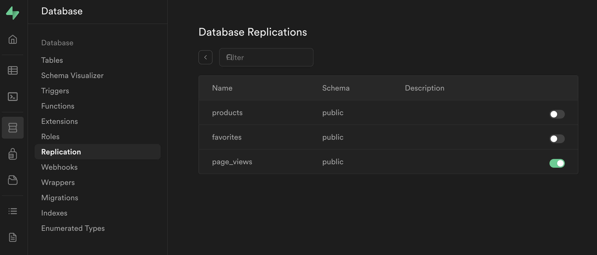
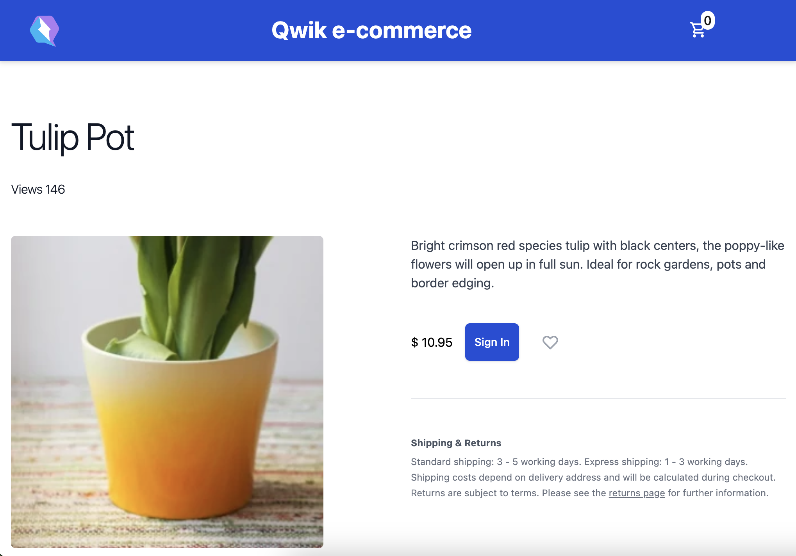

# Real-time database

Supabase offers us a further very interesting functionality, we can create real-time applications because it provides us with a series of very simple methods to use.
If we wanted to implement a chat or a social media it is clear that this functionality can be really useful, but it doesn't often happen that we have to implement such applications. I wanted to share a real application case that I had to develop. I implemented an interactive map that showed the movement of a specific vehicle in real-time. On the vehicle side, its position was sent every second, so I received the coordinates of the car and saved them in the database. On the frontend side, however, I had to show the position on the map and as the database changed, my application had to react accordingly by showing the new position to the end user. The result was very satisfactory because you could see the path of the vehicle, and I remember with pleasure that when we showed this functionality to customers, we always managed to obtain a "wow effect."
We can do the same with Supabase because we have the real-time functionality available. To activate the function we must go to the Database > Replication menu and in this section click on "0 table."
A new screen will open where we can activate real-time for our `page_views` table. By enabling this option we will be able to implement our new functionality. Together we will be able to show in real-time how many views a specific page has.




Ok, now let's write our frontend code to receive and display the data. Let's implement the functionality within the article detail page, but we could create a footer component and show the counter on all pages. We will need to add the middleware that saves the views on the pages we want to monitor.

FILE: `src/routes/detail/[slug]/index.tsx`

```tsx
import type { PostgrestSingleResponse } from "@supabase/supabase-js";
import { HeartIcon } from "~/components/HeartIcon";
import { IconShoppingCart } from "~/components/IconShoppingCart";
import type { Product } from "~/routes";
import { STORE_CONTEXT, useUser } from "~/routes/layout";
import { supabaseClient } from "~/utils/supabase";

export const onGet: RequestHandler = async ({
  params,
  next,
}) => {
  await supabaseClient.rpc("increment_views", {
    page_slug: params.slug,
  });
  await next();
};

export const useProductDetail = routeLoader$(
  async ({ params, resolveValue }) => {
    const slug = params.slug;
    const { data }: PostgrestSingleResponse<Product[]> =
      await supabaseClient
        .from("products")
        .select("*")
        .eq("slug", slug);

    if (!data || data.length === 0) {
      return { product: null, isFavorite: false };
    }

    let isFavorite = false;
    const user = await resolveValue(useUser);
    if (user) {
      const favoritesResponse = await supabaseClient
        .from("favorites")
        .select("*")
        .match({
          user_id: user.id,
          product_id: data[0].id,
        });
      isFavorite =
        !!favoritesResponse.data &&
        favoritesResponse.data.length > 0;
    }
    return { product: data[0], isFavorite };
  }
);

export const useCurentViews = routeLoader$(
  async ({ params }) => {
    const { data } = await supabaseClient
      .from("page_views")
      .select("views")
      .eq("page", params.slug);
    return data && data[0] ? data[0].views : 1;
  }
);

export const changeFavorite = server$(
  async (
    userId: string,
    productId: number,
    isFavorite: boolean
  ) => {
    if (isFavorite) {
      await supabaseClient
        .from("favorites")
        .insert({ user_id: userId, product_id: productId });
    } else {
      await supabaseClient
        .from("favorites")
        .delete()
        .match({ user_id: userId, product_id: productId });
    }
  }
);

export default component$(() => {
  const userSig = useUser();
  const viewsSig = useSignal(useCurentViews().value);
  const navigate = useNavigate();
  const location = useLocation();
  const store = useContext(STORE_CONTEXT);
  const productDetail = useSignal(useProductDetail().value);

  if (!productDetail.value.product) {
    return (
      <div>
        Sorry, looks like we don't have this product.
      </div>
    );
  }

  useVisibleTask$(({ cleanup }) => {
    const sub = supabaseClient
      .channel("custom-all-channel")
      .on(
        "postgres_changes",
        {
          event: "*",
          schema: "public",
          table: "page_views",
        },
        async (payload) => {
          if (
            payload.eventType === "UPDATE" &&
            payload.new.page === location.params.slug
          ) {
            const newViews = payload.new.views;
            viewsSig.value = newViews;
          }
        }
      )
      .subscribe();

    cleanup(() => {
      sub.unsubscribe();
    });
  });

  return (
    <div>
      <div class="...">
        <div>
          <h2 class="...">
            {productDetail.value.product.name}
          </h2>
          <span class="...">
            Views {viewsSig.value.toString()}
          </span>
          <div class="...">
            <div class="...">
              <span class="...">
                <div class="...">
                  
                </div>
              </span>
            </div>
            <div class="...">
              <div class="...">
                <h3 class="...">Description</h3>
                <div
                  class="..."
                  dangerouslySetInnerHTML={
                    productDetail.value.product.description
                  }
                />
              </div>
              <div class="...">
                $ {productDetail.value.product.price}
                <div class="...">
                  {userSig.value ? (
                    <button
                      type="button"
                      class="..."
                      onClick$={() => {
                        const cartProduct = [
                          ...store.cart.products,
                        ].find(
                          (p) =>
                            p.id ===
                            productDetail.value.product!.id
                        );
                        if (cartProduct) {
                          cartProduct.quantity += 1;
                          store.cart.products = [
                            ...store.cart.products,
                          ];
                        } else {
                          store.cart.products = [
                            ...store.cart.products,
                            {
                              ...productDetail.value
                                .product!,
                              quantity: 1,
                            },
                          ];
                        }
                      }}
                    >
                      <IconShoppingCart />
                      Add to cart
                    </button>
                  ) : (
                    <button
                      type="button"
                      class="..."
                      onClick$={() => navigate("/sign-in")}
                    >
                      Sign In
                    </button>
                  )}
                  <button type="button" class="...">
                    <HeartIcon
                      active={
                        productDetail.value.isFavorite
                      }
                      onClick$={async () => {
                        if (userSig.value) {
                          await changeFavorite(
                            userSig.value.id,
                            productDetail.value.product!.id,
                            !productDetail.value.isFavorite
                          );
                          productDetail.value = {
                            ...productDetail.value,
                            isFavorite:
                              !productDetail.value
                                .isFavorite,
                          };
                        }
                      }}
                    />
                    <span class="...">
                      Add to favorites
                    </span>
                  </button>
                </div>
              </div>

              <section class="...">
                <h3 class="...">Shipping & Returns</h3>
                <div class="...">
                  <p>
                    Standard shipping: 3 - 5 working days.
                    Express shipping: 1 - 3 working days.
                  </p>
                  <p>
                    Shipping costs depend on delivery
                    address and will be calculated during
                    checkout.
                  </p>
                  <p>
                    Returns are subject to terms. Please see
                    the
                    <span class="...">
                      returns page
                    </span> for further information.
                  </p>
                </div>
              </section>
            </div>
          </div>
        </div>
      </div>
    </div>
  );
});
```



Great, here's our finished detail page. We have implemented the functionality to display in real-time how many views the page has, but this is a good time to make a summary of the entire file because there is a lot of logic implemented. At the beginning of the file we have an `onGet` middleware that allows us to update the views of our page in the database, every time the page is rendered the counter in our database is also updated. Here we are invoking a database function that behind the scenes will execute the data update or insertion logic.
We then move on to the first `routeLoader$` present, here we read the product detail from the `products` table, and then we check whether the user is logged in or not thanks to the `resolveValue` method that we saw previously. If the user is logged in we check whether the article is among the user's favorites or not. We then pass all this information to the component to display it. Continuing we have another `routeLoader$` which allows us to read how many views the page we are viewing has because we are going to execute a query in our database, this will help us to have the initial value to show to the user.
Then we find a `server$` function that allows us to perform the update on our database to save whether the article is favorited or not for the current user.
Below we have our component, if we don't find the product we display a fallback message for the user otherwise we show the details of our product.
We have several signals, some of which receive default values that have been calculated on the server side. We also have `useNavigate` which allows us to redirect the user in case they need to Sign In and we have `useLocation` which allows us to read the slug from the page URL.
To handle the update of the `viewsSig` signal with the updated hit counter we used a `useVisibleTask$` to run the code in an `eagerly` when the component becomes visible in the viewport. The Qwik team wants to make sure that we are using `useVisibleTask$` with awareness and therefore decided to add a warning if we use it. You can disable it globally by changing the eslint configuration or with a specific eslint comment.
Inside the `useVisibleTask$` we have inserted our logic to react to changes made to the database. We subscribe to changing events in our database and react accordingly. We see that if the event is of type `UPDATE` and the change concerns the page we are viewing then we update the value of `viewsSig` to show the new data.
We also included `cleanup` at the end of the function, which is a very useful method because it allows us to remove the subscription to database changes when it's not necessary anymore.
We can think of `cleanup` as a method that is called when our component is removed from the viewport or when a new task is triggered. It is not invoked when the task is completed.
In the rest of the components we have the details of our product and then every time we add the product to the cart we update the application state to show the update of the counter of the product we want to purchase. As fully explained in the previous sections, the last peculiarity is that if we are not logged in we are asked to sign in.
