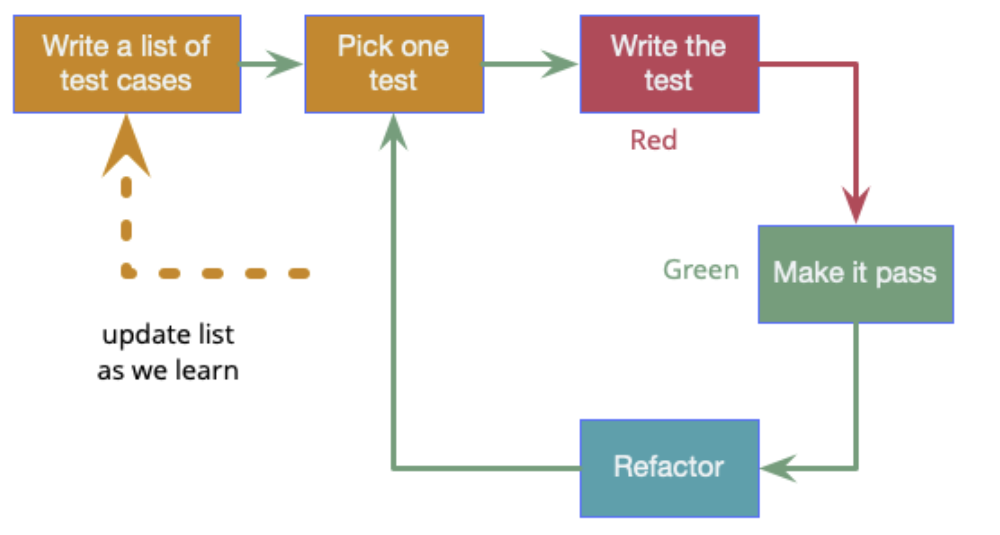

# Test-Driven Development (TDD)

We have seen what tests are for and what types exist, but we have not yet said how to put them into practice with dedication. TDD is a software development method that aims to be lean, and where tests are written before the actual code. The idea is that before even writing the application code for a solution, we think about the first possible cases and variants of the functionality that we need to implement. This approach ensures alignment between the requirements and the code we are going to write for our application. I deliberately said "first possible case studies" because with this methodology, the requirements are transformed into test cases step by step. The problem is divided into small parts and each requirement is introduced one by one, thus avoiding writing superfluous code upfront.
We start by writing the first test, therefore the first requirement, and we make it fail, after all, we haven't written any logic yet, but only the test. How could this work? At this point, the developer writes the minimum code necessary to pass the test. Once the test(s) have passed, we continue with a refactoring phase, which must not break the tests but continue to produce valid code. Once the duplications have been removed, and the code has been improved and aligned with the project standards, we can continue by inserting another requirement and then write a new test starting again with the cycle just described. Requirement after requirement we develop our code. Once we understand the mechanism, using this methodology, we would reduce the development time and increase the quality of our code because in each cycle there is the possibility of refactoring our code. If not adopted in this way, refactoring risks is one of those activities that are difficult to include in everyday activities because there is always something more important to do. With TDD, it is a specific phase of the methodology, and therefore, it is very difficult not to be able to dedicate time to this refactoring activity.

Image from https://martinfowler.com/bliki/TestDrivenDevelopment.html

To get the most out of this methodology, you need to focus on one feature at a time because it is an iterative method; it doesn't pretend to solve everything straight away. We need to start with a test that fails because this means that something is missing in our code. When, on the other hand, we see the green test, it means that we are continuing in the right direction. Don't write the code right away otherwise the tests, even if inserted later, will not help you design well-written logic. It is also good practice to write down good names for our tests because when they fail the names can help us determine what is wrong.
Another golden rule that I can share with you is not to create tests that depend on each other because we cannot execute them in parallel, but only in precise order. This greatly slows down the flow of execution of the tests.
