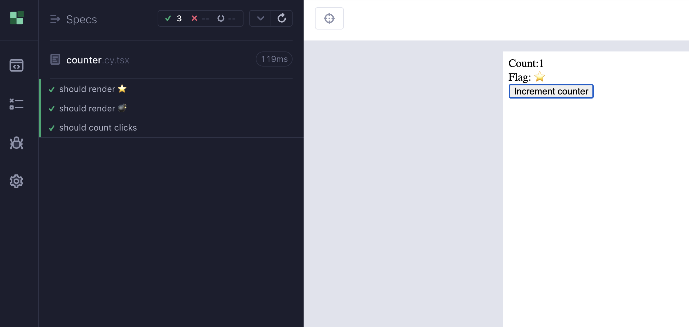
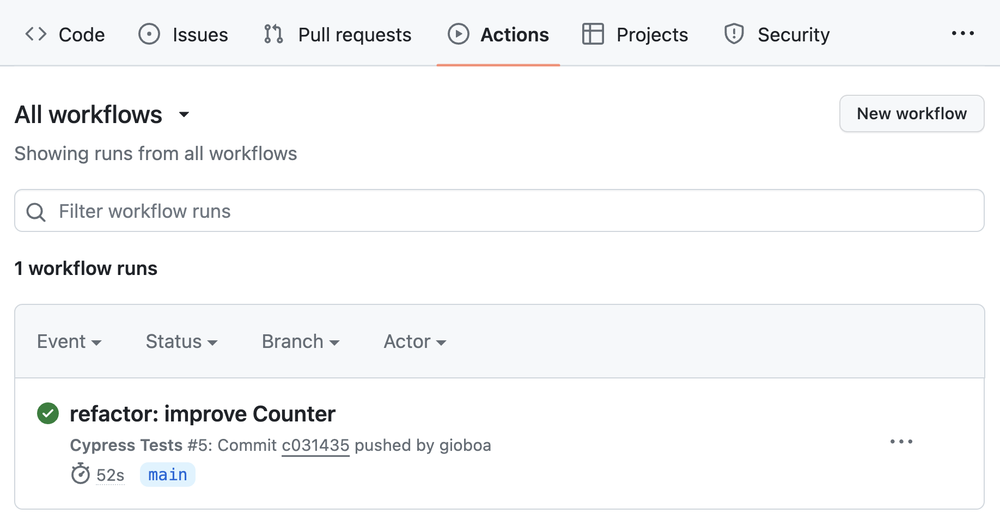

# Let's add some tests with Cypress

There are many tools for running tests with Qwik and via the Qwik CLI, you can integrate them into your project very quickly.
I would like to see together how easy it is to use `Cypress` to run e2e tests of our application.
To add Cypress to Qwik, simply use the

```shell
pnpm run qwik add cypress
```

command, and the Qwik CLI will add and install the dependencies for us and create the configuration files necessary for its operation.
This command, in addition to all the files necessary for the configuration, will also add two scripts in our `package.json`

```shell
"cypress.open": "cypress open --component",
"cypress.run": "cypress run --component",
```

Both commands launch Cypress to run the tests, with `open` the tool will open to show us the tests graphically in the browser while with `run` the same process will be executed but in headless mode. This allows us to run tests even in environments such as pipelines where the graphical interface is not present. If instead, we decide to launch the graphical interface we will also be able to navigate our tests, check the results, and re-run them at will.



Among the various files created for us by the Qwik integration, we also have this first example base file.
We have a component that renders a counter and maintains an internal state using the useStore API.

```typescript
export const Counter = component$(
  (props: { flag: boolean }) => {
    const state = useStore({ counter: 0 });
    return (
      <>
        <span>Count:{state.counter}</span>
        <div class="icon">
          Flag: {props.flag ? "⭐" : "💣"}
        </div>
        <button
          class="btn-counter"
          onClick$={() => state.counter++}
        >
          Increment counter
        </button>
      </>
    );
  }
);
```

Here is the file relating to the tests.

```typescript
it("should render ⭐", () => {
  cy.mount(<Counter flag={true} />);
  cy.get("div.icon").should("contain.text", "⭐");
});

it("should render 💣", () => {
  cy.mount(<Counter flag={false} />);
  cy.get("div.icon").should("contain.text", "💣");
});

it("should count clicks", () => {
  cy.mount(<Counter flag={true} />);
  cy.get("span").should("contain.text", "Count:0");
  cy.get("button").click();
  cy.get("span").should("contain.text", "Count:1");
});
```

Here we have some tests, in the first and second by varying the `flag` property we are going to verify that the `div` with the `ìcon` class contains the text that we have decided to show. The third test instead performs a more complex check, clicks on the button, and verifies that the displayed data containing `state.counter` is as we expect.
With this test, we can go and do the first refactor without fear of creating bugs because Cypress ran the test, and our component is correct.
Let's replace `useStore` with `useSignal` because in any case we only need to keep one value and `useSignal` is the API that best suits this need.

```typescript
export const Counter = component$(
  (props: { flag: boolean }) => {
    const counterSig = useSignal(0);
    return (
      <>
        <span>Count:{counterSig.value}</span>
        <div class="icon">
          Flag: {props.flag ? "⭐" : "💣"}
        </div>
        <button
          class="btn-counter"
          onClick$={() => counterSig.value++}
        >
          Increment counter
        </button>
      </>
    );
  }
);
```

So as per Test-Driven Development practice, we went to improve our component code to use `useSignal`. By launching the test suite we see that our test completes successfully and therefore we can say that we have completed our TDD cycle. If we have other requirements to include in the tests, now is the right time because our code passes the tests correctly, and we have also performed our refactoring, which has allowed us to increase the quality of our code. Well done!

This is a first example which you can then complicate as you wish. This is a test directly on the component and not an end-to-end test that touches the entire application flow. In fact, with Cypress, we can completely control our web page. We can simulate user events, here are some examples: `click`, `dblclick`, `rightclick`, `scrollTo`, `select`, `type`.
It is very clear what these events simulate, and it is possible to integrate them very quickly into our tests.

```typescript
cy.get("span").should("contain.text", "Count:0");
cy.get("button").click();
```

Analyzing the previous example we had already seen the `click` event. So once we have managed to recover the element we can simulate a certain event in a truly natural way.
It is also possible to control the browser by changing the history to move around the URL, but not only that. It is possible to access cookies to read, modify, and delete them. An example is `getAllCookies` which allows us to read cookies. We can also command the browser's `focus` to move the cursor on input, for example, and with the `type` event we can fill in the fields of a form. In short, we have full control to interact in depth with the browser and therefore writing our tests is quite easy. With Cypress, it is then possible to record the tests instead of writing them, and as mentioned before this allows us to reduce the time for creating and maintaining our tests.

## Add Cypress to our GitHub actions

As we have seen in the previous chapters, with GitHub Action we can perform automatic tasks to guarantee quality in our way of working.
To configure our GitHub repository to run the Cypress task on each commit, simply go to this page `https://github.com/<your_github_user>/<your_repo>/actions` and create a new task with this code.

```yml
name: Cypress Tests

on: push

jobs:
  cypress-run:
    runs-on: ubuntu-22.04
    steps:
      - name: Checkout
        uses: actions/checkout@v4
      # Install NPM dependencies, cache them correctly
      # and run all Cypress tests
      - name: Cypress run
        uses: cypress-io/github-action@v6
        with:
          component: true
          build: npm run build
          start: npm start
```

As we can see, GitHub Action has the advantage of simplicity because in just a few minutes you can create something truly valid and advanced.
This task installs the dependencies and through the action provided by Cypress `cypress-io/github-action` we can execute the task to verify our commits. Note that here we are running a specific test for a component, and not for a more complete flow we are using the `component: true` flag. Here is the check for our refactor commit. This flow allows us to verify that our code is always correct and allows us to prevent many bugs from reaching production. The configuration can be as complicated as desired to take into consideration many other variables. This is the basis for automation that nowadays is truly within everyone's reach, and there is no longer any reason not to consider it a necessary practice in everyday development.


