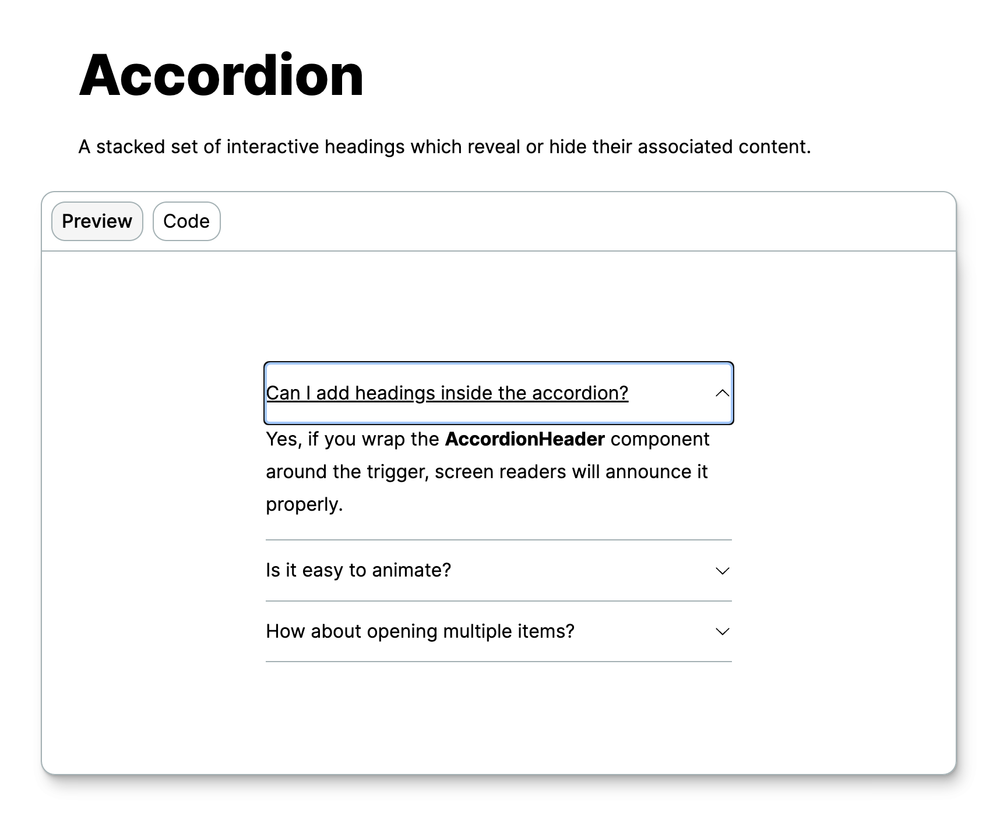

# Qwik UI

At the end of 2022, thanks to the community, the [Qwik UI](https://qwikui.com/) project was born, a library of components dedicated to and implemented on Qwik. To use the Qwik API and define and experiment with best practices in using Qwik. The last few years have allowed us to significantly improve the framework's codebase. By developing a series of low-level components, we touch on borderline cases and also use the various library integrations. This helped and still helps the ecosystem. The idea is that of a library of components that are provided in the form of a Headless Kit, therefore a series of bare-bones components where we can insert our styles independently. The library is still in the beta phase and other kits will almost certainly be released shortly, this will allow end users to not worry about defining the style for our components. So for example, the kit that Tailwind uses behind the scenes could come out and you just need to import the component. Let's see an example of components to understand how this can be implemented. Already in the previous chapters, with the creation of a button, we have seen an example of creating an internal library of components. Here it is very similar, except that a series of properties must be designed in advance to be useful to everyone.

## Accordion component

Let's see the `Accordion` component together.



```tsx
import {
  AccordionContent,
  AccordionHeader,
  AccordionItem,
  AccordionRoot,
  AccordionTrigger,
} from "@qwik-ui/headless";
import SVG from "./svg";

export default component$(() => {
  return (
    <>
      <div class="flex w-full justify-center">
        <AccordionRoot
          animated
          enhance={true}
          class="w-[min(400px,_100%)]"
        >
          <AccordionItem class="border-b">
            <AccordionHeader as="h3">
              <AccordionTrigger class="group flex w-full items-center justify-between rounded-t-sm py-4 text-left hover:underline">
                <span>
                  Can I add headings inside the accordion?
                </span>
                <span class="pl-2">
                  <SVG class="ease transition-transform duration-500 group-aria-expanded:rotate-180 group-aria-expanded:transform" />
                </span>
              </AccordionTrigger>
            </AccordionHeader>
            <AccordionContent class="accordion-animation-1 overflow-hidden">
              <p class="pb-4">
                Yes, if you wrap the{" "}
                <strong>AccordionHeader</strong> component
                around the trigger, screen readers will
                announce it properly.
              </p>
            </AccordionContent>
          </AccordionItem>
          <AccordionItem class="border-b">
            <AccordionHeader as="h3">
              <AccordionTrigger class="group flex w-full items-center justify-between py-4 text-left hover:underline">
                <span>Is it easy to animate?</span>
                <span class="pl-2">
                  <SVG class="ease transition-transform duration-500 group-aria-expanded:rotate-180 group-aria-expanded:transform" />
                </span>
              </AccordionTrigger>
            </AccordionHeader>
            <AccordionContent class="accordion-animation-1 overflow-hidden">
              <p class="pb-4">
                Yup! You can even use animations or CSS
                transitions using the{" "}
                <strong>animated</strong> prop on the
                accordion root!
              </p>
            </AccordionContent>
          </AccordionItem>
          <AccordionItem class="border-b">
            <AccordionHeader as="h3">
              <AccordionTrigger class="group flex w-full items-center justify-between py-4 text-left hover:underline aria-expanded:rounded-none">
                <span>
                  How about opening multiple items?
                </span>
                <span class="pl-2">
                  <SVG class="ease transition-transform duration-500 group-aria-expanded:rotate-180 group-aria-expanded:transform" />
                </span>
              </AccordionTrigger>
            </AccordionHeader>
            <AccordionContent class="accordion-animation-1 overflow-hidden">
              <p class="pb-4">
                You can do that by setting the{" "}
                <strong>behavior</strong> prop to "multi" on
                the Accordion
              </p>
            </AccordionContent>
          </AccordionItem>
        </AccordionRoot>
      </div>
    </>
  );
});
```

Here we see that, to give maximum customization to the end user who will use the component, various components have been defined. We see them listed in the initial imports, and together they make up the final result. These components are in fact `AccordionContent`, `AccordionHeader`, `AccordionItem`, `AccordionRoot`, and `AccordionTrigger`.
Tailwind was used to add style to these headless components, but let's analyze them to understand how you can go into such detail to create something complex.

### AccordionRoot

```tsx
import { accordionRootContextId } from './accordion-context-id';
import { type AccordionRootContext } from './accordion-context.type';

export type AccordionRootProps = {
	behavior?: 'single' | 'multi';
	animated?: boolean;
	enhance?: boolean;
	collapsible?: boolean;
	onSelectedIndexChange$?: PropFunction<(index: number) => void>;
	onFocusIndexChange$?: PropFunction<(index: number) => void>;
} & QwikIntrinsicElements['div'];

export const AccordionRoot = component$(
	({
		collapsible = true,
		behavior = 'single',
		animated = false,
		onSelectedIndexChange$,
		onFocusIndexChange$,
		...props
	}: AccordionRootProps) => {
		const rootRef = useSignal<HTMLDivElement | undefined>();
		const rootElement = rootRef.value;
		const currFocusedTriggerIndexSig = useSignal<number>(-1);
		const currSelectedTriggerIndexSig = useSignal<number>(-1);
		const selectedTriggerIdSig = useSignal<string>('');
		const triggerElementsSig = useSignal<HTMLButtonElement[]>([]);

		useTask$(({ track }) => {
			track(() => currSelectedTriggerIndexSig.value);

			if (onSelectedIndexChange$) {
				onSelectedIndexChange$(currSelectedTriggerIndexSig.value);
			}
		});

		useTask$(({ track }) => {
			track(() => currFocusedTriggerIndexSig.value);
			if (onFocusIndexChange$) {
				onFocusIndexChange$(currFocusedTriggerIndexSig.value);
			}
		});

		const updateTriggers$ = $(() => {
			if (!rootElement) {
				return;
			}

			// needs to grab a new array when adding or removing elements dynamically.
			const getLatestTriggers = Array.from(
				rootElement.querySelectorAll('[data-trigger-id]')
			) as HTMLButtonElement[];

			triggerElementsSig.value = getLatestTriggers.filter((element) => {
				if (element.getAttribute('aria-disabled') === 'true') {
					return false;
				}

				return true;
			});
		});

		const focusPreviousTrigger$ = $(() => {
			[...]
		});

		const focusNextTrigger$ = $(() => {
      [...]
		});

		const focusFirstTrigger$ = $(() => {
			[...]
		});

		const focusLastTrigger$ = $(() => {
			[...]
		});

		// takes a role call of its children (reactive b/c it's a signal)
		useVisibleTask$(function reIndexTriggers() {
			updateTriggers$();
		});

		const contextService: AccordionRootContext = {
			updateTriggers$,
			focusFirstTrigger$,
			focusPreviousTrigger$,
			focusNextTrigger$,
			focusLastTrigger$,
			currFocusedTriggerIndexSig,
			currSelectedTriggerIndexSig,
			selectedTriggerIdSig,
			triggerElementsSig,
			collapsible,
			behavior,
			animated,
		};

		useContextProvider(accordionRootContextId, contextService);

		return (
			<div {...props} ref={rootRef}>
				<Slot />
			</div>
		);
	}
);
```

Meanwhile, we can notice that in this long component at the end, we have inserted a `<Slot />` which allows you to render the other components that are enclosed within `<AccordionRoot />`. Furthermore, if we go to the beginning of the file we have different properties that are used to cover different cases and satisfy all end users.

Here are the properties that this component accepts:

- **behavior**: Determines whether the Accordion will open one or multiple items at a time.
- **collapsible**: Will allow the accordion to collapse items if set to true.
- **animated**: Allows the trigger to close using the onAnimationEnd$ and onTransitionEnd$ event handlers.
- **onSelectedIndexChange$**: An event hook that gets notified whenever the selected index changes.
- **onFocusIndexChange$**: An event hook that gets notified whenever the focus index changes.

In addition to the methods that will be used to make the component dynamic, there is `useContextProvider(accordionRootContextId, contextService);` which is used to create a context to be used in the other components.

### AccordionItem

```tsx
import { accordionItemContextId } from "./accordion-context-id";
import { type AccordionItemContext } from "./accordion-context.type";

export type AccordionItemProps = {
  defaultValue?: boolean;
} & QwikIntrinsicElements["div"];

export const AccordionItem = component$(
  ({
    defaultValue = false,
    id,
    ...props
  }: AccordionItemProps) => {
    const localId = useId();
    const itemId = id || localId;

    const isTriggerExpandedSig =
      useSignal<boolean>(defaultValue);

    const itemContext: AccordionItemContext = {
      itemId,
      isTriggerExpandedSig,
      defaultValue,
    };

    useContextProvider(accordionItemContextId, itemContext);

    return (
      <div
        id={itemId}
        data-type="item"
        data-item-id={itemId}
        {...props}
      >
        <Slot />
      </div>
    );
  }
);
```

Here are the properties that this component accepts:

- **id**: Allows the consumer to supply their id attribute for the item and its descendants.
- **defaultValue**: Determines whether the Accordion Item will open by default.

This component is used to render the rest of the components and therefore is short. Here too, a context `useContextProvider(accordionItemContextId, itemContext);` is created, again to share an internal state with the components that will be inserted in place of the `<Slot />`.

### AccordionHeader

```tsx
import { accordionItemContextId } from "./accordion-context-id";

type HeadingUnion = "h1" | "h2" | "h3" | "h4" | "h5" | "h6";

export type AccordionHeaderProps =
  QwikIntrinsicElements[HeadingUnion] & {
    as?: HeadingUnion;
  };

export const AccordionHeader = component$(
  ({ as = "h3", ...props }: AccordionHeaderProps) => {
    const itemContext = useContext(accordionItemContextId);
    const itemId = itemContext.itemId;
    const headerId = `${itemId}-header`;

    const PolymorphicHeading = as;

    return (
      <PolymorphicHeading id={headerId} {...props}>
        <Slot />
      </PolymorphicHeading>
    );
  }
);
```

Here are the properties that this component accepts:

- **as**: Sets the heading tag of the Accordion Header

Thanks to `QwikIntrinsicAttributes` you can inherit the properties of native HTML elements.

- **class**: CSS classes you can apply
- **style**: CSS styles you can apply
- **disabled**: Disables the element
- **onClick$**: A custom click handler that executes when the element is clicked.
- **onKeyDown$**: A custom click handler that executes when the key is pressed down.
- **onFocus$**: A custom click handler that executes when an element is focused.

Here the `itemContext` is extracted from the `accordionItemContextId` context and the `headerId` to be assigned to the component is used.

### AccordionTrigger

```tsx
import {
  accordionItemContextId,
  accordionRootContextId,
} from "./accordion-context-id";

import { KeyCode } from "../../utils/key-code.type";

const accordionPreventedKeys = [
  KeyCode.Home,
  KeyCode.End,
  KeyCode.PageDown,
  KeyCode.PageUp,
  KeyCode.ArrowDown,
  KeyCode.ArrowUp,
];

export type AccordionTriggerProps = {
  disabled?: boolean;
} & QwikIntrinsicElements["button"];

export const AccordionTrigger = component$(
  ({ disabled, ...props }: AccordionTriggerProps) => {
    const contextService = useContext(
      accordionRootContextId
    );
    const itemContext = useContext(accordionItemContextId);

    const ref = useSignal<HTMLButtonElement>();
    const triggerElement = ref.value;

    const behavior = contextService.behavior;
    const collapsible = contextService.collapsible;
    const defaultValue = itemContext.defaultValue;

    const triggerElementsSig =
      contextService.triggerElementsSig;
    const triggerId = `${itemContext.itemId}-trigger`;

    const updateTriggers$ = contextService.updateTriggers$;

    /* content panel id for aria-controls */
    const contentId = `${itemContext.itemId}-content`;

    const selectedTriggerIdSig =
      contextService.selectedTriggerIdSig;
    const isTriggerExpandedSig =
      itemContext.isTriggerExpandedSig;

    /* The consumer can use these two signals. */
    const currFocusedTriggerIndexSig =
      contextService.currFocusedTriggerIndexSig;
    const currSelectedTriggerIndexSig =
      contextService.currSelectedTriggerIndexSig;

    const setSelectedTriggerIndexSig$ = $(() => {
      if (behavior === "single" && triggerElement) {
        currSelectedTriggerIndexSig.value =
          triggerElementsSig.value.indexOf(triggerElement);
      }
    });

    const setCurrFocusedIndexSig$ = $(() => {
      if (!triggerElement) {
        return;
      }

      currFocusedTriggerIndexSig.value =
        triggerElementsSig.value.indexOf(triggerElement);
    });

    useTask$(function resetTriggersTask({ track }) {
      track(() => selectedTriggerIdSig.value);

      if (
        behavior === "single" &&
        triggerId !== selectedTriggerIdSig.value
      ) {
        isTriggerExpandedSig.value = false;
      }
    });

    useTask$(function openDefaultValueTask() {
      if (defaultValue) {
        isTriggerExpandedSig.value = true;
      }
    });

    useVisibleTask$(function navigateTriggerVisibleTask({
      cleanup,
    }) {
      if (!triggerElement) {
        return;
      }

      /* runs each time a new trigger is added. We need to tell the root it's time to take a role call. */
      if (!disabled) {
        updateTriggers$();
      }

      function keyHandler(e: KeyboardEvent) {
        if (
          accordionPreventedKeys.includes(e.key as KeyCode)
        ) {
          e.preventDefault();
        }
      }

      triggerElement.addEventListener(
        "keydown",
        keyHandler
      );
      cleanup(() => {
        triggerElement?.removeEventListener(
          "keydown",
          keyHandler
        );
      });
    });

    useVisibleTask$(
      function cleanupTriggersTask({ cleanup }) {
        cleanup(() => {
          updateTriggers$();
        });
      },
      { strategy: "document-ready" }
    );
    return (
      <button
        ref={ref}
        id={triggerId}
        disabled={disabled}
        aria-disabled={disabled}
        data-trigger-id={triggerId}
        data-state={
          isTriggerExpandedSig.value ? "open" : "closed"
        }
        onClick$={
          disabled
            ? []
            : [
                $(() => {
                  selectedTriggerIdSig.value = triggerId;

                  setSelectedTriggerIndexSig$();

                  collapsible
                    ? (isTriggerExpandedSig.value =
                        !isTriggerExpandedSig.value)
                    : (isTriggerExpandedSig.value = true);
                }),
                props.onClick$,
              ]
        }
        aria-expanded={isTriggerExpandedSig.value}
        aria-controls={contentId}
        onKeyDown$={[
          $(async (e: QwikKeyboardEvent) => {
            if (e.key === "ArrowUp") {
              await contextService.focusPreviousTrigger$();
            }

            if (e.key === "ArrowDown") {
              await contextService.focusNextTrigger$();
            }

            if (e.key === "Home") {
              await contextService.focusFirstTrigger$();
            }

            if (e.key === "End") {
              await contextService.focusLastTrigger$();
            }
          }),
          props.onKeyDown$,
        ]}
        onFocus$={[setCurrFocusedIndexSig$, props.onFocus$]}
        {...props}
      >
        <Slot />
      </button>
    );
  }
);
```

Here too we have a series of properties that come directly from `QwikIntrinsicElements['button']` we inherit all the properties plus we have the possibility of passing the property to deactivate the button.
In terms of accessibility, we are supporting everything necessary.

- **Tab**: Moves focus to the next focusable trigger.
- **Shift + Tab**: Moves focus to the previous focusable trigger.
- **Space / Enter**: Expand or collapse the Accordion Trigger.
- **Up Arrow**: When focus is on an accordion trigger, it will move to the previous one, or the last if at the top.
- **Down Arrow**: When focus is on an accordion trigger, it will move to the next one, or the first if at the bottom.
- **Home**: When on an Accordion Trigger, it will focus to the first Accordion Trigger.
- **End**: When on an Accordion Trigger, it will focus to the last Accordion Trigger.

### AccordionContent

```tsx
import {
  accordionItemContextId,
  accordionRootContextId,
} from "./accordion-context-id";

export type ContentProps = QwikIntrinsicElements["div"];

export const AccordionContent = component$(
  ({ ...props }: ContentProps) => {
    const contextService = useContext(
      accordionRootContextId
    );
    const itemContext = useContext(accordionItemContextId);

    const ref = useSignal<HTMLElement>();
    const contentElement = ref.value;
    const contentId = `${itemContext.itemId}-content`;

    const animated = contextService.animated;
    const defaultValue = itemContext.defaultValue;
    const totalHeightSig = useSignal<number>(0);

    const isTriggerExpandedSig =
      itemContext.isTriggerExpandedSig;
    const isContentHiddenSig = useSignal<boolean>(
      !defaultValue
    );

    const hideContent$ = $(() => {
      if (!isTriggerExpandedSig.value) {
        isContentHiddenSig.value = true;
      }
    });

    useStylesScoped$(`
    /* check global.css utilites layer for animation */
    @keyframes accordion-open {
      0% {
        height: 0;
      }
      100% {
        height: var(--qwikui-accordion-content-height);
      }
    }
  
    @keyframes accordion-close {
        0% {
          height: var(--qwikui-accordion-content-height);
        }
        100% {
          height: 0;
        }
      }
  `);

    /* allows animate / transition from display none */
    useTask$(function animateContentTask({ track }) {
      if (!animated) {
        return;
      }

      track(() => isTriggerExpandedSig.value);

      if (isTriggerExpandedSig.value) {
        isContentHiddenSig.value = false;
      }
    });

    /* calculates height of the content container based on children */
    useVisibleTask$(function calculateHeightVisibleTask({
      track,
    }) {
      if (animated === false) {
        return;
      }

      track(() => isContentHiddenSig.value);

      if (totalHeightSig.value === 0) {
        getCalculatedHeight();
      }

      function getCalculatedHeight() {
        if (!contentElement) {
          return;
        }

        const contentChildren = Array.from(
          contentElement.children
        ) as HTMLElement[];

        contentChildren.forEach((element, index) => {
          totalHeightSig.value += element.offsetHeight;

          if (index === contentChildren.length - 1) {
            contentElement.style.setProperty(
              "--qwikui-accordion-content-height",
              `${totalHeightSig.value}px`
            );
          }
        });
      }
    });

    return (
      <div
        ref={ref}
        role="region"
        id={contentId}
        data-content-id={contentId}
        data-state={
          isTriggerExpandedSig.value ? "open" : "closed"
        }
        hidden={
          animated
            ? isContentHiddenSig.value
            : !isTriggerExpandedSig.value
        }
        onAnimationEnd$={[
          hideContent$,
          props.onAnimationEnd$,
        ]}
        onTransitionEnd$={[
          hideContent$,
          props.onTransitionEnd$,
        ]}
        style={{
          ["--qwikui-collapsible-content-height" as string]:
            "var(--qwikui-accordion-content-height)",
          ["--qwikui-collapsible-content-width" as string]:
            "var(--qwikui-accordion-content-width)",
        }}
        {...props}
      >
        <Slot />
      </div>
    );
  }
);
```

This is the last component, and we are going to exploit a series of properties that come directly from `QwikIntrinsicElements['div']`. We see that the animation of the icon to open and close the accordion was then implemented using CSS.

For a simple component as the accordion may seem, we see that there is a lot of code behind it and therefore it makes us reflect on the fact that implementing an accessible component that satisfies everyone's needs is not simple.

## End-to-end Component Testing

The components of the library are all tested and this is no exception we can go and see the Cypress tests that have been implemented. Here is a link to the previous section where we went to see how to test our component in isolation.

```tsx
import {
  AccordionRoot,
  AccordionItem,
  AccordionContent,
  AccordionTrigger,
  AccordionHeader,
} from "./index";

interface AccordionProps {
  behavior?: "single" | "multi";
  collapsible?: boolean;
}

const ThreeItemAccordion = component$(
  ({ behavior, collapsible, ...props }: AccordionProps) => {
    return (
      <AccordionRoot
        behavior={behavior}
        collapsible={collapsible}
        {...props}
      >
        <AccordionItem class="border-b">
          <AccordionTrigger>Trigger 1</AccordionTrigger>
          <AccordionContent>
            <p>Content 1</p>
          </AccordionContent>
        </AccordionItem>
        <AccordionItem class="border-b">
          <AccordionTrigger>Trigger 2</AccordionTrigger>
          <AccordionContent>
            <p>Content 2</p>
          </AccordionContent>
        </AccordionItem>
        <AccordionItem class="border-b">
          <AccordionTrigger>Trigger 3</AccordionTrigger>
          <AccordionContent>
            <p>Content 3</p>
          </AccordionContent>
        </AccordionItem>
      </AccordionRoot>
    );
  }
);

describe("Critical Functionality", () => {
  it("INIT", () => {
    cy.mount(<ThreeItemAccordion />);

    cy.checkA11yForComponent();
  });

  it(`GIVEN 3 accordion items
      WHEN clicking the 2nd item's trigger
      THEN the 2nd trigger should have aria expanded set to true
    `, () => {
    cy.mount(<ThreeItemAccordion />);

    cy.findByRole("button", { name: /Trigger 2/i })
      .click()
      .should("have.attr", "aria-expanded", "true");
  });

  it(`GIVEN 3 accordion items
      WHEN clicking the 2nd item's trigger twice
      THEN the 2nd trigger should have aria expanded set to false
  `, () => {
    cy.mount(<ThreeItemAccordion />);

    cy.findByRole("button", { name: /Trigger 2/i })
      .click()
      .click()
      .should("have.attr", "aria-expanded", "false");
  });

  it(`GIVEN 3 accordion items
      WHEN clicking the 2nd item's trigger
      THEN render the 2nd item's content
  `, () => {
    cy.mount(<ThreeItemAccordion />);

    cy.findByRole("button", { name: /Trigger 2/i }).click();

    cy.findByRole("region").should("contain", "Content 2");
  });

  it(`GIVEN 3 accordion items
      WHEN clicking the 2nd item's trigger twice
      THEN the 2nd item's content should be hidden.
  `, () => {
    cy.mount(<ThreeItemAccordion />);

    cy.findByRole("button", { name: /Trigger 2/i })
      .click()
      .click();

    cy.findByRole("region").should("not.exist");
  });
});

describe("Keyboard Navigation", () => {
  it(`GIVEN 3 accordion items and the 2nd item's trigger is focused
  WHEN the enter key is pressed
  THEN the content of the 2nd item should render
`, () => {
    cy.mount(<ThreeItemAccordion />);

    cy.findByRole("button", { name: /Trigger 2/i })
      .focus()
      .type(`{enter}`);

    cy.findAllByRole("region").should(
      "contain",
      "Content 2"
    );
  });

  it(`GIVEN 3 accordion items and the 3rd item's trigger is focused
    WHEN the space key is pressed
    THEN the content of the 3rd item should render 
  `, () => {
    cy.mount(<ThreeItemAccordion />);

    cy.findByRole("button", { name: /Trigger 3/i })
      .focus()
      .type(" ");

    cy.findAllByRole("region").should(
      "contain",
      "Content 3"
    );
  });

  it(`GIVEN 3 accordion items and the focus is on the 1st trigger
    WHEN down arrow key is pressed
    THEN the next trigger should get focus
  `, () => {
    cy.mount(<ThreeItemAccordion behavior="single" />);

    cy.findByRole("button", { name: /Trigger 1/i })
      .focus()
      .type("{downArrow}");

    cy.findByRole("button", { name: /Trigger 2/i }).should(
      "have.focus"
    );
  });

  it(`GIVEN 3 accordion items and the focus is on the 2nd trigger
  WHEN the up arrow key is pressed
  THEN the previous trigger should get focus
  `, () => {
    cy.mount(<ThreeItemAccordion behavior="single" />);

    cy.findByRole("button", { name: /Trigger 1/i })
      .focus()
      .type("{downArrow}");

    cy.findByRole("button", { name: /Trigger 2/i })
      .focus()
      .type("{upArrow}");

    cy.findByRole("button", { name: /Trigger 1/i }).should(
      "have.focus"
    );
  });
});

describe("Prop Behavior", () => {
  it(`GIVEN 3 accordion items with type single
      WHEN clicking the 1st trigger, and soon after the 2nd trigger
      THEN the content of the 1st item should close, and the 2nd should open.
    `, () => {
    cy.mount(<ThreeItemAccordion behavior="single" />);

    cy.findByRole("button", { name: /Trigger 1/i })
      .click()
      .should("have.attr", "aria-expanded", "true");

    cy.findByRole("button", { name: /Trigger 2/i })
      .click()
      .should("have.attr", "aria-expanded", "true");

    cy.findByRole("button", { name: /Trigger 1/i }).should(
      "have.attr",
      "aria-expanded",
      "false"
    );
  });

  it(`GIVEN 3 accordion items of type multi
      WHEN clicking multiple different triggers
      THEN none of the content should close.
  `, () => {
    cy.mount(<ThreeItemAccordion behavior="multi" />);

    cy.findByRole("button", { name: /Trigger 1/i }).click();
    cy.findByRole("button", { name: /Trigger 2/i }).click();

    cy.findAllByRole("region")
      .eq(0)
      .should("contain", "Content 1");
    cy.findAllByRole("region")
      .eq(1)
      .should("contain", "Content 2");
  });

  const DefaultValueAccordion = component$(() => {
    return (
      <AccordionRoot>
        <AccordionItem class="border-b">
          <AccordionTrigger>Trigger 1</AccordionTrigger>
          <AccordionContent>Content 1</AccordionContent>
        </AccordionItem>
        <AccordionItem defaultValue>
          <AccordionTrigger>Trigger 2</AccordionTrigger>
          <AccordionContent>Content 2</AccordionContent>
        </AccordionItem>
      </AccordionRoot>
    );
  });

  it(`GIVEN 2 accordion items
      WHEN the 2nd item has the defaultValue prop
      THEN the 2nd item's content should be open.
  `, () => {
    cy.mount(<DefaultValueAccordion />);

    cy.findByRole("region").should("contain", "Content 2");
  });

  it(`GIVEN 2 accordion items of type single
      WHEN the 2nd item has the defaultValue prop, and the 1st trigger is clicked
      THEN the 2nd item's content should be closed, and the 1st opened.
  `, () => {
    cy.mount(<DefaultValueAccordion />);

    cy.findByRole("button", { name: /Trigger 1/i }).click();

    cy.findByRole("region").should("contain", "Content 1");

    cy.findByRole("region").eq(1).should("not.exist");
  });

  const HeaderAccordion = component$(() => {
    return (
      <AccordionRoot>
        <AccordionItem class="border-b">
          <AccordionHeader as="h4">
            <AccordionTrigger>Trigger 1</AccordionTrigger>
            <AccordionContent>Content 1</AccordionContent>
          </AccordionHeader>
        </AccordionItem>
      </AccordionRoot>
    );
  });

  it(`GIVEN 1 accordion item
      WHEN there is an AccordionHeader wrapped around the item
      THEN it should be a heading
  `, () => {
    cy.mount(<HeaderAccordion />);

    cy.findByRole("heading");
  });

  it(`GIVEN 1 accordion item with the as prop on an accordion header
      WHEN as is set to h4
      THEN AccordionHeader should be rendered as an h4
  `, () => {
    cy.mount(<HeaderAccordion />);

    cy.get("h4");
  });
});
```

Here we can see that although we have several tests for this component, I omitted many because otherwise the file would have become too long. The description of the various tests is explanatory, but it should be noted that initially an accessibility check is immediately performed with the Cypress `checkA11yForComponent` method. In the various tests, a component created on the fly is used, which allows us to carry out our tests in isolation. Among the various tests, those relating to `Keyboard Navigation` are also performed, which is fundamental for accessibility. I invite you to take a look at it to understand what the code does because by looking at other people's code we can learn a lot.

## Qwik UI team

Together with other developers, I started this project which was born with the desire to produce a library of totally accessible components, in fact we have never compromised on the topic of accessibility and use of Qwik with the best practices. From the beginning, these two have been the key points, with the addition of the fact that this project was born and wants to remain a community-driven project. Finding time for this project was not easy, during working hours there is no possibility of dedicating oneself to extra activities, and therefore as often happens, it is precisely by sacrificing free time that one can make one's contribution. Today, I am not as actively engaged in the project, but I keep track of its developments from a distance. If there is a need and time permits, I am always happy to lend a hand. I want to express my gratitude to all the individuals who have collaborated on the project; even though it is still in beta, their collective effort has resulted in truly sensational work.
