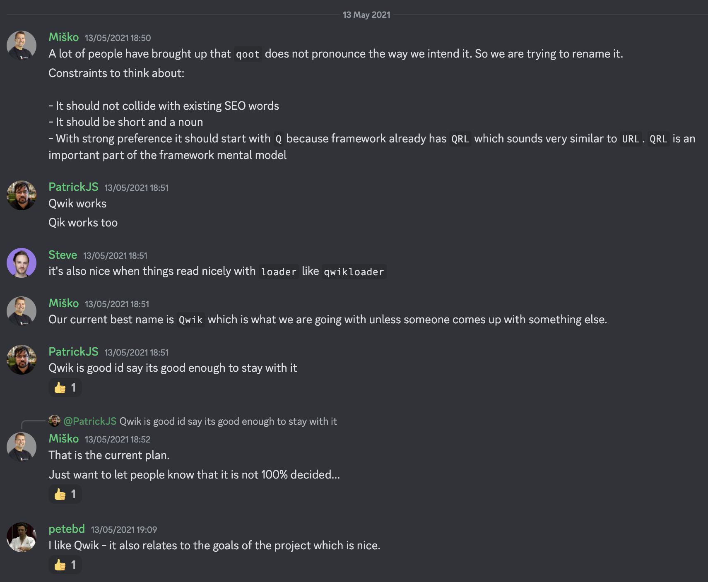

# A bit of history of Qwik

During these chapters, we went into detail about Qwik, an innovative framework that, compared to all the others available, approaches flows in a different way to allow you to create modern applications.
Clearly, like all ideas, Qwik also started with a prototype which evolved over the months.
If we execute the following command within the Qwik codebase we can see how and when the repository was born.

```shell
git log --reverse
```

Output:

```shell
commit bfaf99c568b0eea147a40d1503370cd6de1bf4ea
Author: Miško Hevery <misko@hevery.com>
Date:   Sat Feb 13 13:23:14 2021 -0800

    Initial commit

commit ea318b072b7c43078e32d3500b6fdf5f88ac2a8a
Author: Misko Hevery <misko@hevery.com>
Date:   Sat Feb 13 15:30:01 2021 -0800

    feat: initial implementation of qootloader vs sample apps

commit 4f90f1d7f986177f767a01225c8e10c8177d4ae0
Author: Misko Hevery <misko@hevery.com>
Date:   Mon Feb 15 13:24:39 2021 -0800

    chore: Setup unit and e2e testing infrastructure.

commit 86dc3e5c1977dd4fe31f41c97b95d73006372749
Author: Misko Hevery <misko@hevery.com>
Date:   Mon Feb 15 22:30:59 2021 -0800

    feat: JSX scaffolding for rendering

commit 7b01a60d7b48fd6f72abbe174ce0c0178e7a3bbc
Author: Misko Hevery <misko@hevery.com>
Date:   Wed Feb 17 19:22:11 2021 -0800

    chore: setup unit tests infrastructure

commit 600918b704a2fc1167ecca9f838b199b5440149e
Author: Misko Hevery <misko@hevery.com>
Date:   Thu Feb 18 22:43:12 2021 -0800

    feat: basic JSX implementation for rendering
```

It's February 2021, the creator of the framework, `Miško Hevery`, was starting to lay the foundations for what today we can now consider, without presumption, the framework that is changing the world of frontend. This new mental model had already been in his head for many years, initially as an embryonic idea and then more and more concrete. Already in May 2019, in the [Keynote of Day3 of the ng-conf](https://youtu.be/-kYtw3CSe6s?t=797), Miško Hevery presented to the world his idea who only after a few years would have had the time and strength to make it effective. To present the 2019 talk, the idea had certainly been in his mind for some time, who knows, perhaps as early as 2018. So it is a newly implemented framework, but it was digested for a long time before taking shape.
We see that in 2021 there is the first commit, an `initial commit` and then a `feat: initial implementation of qootloader vs sample apps` and then continuing in the following days up to today. We can see that instead of the current `qwikloader`, there was a `qootloader` because the framework was initially called `qoot` and then was renamed to `Qwik`.
Also for this decision, we can go back in time and see some old messages in the Qwik Discord server. Here we have gone back to May 2021, when the decision to change the name of the framework was made.



It's nice to read that obviously, they checked if the domain was available to buy it and then a discussion started on which logo to choose for the framework. It's nice to note that all the decisions that were made were always shared with the community and were open to any changes. Now the way of proceeding with decisions has not changed because the community comes first. Moments are organized to share the news of the framework and external contributions are encouraged. This way of operating makes it pleasant to be part of a project and know that, if we want, we can have our say and influence future changes.
The first integrations were born precisely to help the community, and among the first integrations, the one with React was developed. In fact, it is possible to integrate React components within our Qwik applications.
