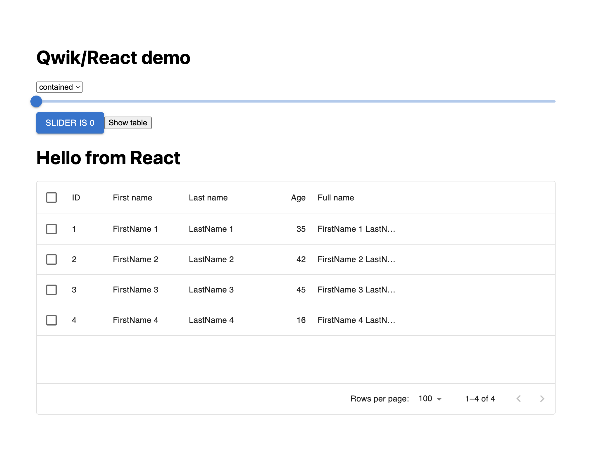

# qwikify$

The integration with React components was created under the name `qwikify$` and the use case is soon explained. Let's imagine we have a series of components written in React that we would like to reuse in our application. If we want to use Qwik and use these components it is clear that without this integration it would not be possible. Furthermore, it is also possible to use React libraries such as MaterialUI, and Threejs, in short, we can draw on the vast React ecosystem. This approach can also be used to get the benefits of Qwik without having to rewrite your React application.
This solution is integrated into the Qwik codebase and therefore it is clear that any problems will be followed directly by the Qwik team or by the large community that supports it, in fact, the import of `qwikify$` comes directly from a core Qwik package.

> Thanks to the community it is possible to also integrate Angular, Preact, or other framework components within our Qwik application. These integrations have APIs completely similar to the React one, which we will analyze, and were developed as mentioned by the community. Thanks to the commitment of all the developers involved the Qwik ecosystem has grown enormously.

As we have seen many times throughout this book, with `qwik add` we have understood that we can do many things, the only thing missing is being able to make coffee.
So to add the integration with React we can type:

```shell
pnpm qwik add react
```

This integration configures everything automatically:

```shell
┌  🦋  Add Integration  react
│
◇  👻  Ready?  Add react to your app?
│
│  🐬 Modify
│     - package.json
│     - vite.config.ts
│
│  🌟 Create
│     - src/integrations/react/mui.tsx
│     - src/routes/react/index.tsx
│
│  💾 Install pnpm dependencies:
│     - @emotion/react ^11.11.1
│     - @emotion/styled ^11.11.0
│     - @mui/material ^5.13.0
│     - @mui/x-data-grid ^6.4.0
│     - @types/react ^18.2.28
│     - @types/react-dom ^18.2.13
│     - react 18.2.0
│     - react-dom 18.2.0
│
◆  Ready to apply the react updates to your app?
│  ● Yes looks good, finish update!
│  ○ Nope, cancel update
└
```

We can see that some dependencies will be added to our application and then to create the React example some libraries are installed. A new `qwikReact` plugin will also be added to the Vite configuration. This serves to optimize the dependencies related to React during the compilation phase.
The Qwik CLI will also create a `src/integrations/react/mui.tsx` file where our React components are located and where they are wrapped with `qwikify$`.

FILE: `src/integrations/react/mui.tsx`

```tsx
// This pragma is required so that React JSX is used instead of Qwik JSX
/** @jsxImportSource react */

import { Button, Slider } from "@mui/material";
import {
  DataGrid,
  GridColDef,
  GridValueGetterParams,
} from "@mui/x-data-grid";

export const MUIButton = qwikify$(Button);
export const MUISlider = qwikify$(Slider, {
  eagerness: "hover",
});

export const TableApp = qwikify$(() => {
  const columns: GridColDef[] = [
    { field: "id", headerName: "ID", width: 70 },
    {
      field: "firstName",
      headerName: "First name",
      width: 130,
    },
    {
      field: "lastName",
      headerName: "Last name",
      width: 130,
    },
    {
      field: "age",
      headerName: "Age",
      type: "number",
      width: 90,
    },
    {
      field: "fullName",
      headerName: "Full name",
      description:
        "This column has a value getter and is not sortable.",
      sortable: false,
      width: 160,
      valueGetter: (params: GridValueGetterParams) =>
        `${params.row.firstName || ""} ${
          params.row.lastName || ""
        }`,
    },
  ];

  const rows = [
    {
      id: 1,
      lastName: "LastName 1",
      firstName: "FirstName 1",
      age: 35,
    },
    {
      id: 2,
      lastName: "LastName 2",
      firstName: "FirstName 2",
      age: 42,
    },
    {
      id: 3,
      lastName: "LastName 3",
      firstName: "FirstName 3",
      age: 45,
    },
    {
      id: 4,
      lastName: "LastName 4",
      firstName: "FirstName 4",
      age: 16,
    },
  ];

  return (
    <>
      <h1>Hello from React</h1>

      <div style={{ height: 400, width: "100%" }}>
        <DataGrid
          rows={rows}
          columns={columns}
          checkboxSelection
        />
      </div>
    </>
  );
});
```

And finally in the `https://my-website.com/react` route an example page will be created where we can already see `qwikify$` in action.

> It should be noted that this is not an emulation of React because we are using the real library.

Here is the result in the `/react` route



This is a complete example that is provided out of the box but it makes more sense to analyze a basic example in detail to see all the various cases.
It is not possible to use React components in Qwik without converting them using `qwikify$`. React components are very similar but behind the scenes, they are very different.
React and Qwik cannot be mixed in the same file. Best practices indicate inserting the React components in the `src/integrations/react/` folder.

> It should be noted that with this integration we are not going to exploit the resumability of Qwik on our React components, but we can improve the hydration process of React by postponing it and therefore making it lazy and more. Unfortunately, due to how React works, if we did not execute the hydration, our Counter button, even if pressed, would not perform any action because it is precisely the hydration process that attaches the event to the button.

Let's analyze this React component:

```tsx
/** @jsxImportSource react */
import { useState } from "react";

function Counter() {
  const [count, setCount] = useState(0);
  return (
    <button
      className="react"
      onClick={() => setCount(count + 1)}
    >
      Count: {count}
    </button>
  );
}

export const QCounter = qwikify$(Counter, {
  eagerness: "hover",
});
```

In our example, we see that we have a React component that defines a Counter.
When we export the component and wrap it with `qwikify$` we define the condition for which the React code is executed to perform the lazy hydration.
I deliberately said "executed" because behind the scenes thanks to the Qwik service worker we have already downloaded all the files and placed them in the cache to be executed when necessary.
So we are rendering the component on the server (with SSR), and we are improving React's hydration by not only making it lazy but also caching all the necessary files in the service worker. All this makes our application better and more performant. We have different configurations to define how to delay the hydration process, let's see them together:

- **eagerness: 'hover'**: The component eagerly hydrates `when the mouse is over the component` and you can use this for lowest-priority UI elements which interactivity is not crucial, and only needs to run on desktop. (hover event is not present on mobile devices)
- **eagerness: 'idle'**: The component eagerly hydrates when the `browser first becomes idle`, i.e., when everything important has already run before and you can use this for lower-priority UI elements that don't need to be immediately interactive.
- **eagerness: 'load'**: The component eagerly hydrates `when the document loads` and you can use this for your immediately visible UI elements that need to be interactive as soon as possible.
- **eagerness: 'visible'**: The component eagerly hydrates `when it becomes visible in the viewport` and you can use this for low-priority UI elements that are either far down the page (“below the fold”) or so resource-intensive to load that you would prefer not to load them at all if the user never saw the element.

We therefore have many possibilities to make the expensive process of hydration better, but it is possible to provide the same configuration via a sugar syntax that allows us to give the same instructions. Let's see how:

```tsx
<QCounter client:hover></QCounter>
```

Here we see that we have used `client:hover` as an attribute in our component wrapped with `qwikify$` and this instructs the system to behave like the previous example i.e., like this
`export const QCounter = qwikify$(Counter, { eagerness: 'hover' });`.
The other attributes we can pass are `client:idle`, `client:load`, and `client:visible`, but thanks to the use of this attribute we can have further possibilities.

- **client:signal**: This is an advanced API that allows to hydrating of the component whenever the passed signal becomes true. This effectively allows you to implement custom strategies for hydration.

```tsx
export default component$(() => {
  const hydrateReact = useSignal(false);
  return (
    <>
      <button onClick$={() => (hydrateReact.value = true)}>
        Hydrate Slider when click
      </button>

      <MUISlider client:signal={hydrateReact}></MUISlider>
    </>
  );
});
```

- **client:event**: The component eagerly hydrates when specified DOM events are dispatched.

```tsx
<MUISlider client:event="click"></MUISlider>
```

- **client:only**: When true, the component will not run in SSR, only in the browser.

```tsx
<MUISlider client:only></MUISlider>
```

Sorry for the long overview of the configurations, but for completeness, it was right to show all the possibilities we have available to use and improve React within our Qwik application.

We can achieve the best benefits by defining large islands rather than many leaves. It is enough that the outermost component is wrapped with `qwikify$`, and the rest of the internal components can be classic React components. It is therefore possible to manage a state internal to our React islands, but thanks to Qwik, we can act as a bridge, and in a very simple way, it is also possible to share the state between our islands.
Let's see an example that is often worth a thousand words.

FILE: `src/integrations/react/islands.tsx`

```tsx
function ReactIsland1({
  onClick,
}: {
  onClick: () => void;
}) {
  return (
    <>
      // More reactive things here
      <button onClick={onClick}>+1</button>
    </>
  );
}

function ReactIsland2({ count }: { count: number }) {
  return (
    <>
      // More reactive things here
      <p className="react">Count: {count}</p>
    </>
  );
}

export const QIsland1 = qwikify$(ReactIsland1, {
  eagerness: "idle",
});
export const QIsland2 = qwikify$(ReactIsland2, {
  eagerness: "idle",
});
```

FILE: `src/routes/react/index.tsx`

```tsx
import {
  QIsland1,
  QIsland2,
} from "../../integrations/react/islands";

export default component$(() => {
  const count = useSignal(0);
  return (
    <main>
      <QIsland1
        onClick$={() => {
          console.log("click", count.value);
          count.value++;
        }}
      />
      <QIsland2 count={count.value}></QIsland2>
    </main>
  );
});
```

Here we can see that thanks to Qwik's state management, in this case, we are using `useSignal` we can go and share the state between our React islands. This is a behavior that is very simple to manage. However, during these chapters, we have seen that with Astro, it is not possible to perform this sharing except with an external library. Therefore, in my opinion, Qwik's approach is more consistent and robust because we do not have to add other layers but only use the APIs that the framework makes available to us.
So I would say that we have everything needed to integrate React into Qwik for a future full migration.
